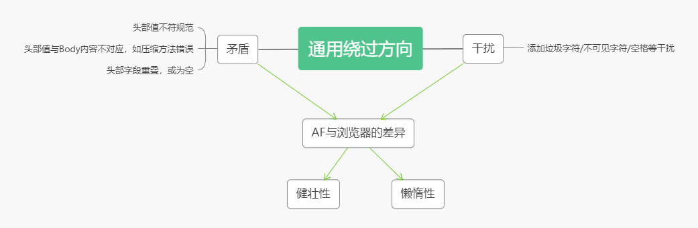

这篇博客整理自两个月以来在深信服实习的所学

HTTP攻击分为响应端和请求端

**响应端攻击**指服务器对客户端进行攻击，一般的攻击形式为：在HTML页面中插入恶意的js代码等，常见的有shellcode，HTML注入攻击，CSS注入攻击等，其主要利用了浏览器的漏洞，当用户浏览了带有恶意代码的网页，攻击就有可能生效；

**请求端攻击**指客户端对服务器发送恶意代码，针对服务器的漏洞进行攻击，如在HTTP头部字段注入shellcode或利用vary字段填充打爆服务器缓存等

这篇博客分享的，是如何利用防火墙和浏览器/服务器之间HTTP协议解析的不同，实现让防火墙无法检出恶意代码，实现直接攻击的方法。

# 一、HTTP响应端绕过原理 #

## 1.1 HTTP响应端绕过原理 ##

介绍响应端绕过原理之前，先要了解关于浏览器的两个重要特点：

### 1.1.1浏览器的健壮性 ###

程序的健壮性，旨在处理实际情况下可能出现的格式错误的数据，使程序不容易崩溃或仍能正确运行，浏览器的健壮性往往体现在解析某些存在错误的网页时，仍能解析出正常的结果，如HTML标签未闭合等小错误，浏览器均可以自行修复。

### 1.1.2浏览器的懒惰性 ###

浏览器的懒惰性不同于健壮性，浏览器的懒惰性在于遇到实践中从未期望过的，无意义的数据时，仍有可能解析成功。从浏览器的角度来看，这并没有害处，因为它仍然以有效的方式处理了数据。但是从审查者，也就是AF的角度来说，很多情况下都会对数据进行不同的解释，这种解释上的差异就会导致绕过。**这一点是很多人所不能理解的，外行常常将健壮性和懒惰性混为一谈。**

### 1.1.3差异→绕过 ###

针对以上两点，从AF的角度上来看，均是由于AF与浏览器之间对数据处理的差异而产生的对数据理解的不同，由此，**攻击者可以利用一些手段“绕过”AF的防御，而这些手段对漏洞在浏览器端的生效并无影响。**我们把上述攻击称为“绕过”。

同时，不同的浏览器处理数据的方式不同，导致的绕过手段也不尽相同。根据我的研究，浏览器可以分为3大类，一类是针对chrome内核，chrome浏览器和大部分国产浏览器都通用的绕过方法，一类是针对IE内核，仅对某些IE版本生效的绕过方法，还有一类是以Firefox为代表的Gecko内核的绕过方法。在本文中，将使用chrome、ie、firefox表示某些绕过手段在特定浏览器生效，同时尽可能的标出版本号。

看到这里，对HTTP绕过有基本认识的你已经可以试着阅读**参考资料**中的内容了，里面提及了多种绕过手段，本文中将不再赘述。除此之外，对于市面上的AF而言，对字符集的支持可能不是很完善，常常可以通过直接换一种编码的形式形成绕过，一部分原因是其使用的检测引擎过于老旧，导致其过于依赖预处理的解码。

# 二、HTTP请求端绕过原理 #

目前大家很少关注HTTP请求端的绕过，原因很简单，因为即使绕过了防火墙，攻击的服务器很有可能已经修复了所利用的漏洞，导致耗费人力精力构造的绕过没有效果。其次，很多针对服务器的攻击方法需要发送多次请求，其构造的报文十分精巧，很难有利用协议绕过的空间。

HTTP请求端的绕过，其涉及影响AF对Body解析的部分，基本与响应端类似。除此之外，HTTP很多请求端攻击是在头部字段或URI上做文章，对此，可以将其中的攻击字段做BASE64编码或escape编码，常常也能形成绕过，这同样是利用了AF针对编码处理的不足。

建议读者一定读一读HTTP Evader，从浏览器/服务器和AF的差异入手，定能找到其中的绕过方法。

# 参考资料 #

本文部分取自以下网站，并不代表原作者观点，有兴趣还请自行阅读

失误之处敬请谅解！

[HTTP Evader](https://noxxi.de/research.html)：https://noxxi.de/research.html

这里主要介绍了HTTP响应端常见的绕过手段，附带解释，非常完善！

[技术讨论 在HTTP协议层面绕过WAF](https://www.freebuf.com/news/193659.html)：https://www.freebuf.com/news/193659.html

这里主要介绍了对chunk变形的绕过手段，可以绕过市面上很多免费的waf

# 写在最后 #

实际上防火墙就是一道墙，如果攻击足够猛，肯定是可以翻越过这道墙的，但在此之前，黑客需要考虑是否耗费如此大的精力物力来翻墙。毕竟，有那么多可爱的肉鸡。
