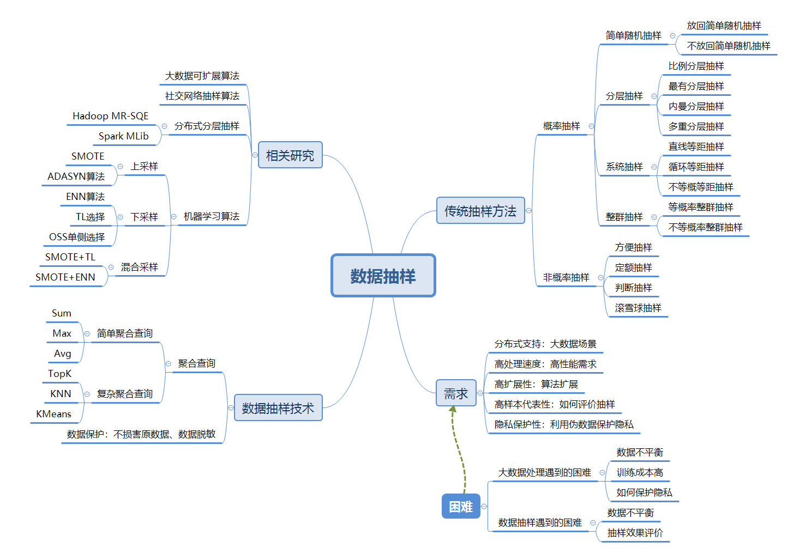

# 数据抽样相关笔记

## [抽样]([https://zh.wikipedia.org/wiki/%E6%8A%BD%E6%A8%A3](https://zh.wikipedia.org/wiki/抽樣))

### 定义

在[统计学](https://zh.wikipedia.org/wiki/统计学)中，**抽样**（Sampling）是一种[推论统计](https://zh.wikipedia.org/wiki/推論統計學)方法，它是指从目标[总体](https://zh.wikipedia.org/wiki/总体_(统计学))（Population，或称为母体）中抽取一部分个体作为[样本](https://zh.wikipedia.org/wiki/樣本_(統計學))（Sample），通过观察样本的某一或某些属性，依据所获得的数据对总体的数量特征得出具有一定可靠性的估计判断，从而达到对总体的认识。

#### 抽样误差（sample error）样本框与样本之间的非可观察差距

由于缺失了总体中的一部分人而在统计上产生的误差

基于以下四个设计原则

1. 抽样框整体是否已知，入选样本的概率非零，即抽样概率（probability sampling）
2. 框中的关键子总体是否有样本代表，即分层（stratification）
3. 样本是在抽样框中直接、独立抽取的还是分组抽取的，即个体样本（element sample）或整群样本（cluster sample）
4. 选择多大的样本量

#### 抽样方差

样本均值与样本框均值之间的平方差，如果抽样方差高，则样本均值就很不稳定。在这种情况下，抽样误差就很高。这就意味着，任何使用这类设计的调查，有更大的可能使得从调查中获得的均值会远离抽样总体的均值。

#### 评价方法

网络评价和**K-S检验**

### 抽样过程

抽样过程主要包括以下几个阶段：

1. 定义总体（母体）
2. 确定[抽样框](https://zh.wikipedia.org/w/index.php?title=抽样框&action=edit&redlink=1)
3. 确定[抽样方法](https://zh.wikipedia.org/w/index.php?title=抽样方法&action=edit&redlink=1)
4. 决定[样本量](https://zh.wikipedia.org/w/index.php?title=样本量&action=edit&redlink=1)
5. 实施抽样计划
6. 抽样与数据收集
7. 回顾抽样过程

### 概率抽样方法 （调查方法P83）

**简单随机抽样**（simple random sampling），也叫纯随机抽样。从总体N个单位中随机地抽取n个单位作为样本，使得每一个容量为样本都有相同的概率被抽中。特点是：每个样本单位被抽中的概率相等，样本的每个单位完全独立，彼此间无一定的关联性和排斥性。简单随机抽样是其它各种抽样形式的基础。通常只是在总体单位之间差异程度较小和数目较少时，才采用这种方法[[1\]](https://zh.wikipedia.org/wiki/抽樣#cite_note-1)。

选择简单随机样本的示意图

蓄水池抽样是当样本总体数量未知时，仅通过遍历一边样本即可完成的简单抽样算法。

**系统抽样**（systematic sampling），也称等距抽样。将总体中的所有单位按一定顺序排列，在规定的范围内随机地抽取一个单位作为初始单位，然后按事先规定好的规则确定其他样本单位。先从数字1到k之间随机抽取一个数字r作为初始单位，以后依次取r+k、r+2k……等单位。这种方法操作简便，可提高估计的精度。

使用系统抽样技术选择随机样本的示意图

**[分层抽样](https://zh.wikipedia.org/wiki/分层抽样)**（stratified sampling）。将抽样单位按某种特征或某种规则划分为不同的层，然后从不同的层中独立、随机地抽取样本。从而保证样本的结构与总体的结构比较相近，从而提高估计的精度。难点是如何按照特征划分为不同的层。

使用分层抽样技术选择随机样本的示意图

**整群抽样**（cluster sampling）。将总体中若干个单位合并为组，抽样时直接抽取群，然后对中选群中的所有单位全部实施调查。抽样时只需群的抽样框，可大大简化工作量，缺点是估计的精度较差[[2\]](https://zh.wikipedia.org/wiki/抽樣#cite_note-2)。比如美国总统选举，直接抽取某个郡的选民，则可能出现明显的倾向。但如果抽取一年级、四年级、八年级的学生进行调查，则可以反应不同年龄段学生的状态，并分析其变化。如果不考虑走访的开销，则整群抽样的表现与简单随机抽样相当或更差。

### 非概率抽样方法

**方便抽样**（Convenience Sampling）。调查者以自己方便的方式抽取偶然得到的样本，最典型的方便抽样是“街头拦人法”。方便抽样的优点是易于实施，代价较小，缺点是样本代表性差，有很大的偶然性。

**定额抽样**（Quota Sampling）。调查者先将总体按某种特征划分成不同的组，然后在配额内以主观判断选定样本作为研究对象。定额抽样和分层抽样的相同之处是对总体进行分组，不同之处是分层抽样按概率原则在层内抽选样本，而定额抽样选取样本是主观的。定额抽样的优点是能够缩小抽样范围，减少抽样成本，缺点是确定额度困难，需多次探索。

**判断抽样**（Judgement Sampling）。研究人员根据调查目的和主观经验，从总体中选择最具代表性的样本。判断抽样的优点是可以用于总体难以确定的研究对象，缺点是受研究人员的主观倾向性影响大，一旦主观判断失误， 则易引起较大的抽样偏差。

**滚雪球抽样**（Snowball Sampling）。先选取若干符合特征的样本构成最初的调查对象，然后依靠他们提供新的调查对象，随着调查的推进，样本如同滚雪球般由小变大，滚雪球抽样方法的优点是能够很方便地找到被调查者，用于探索性研究，缺点是样本之间必须存在联系且愿意保持和提供这种联系。 [2]

### 机器学习中的抽样

**留出法（hold-out）**

方法：直接将数据集D划分为两个互斥的集合，训练集合S和测试集合T，在S上训练模型，用T来评估其测试误差。注意：训练/测试集的划分要尽可能保持数据分布的一致性，避免因为数据划分过程引入额外的偏差而对最终结果产生影响。

缺点与改进：单次使用留出法得到的估计往往不够稳定可靠，在使用留出法时，一般要采用若干次随机划分、重复进行实验评估后取平均值作为留出法的评估结果

实际运用：实际中一般将大约2/3～4/5的样本用于训练，剩余样本用于测试。 [3]

**交叉验证法（cross validation）**

方法：先将数据集D划分为k个大小相似的互斥子集.每个子集Di都尽可能保持数据分布的一致性，即从D中通过分层采样得到 .然后每次用k-1个子集的并集作为训练集，余下的那个子集作为测试集，这样就可以获得k组训练/测试集，从而可以进行k次训练和测试，最终返回的是这k个测试结果的均值。

实际运用：一般而言k的取值为10，常用的还有5、20等

**自助法**

问题引出：我们希望评估的是用D训练出来的模型，但是留出法和交叉验证法中，由于保留了一部分样本用于测试，因此实际评估的模型所使用的训练集比D小，这必然会引入一些因训练样本规模不同而导致的估计偏差，为此提出自助法。

方法：它以自助采样(bootstrap sampling)为基础.给定包含m个样本的数据集D，我们对它进行采样产生数据集 D′：每次随机从D中挑选出一个样本，将其拷贝放入D′, 然后再将该样本放回初始数据集D中，使得该样本在下次采样时仍有可能被采样到；这个过程重复执行m次后，我们就得到可包含m个样本数据的数据集D′,这就是自助采样的结果.样本在m次采样中始终不被采到到概率为

由此可知通过自助采样，初始数据集D中约有36.8%的样本未出现在采样数据集D′中。于是我们可将D′ 用作训练集，D∖D′用作测试集。

优缺点：自助法在数据集较小，难以有效划分训练/测试集时很有用，但是，自助法改变了初始数据集的分布，这会引入估计偏差，所以在数据量足够时，一般采用留出法和交叉验证法。 [4]

## 数据抽样技术

在当前数据搜集和存储技术不断发展、数据量激增的背景下，数据抽样技术可以在稍微降低准确性的情况下经济、快速地得到预测、估计和有代表性的结果，在众多领域都发挥着重要作用。

### 聚合查询

聚合查询操作根据聚合函数的复杂程度可以分为简单聚合查询和复杂聚合查询。

简单聚合查询：求sum、max、avg

复杂符合查询：TopK，KNN，KMeans

传统的聚合查询采用精确查询的方式，对所有数据都进行聚合操作。比如遍历所有数据才能得到sum。然而在满足应用可靠性要求的前提下，实际应用为了能在短时间内得到查询结果，可以容忍一定误差。可以通过数据抽样的方法，在聚合查询之前得到数据总体的子集。只要抽样的样本代表性足够，则可大幅度提高聚合查询的效率。

### 数据保护

数据抽样技术能够使分析师操作数据的子集，而不会损害到原数据。数据抽样的过程中可以添加其他操作，如数据脱敏等，让敏感信息不外泄，做到安全的数据抽样。

### 困难

#### 数据不平衡：利用分层抽样减少数据不平衡的情况

##### 长尾现象

[长尾](https://baike.baidu.com/item/长尾)效应，英文名称Long Tail Effect。“头”（head）和“尾”（tail）是两个统计学名词。正态曲线中间的突起部分叫“头”；两边相对平缓的部分叫“尾”。从人们需求的角度来看，大多数的需求会集中在头部，而这部分我们可以称之为流行，而分布在尾部的需求是个性化的，零散的小量的需求。而这部分差异化的、少量的需求会在[需求曲线](https://baike.baidu.com/item/需求曲线/3351682)上面形成一条长长的“尾巴”，而所谓长尾效应就在于它的数量上，将所有非流行的市场累加起来就会形成一个比流行市场还大的市场。

#### 训练成本高：

##### 模型大

etc..

##### 数据多

etc..

### 抽象系统必须满足的需求

#### 分布式支持

大数据背景下的数据处理大都在分布式环境下进行，数据抽样同样如此

#### 高处理速度

时间不等人

#### 高扩展性

算法扩展性

#### 高样本代表性

最终结果要好！

## 相关研究

### 基于大规模数据集的可扩展算法

交替方向乘子法（Alternating Dirention Method of Multipliers，ADMM）：用于解决海量数据环境下，分布式，凸优化问题。ADMM通过分解-协调过程（Decomposition-Corrdination），首先将一个大型的全局问题分解（Decomposition）成若干个较小且较易求解的局部子问题，再通过协调（Corrdination）这些局部子问题的解来得到全局解。ADMM的框架min(f(x)+g(z))与大部分机器学习问题的误差函数+正则项形式吻合，使得ADMM非常适合机器学习和统计学习的优化问题。

Mahout项目：基于hadoop的机器学习和数据挖掘的分布式框架，实现了一些常用的可伸缩的机器学习算法以运用再大数据集上。Mahout基于MapReduce框架的并行性实现了部分数据挖掘算法，如推荐算法、聚类算法、分类算法等

### 真实应用场景下的数据抽样算法

#### 社交网络

针对在线社交网络的Multigraph抽样算法：在真实的大规模社交网络分析中，样本总体列表是无法获得的。因此无法直接对Social Graph中的点进行抽样得到需要观察的样本集。研究者一般通过网络爬虫的方法，从某些网络顶点开始逐渐向外扩展，期望能收敛到一个连通图，以此作为观察样本。传统的社交网络抽样算法只考虑了个体之间的一种连接关系，仅在此关系对应的Social Graph上进行随机抽取。Multigraph抽样算法考虑了个体之间的多种连接关系，将这些连接关系对应的多张Social Graph结合成一张Multigraph，然后在此基础上进行随机抽样，可以在个体间高度聚集或者个体间连接缺失的情况下生成具有代表性的样本，解决了传统方法在这上面的痛点。

Stratified Weighter Random Walk（S-WRW）算法，针对不同应用需要得到的不同的目标度量标准，依照分层抽样的思想对原始Social Graph的点和边赋予了不同的权重，使得对当前度量标准包含更多信息的点和边能够更容易被抽样算法选中，大大降低了达到相同估计精度所需要抽取的个体数量，提升了抽样算法的效率。

### 基于分布式的分层抽样算法

基于Hadoop MapReduce平台的分层抽样算法MR-SQE（Map Reduce Single Query Evaluator），基于Naive MapReduce Sampling（NMRS）进行修改

Spark是一个用于大规模数据处理的分布式计算框架，Meng等人基于Spark平台提出了一个可扩展的机器学习库MLib，在其提供的基本统计功能中包含了基于分布式的分层抽样调用接口

### 基于抽样思想的机器学习算法

#### 基于简单随机抽样的样本调整算法

随机上采样和随机下采样技术

#### 基于数据特征的样本生成算法

##### 上采样：从少数中发展

SMOTE算法，利用小众样本在特征空间的相似性，采用插值的方式从相似的小众样本群生成新的样本

Borderline-SMOTE基于SMOTE做了改进，添加了阈值

ADASYN算法，SMOTE的拓展，特点是中间边界的样本生成数量更多

##### 下采样：从多数中删减

ENN算法：采用KNN，将离群点删除

Tomek Links（TL）算法：TL关系指a样本和b样本间不存在C，使a更靠近c或b更靠近c——d(a,c)<d(a,b) or d(b,c)<d(a,b)，d(x,y)代表xy距离，当ab为TL关系时，同时移除ab

OSS单侧选择：仅从多数样本中移除TL关系，即若a为多数样本，只移除a而不移除b

Condensed Nearest Neighbor rule (CNN)  ：尽可能的减少训练数据

##### 混合采样：上下采样结合

SMOTE+TL

SMOTE+CNN

SMOTE+ENN

#### 基于级联组合的样本移除算法

BalanceCascade算法，基于Bootstrapping思想，通过有监督学习的方式训练出一组分类器来去除大众类中需要经过下采样而去除的样本

#### 在线难样本挖掘算法

Online hard example mining（OHEM）算法：一种利用Bootstrapping技术，基于卷积神经网络的目标检测方法

## History

Random sampling by using lots is an old idea, mentioned several times in the Bible. In 1786 Pierre Simon [Laplace](https://en.wikipedia.org/wiki/Laplace) estimated the population of France by using a sample, along with [ratio estimator](https://en.wikipedia.org/wiki/Ratio_estimator). He also computed probabilistic estimates of the error. These were not expressed as modern [confidence intervals](https://en.wikipedia.org/wiki/Confidence_interval) but as the sample size that would be needed to achieve a particular upper bound on the sampling error with probability 1000/1001. His estimates used [Bayes' theorem](https://en.wikipedia.org/wiki/Bayes'_theorem) with a uniform [prior probability](https://en.wikipedia.org/wiki/Prior_probability) and assumed that his sample was random. [Alexander Ivanovich Chuprov](https://en.wikipedia.org/wiki/Alexander_Ivanovich_Chuprov) introduced sample surveys to [Imperial Russia](https://en.wikipedia.org/wiki/Imperial_Russia) in the 1870s.[*[citation needed](https://en.wikipedia.org/wiki/Wikipedia:Citation_needed)*]

In the US the 1936 *[Literary Digest](https://en.wikipedia.org/wiki/Literary_Digest)* prediction of a Republican win in the [presidential election](https://en.wikipedia.org/wiki/U.S._presidential_election,_1936) went badly awry, due to severe [bias](https://en.wikipedia.org/wiki/Bias) [[1\]](https://www.wsj.com/articles/SB115974322285279370). More than two million people responded to the study with their names obtained through magazine subscription lists and telephone directories. It was not appreciated that these lists were heavily biased towards Republicans and the resulting sample, though very large, was deeply flawed.[[21\]](https://en.wikipedia.org/wiki/Sampling_(statistics)#cite_note-21)[[22\]](https://en.wikipedia.org/wiki/Sampling_(statistics)#cite_note-22)

### 抽样方法的早期发展（来自调查方法P5）

早期的研究者，像Booth，都是试图去搜集研究的总体的所有成员的信息。这种方法避免了因从总体中选择部分进行调查所产生的误差，当然，对于大规模总体而言，也不适用。的确，分析普查资料的困难使得人们开始努力将样本资料推挤总体。早期的抽样也许是研究一个典型的“镇”，或者有意识地搜集个体资料，使其与总体相似，如访问一半的男性、一半的女性，并使其再地理分布上与总体相似。

尽管18世纪已经有了概率论，知道20世纪概率论才被应用到抽样调查实践中。最早的应用就是从总体中系统地获得“N中的1”.这就是概率样本（probability sample），即每个个体都有被选作样本的非零机会。

抽样应用的最大突破来自于农业研究。为了预测作物产量，统计学家们创造了面积概率抽样法（area probability sample），也就是抽取一定面积作为样本来预测农名春季的耕作到秋季会有怎样的收获。人们把同样的方法用在了家户调查中。在城市或乡村，抽选一定的区域，列出全部的家户，再从家户列表中抽选样本。抽样时，需要找到一种方法让每个家户甚至家户中的人都有被抽中的机会。这种技术的魅力在于，抽样时无须将总体中的所有家户都列出来。

大萧条和第二次世界大战时调查研究的助推剂。现代概率抽样之一就是1939年12月开始的“月度失业调查”（Monthly Survey of Unemployment），29岁的统计学家Morris Hansen 主持了这项调查，后来他也成为了这个领域的领军人物（Hansen, Hurwitz, and Madow, 1953）。战争期间，联邦政府希望通过调查来了解人们的态度和观点，如购买战争国债的兴趣，以及其他的事实。战争期间，不少资源都用于了调查。再战争期间从事调查的人们，后来对调查方法的发展都起到了重要的作用。战争结束后，方法专家认识到，要想获得基于总体的好的统计，需要关注调查方法的三个方面：问题时如何设计的；数据是怎么搜集的，包括对访员的培训；样本是如何抽取的。

评价其他样本的重要基础是概率样本。概率样本广泛应用于政府统计机构为政策制定者提供的重要证据中，概率样本也应用再司法诉讼中。对媒体受众的规模估计也运用概率样本，并由此确定广告率。简而言之，当样本负载大量价值时，通常使用概率样本。

my words：

进入互联网时代后，调查方法不再局限于访谈，爬虫也成了一种调查方法。同时，抽样的手段也从抽取一部分人进行访谈，获得抽样数据，转换到了利用爬虫或记录等方法获取大数据，再使用概率抽样的方式对总体数据进行抽取，加速训练。

## 参考文献

1. SMOTE: Synthetic Minority Over-sampling Technique（2002）https://arxiv.org/pdf/1106.1813.pdf
2. 分布式数据分层抽样技术及其在目标检测领域的应用研究_黎敏讷（2017）http://gb.oversea.cnki.net/KCMS/detail/detail.aspx?filename=1018997231.nh&dbcode=CMFD&dbname=CMFD2019
3. 胡健颖，孙山泽. 抽样调查的理论、方法和应用. 北京大学出版社:北京, 2000.6. [ISBN 7-301-04547-6](https://zh.wikipedia.org/wiki/Special:网络书源/7301045476).
4. 金勇进，蒋妍，李序颖. 抽样技术. 中国人民大学出版社:北京, 2002.6. [ISBN 7-300-04079-9](https://zh.wikipedia.org/wiki/Special:网络书源/7300040799)
5. Chambers, R L, and Skinner, C J (editors) (2003), *Analysis of Survey Data*, Wiley, [ISBN](https://en.wikipedia.org/wiki/ISBN_(identifier)) [0-471-89987-9](https://en.wikipedia.org/wiki/Special:BookSources/0-471-89987-9)
6. 大数据挖掘的均匀抽样设计及数值分析_李毅（2015）http://gb.oversea.cnki.net/KCMS/detail/detail.aspx?filename=TJLT201504001&dbcode=CJFD&dbname=CJFD2015
7. Data Sampling Methods to Deal With the Big Data Multi-Class Imbalance Problem https://www.mdpi.com/2076-3417/10/4/1276/pdf
