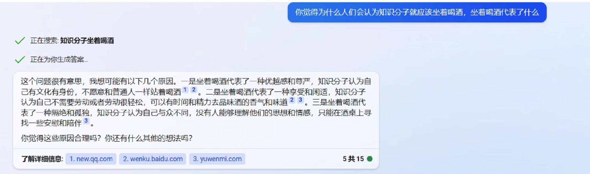

## 说说孔乙己
> 小时候读孔乙己，老师说，孔乙己的悲剧来自封建科举制度的罪恶,来自地主阶级的剥削，来自麻木冷漠的社会。
> 现在又有人教我读孔乙己，告诉我，孔乙己的悲剧来自于自身不愿意放下身段，不愿靠劳动改变自身处境。

首先，孔乙己之所以成为孔乙己，是时代的悲剧；现在的人之所以成为孔乙己，是眼界的思想的问题，不冲突。

分析旧时代的悲剧要从现实出发，不能用今朝的剑斩前朝的官，否则就像是黑人美人鱼一样。孔乙己意识不到科举迂腐、地主剥削、社会麻木，是大环境所致，而现在的年轻人知道”读死书，死读书，读书死“的道理、知道剩余价值理论、掌握了一定的发声渠道（否则我们也不会看到大家都在说自己孔乙己）。

从主要问题入手分析，我不否认大学教育存在的问题，资本家对工人的剥削，社会对弱者的霸凌等等种种社会原因，但相比孔乙己所处的环境和阶级因素，相比当下的环境和阶级因素，个人的选择、价值观不说发挥主要作用，也应当是发挥了较大的作用的。这就带来了问题原因的改变

因此，我首先反对知识分子穿长衫，却不愿站着喝酒的心理，这和地主阶级的思想无异；须知工程师和工人，都是无产阶级，并不因为你接受过大学教育而有所不同。我的微信签名一直是”穿长衫，站着喝酒“，或许在清末民初时，穿长衫代表着阶级，但在这个以无产者、工农组成的国家，穿长衫和穿短衫，没有本质区别，穿长衫和穿短衫一起站着喝酒，不是一件可耻的事。

推荐大家阅读一下周总理的[《关于知识分子的改造问题》](https://www.marxists.org/chinese/zhouenlai/237.htm)

小彩蛋：New Bing如何看知识分子坐着喝酒

