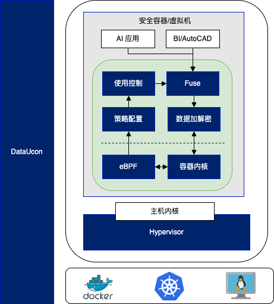

> 这篇文章是对最近看到的一些资料的整理和一些构想，我将着手在[可观测性行业发展与机遇](https://wh1isper.github.io/2023/10/29/2023-10-30-%E5%8F%AF%E8%A7%82%E6%B5%8B%E6%80%A7%E8%A1%8C%E4%B8%9A%E5%8F%91%E5%B1%95%E4%B8%8E%E6%9C%BA%E9%81%87/)和[定义数据使用可观测性](https://wh1isper.github.io/2023/10/30/2023-10-31-%E5%AE%9A%E4%B9%89%E6%95%B0%E6%8D%AE%E4%BD%BF%E7%94%A8%E5%8F%AF%E8%A7%82%E6%B5%8B%E6%80%A7/)中展开讨论可观测性的不同角度以及目前我对数据使用可观测性的认识

# 1. 可观测性

随着分布式架构渐成主流，[可观测性](https://en.wikipedia.org/wiki/Observability)（Observability）一词也日益频繁地被人提起。最初，它与[可控制性](https://en.wikipedia.org/wiki/Controllability)（Controllability）一起，是由匈牙利数学家 Rudolf E. Kálmán 针对线性动态控制系统提出的一组对偶属性，原本的含义是“可以由其外部输出推断其内部状态的程度”。

在学术界，虽然“可观测性”这个名词是近几年才从控制理论中借用的舶来概念，不过其内容实际在计算机科学中已有多年的实践积累。学术界一般会将可观测性分解为三个更具体方向进行研究，分别是：[事件日志](http://icyfenix.cn/distribution/observability/logging.html)、[链路追踪](http://icyfenix.cn/distribution/observability/tracing.html)和[聚合度量](http://icyfenix.cn/distribution/observability/metrics.html)，这三个方向各有侧重，又不是完全独立，它们天然就有重合或者可以结合之处，2017 年的分布式追踪峰会（2017 Distributed Tracing Summit）结束后，Peter Bourgon 撰写了总结文章[《Metrics, Tracing, and Logging》](https://peter.bourgon.org/blog/2017/02/21/metrics-tracing-and-logging.html)系统地阐述了这三者的定义、特征，以及它们之间的关系与差异，受到了业界的广泛认可。

- 日志（Logging）：日志的职责是记录离散事件，通过这些记录事后分析出程序的行为，譬如曾经调用过什么方法，曾经操作过哪些数据，等等。打印日志被认为是程序中最简单的工作之一，调试问题时常有人会说“当初这里记得打点日志就好了”，可见这就是一项举手之劳的任务。输出日志的确很容易，但收集和分析日志却可能会很复杂，面对成千上万的集群节点，面对迅速滚动的事件信息，面对数以 TB 计算的文本，传输与归集都并不简单。对大多数程序员来说，分析日志也许就是最常遇见也最有实践可行性的“大数据系统”了。
- 追踪（Tracing）：单体系统时代追踪的范畴基本只局限于[栈追踪](https://en.wikipedia.org/wiki/Stack_trace)（Stack Tracing），调试程序时，在 IDE 打个断点，看到的 Call Stack 视图上的内容便是追踪；编写代码时，处理异常调用了 Exception::printStackTrace()方法，它输出的堆栈信息也是追踪。微服务时代，追踪就不只局限于调用栈了，一个外部请求需要内部若干服务的联动响应，这时候完整的调用轨迹将跨越多个服务，同时包括服务间的网络传输信息与各个服务内部的调用堆栈信息，因此，分布式系统中的追踪在国内常被称为“全链路追踪”（后文就直接称“链路追踪”了），许多资料中也称它为“[分布式追踪](https://opentracing.io/docs/overview/what-is-tracing/)”（Distributed Tracing）。追踪的主要目的是排查故障，如分析调用链的哪一部分、哪个方法出现错误或阻塞，输入输出是否符合预期，等等。
- 度量（Metrics）：度量是指对系统中某一类信息的统计聚合。譬如，证券市场的每一只股票都会定期公布财务报表，通过财报上的营收、净利、毛利、资产、负债等等一系列数据来体现过去一个财务周期中公司的经营状况，这便是一种信息聚合。Java 天生自带有一种基本的度量，就是由虚拟机直接提供的 JMX（Java Management eXtensions）度量，诸如内存大小、各分代的用量、峰值的线程数、垃圾收集的吞吐量、频率，等等都可以从 JMX 中获得。度量的主要目的是监控（Monitoring）和预警（Alert），如某些度量指标达到风险阈值时触发事件，以便自动处理或者提醒管理员介入。

# 2. 数据使用可观测性

不同于微服务/分布式架构的可观测性注重于系统运行时的可观测性，数据使用可观测性聚焦于数据使用过程中的可观测性。其特征在于，以数据为中心，设计对应的Logging、Tracing和Metrics工具。

|         | 微服务                                                                                       | 数据使用                                                                                   |
| ------- | -------------------------------------------------------------------------------------------- | ------------------------------------------------------------------------------------------ |
| Logging | 记录系统运行期间发生过的离散事件                                                             | 记录数据使用期间发生过的离散事件                                                           |
| Tracing | 记录一个请求在分布式系统中的调用过程 获得一个请求在系统中的执行路径和服务节点的执行情况 | 记录数据在数据分析工作流中的使用过程 建立某个数据在工作流中的执行路径、输出结果的关联 |
| Metrics | 揭示系统的总体运行状态                                                                       | 揭示数据的总体使用情况                                                                     |

目前我所在的组织([hitsz-ids](https://github.com/hitsz-ids/))发起了一个开源项目[🔍duetector](https://github.com/hitsz-ids/duetector)，旨在基于[eBPF](https://ebpf.io/)等技术，通过实现对数据使用过程的Logging, Tracing, Metrics实现数据使用过程的白盒化和可观测性，欢迎任何有兴趣的人加入我们。

# 3. Case: 数据使用可观测性赋能数据使用控制

## 3.1 数据分享与数据使用控制

汇集和分享数据可以增加以及分发数据的价值，但数据一旦分享就无法撤销，出于监管、隐私和法律原因需要控制数据分发的情况下，很多数据无法进行共享。总体来看，目前形成的极少数数据共享联盟或组织，都是有选择性地、基于某种协议的数据共享，而促成这种协议往往需要漫长而繁琐的一次性谈判。以上，极大地阻碍了数据分享流通的效率，也限制了数据的使用价值。

数据分享一般可以分为两类场景：

- 组织内的数据分享：组织内部，以分析师小组的形式进行数据使用，一般需要一个系统汇集并管理组织内的所有数据，让分析师自由选择数据进行分析，同时也允许负责审计的人员对分析师如何使用数据资产进行审计
- 跨组织的数据分享：以组织的形式进行数据分享，往往需要一个平台来保护各个参与者的隐私，包括数据的隐私（数据中的敏感信息等）和数据使用者的隐私（参数、模型等），同时也需要一个系统来管理数据的使用，以便审计数据的使用情况。这一类数据分享的典型场景是数据共享联盟（Data Sharing Consortium），如医疗数据共享联盟、金融数据共享联盟等，这一场景往往能够促进数据的流通，提高数据的使用效率，带来更大的经济效益。

组织内的数据分享通过数据湖仓等大数据技术已经有了较好的解决方案，而跨组织的数据分享则需要更多的技术支持，包括数据隐私保护、数据使用审计、数据使用可观测性等。为了满足[《欧盟通用数据保护条例》(GDPR)](https://gdpr-info.eu/)、[《数据二十条》](https://www.gov.cn/zhengce/2022-12/19/content_5732695.htm)等法律法规的要求，保护数据和数据使用者的隐私，需要新的技术和研究来支持数据的分享。其中一项关键技术，就是控制数据的使用，即数据使用控制（Data Usage Control，简称 DataUCon）。

数据使用控制主要解决“数据使用过程不可控”的问题，以目前的技术手段，往往无法在数据使用的过程中识别到数据的超范围使用、滥用、违规使用等问题，也难以限制数据的使用方式、次数。以上问题，被归纳为“4W1H”的数据受控访问和使用目标。**想要对数据的使用进行控制，就需要对数据使用的过程白盒化，即数据使用过程可观测，以便对数据使用过程进行监控、审计和控制。**

## 3.2 基于数据可观测性的数据使用控制

在[数据受控使用环境(DataUCon)](https://juejin.cn/post/7283308642581577762)项目中，我们提出了一种基于数据使用可观测性的数据使用控制方案，通过对数据使用过程的可观测性，实现对数据使用过程的监控、审计和控制，从而实现对数据使用的控制。具体而言，数据可观测性为数据策略的执行提供了必要的信息，包括数据使用的时间、地点、方式、次数、使用者、使用者的行为等，这些信息可以用于数据使用的审计，也可以用于数据使用的控制，如数据使用的限制、数据使用者的惩罚等。

# 4. Community: OpenTelemetry与数据使用可观测性

[OpenTelemetry](https://opentelemetry.io/)合并了OpenTracing和OpenCensus项目，提供了一组API和库来标准化遥测数据的采集和传输。OpenTelemetry提供了一个安全，厂商中立的工具，这样就可以按照需要将数据发往不同的后端。想要更详细的了解OpenTelemetry，可以参考[《OpenTelemetry 可观测性的未来》](https://lib.jimmysong.io/opentelemetry-obervability/)的系列文章。

我们的项目将逐步支持OpenTelemetry，以便更好的与OpenTelemetry生态进行对接，允许用户使用统一的、厂商中立的工具来标准化遥测数据的采集和传输，并与现有的遥测系统良好对接。

# 5. Alternatives: 其他路线或方案

- 联邦学习（Federated Learning）：联邦学习是一种分布式机器学习方法，它允许在不共享数据的情况下训练机器学习模型。联邦学习的目标是训练一个能够适应所有参与者的模型，而不是训练一个适合单个参与者的模型。联邦学习的典型场景是在移动设备上训练机器学习模型，如在移动设备上训练语音识别模型、图像识别模型等。联邦学习的优势在于，不需要将数据集中到一个地方，而是在本地训练模型，然后将模型的更新发送到中央服务器，这样就可以保护数据的隐私。但目前联邦学习的安全性受到质疑，易受到旁路攻击、恶意参与者攻击、数据夹带攻击，导致数据泄露、模型无法训练等问题。同时，联邦学习的效率也令人堪忧，其训练的模型往往需要更多的迭代次数才能达到同等的准确率，而且在模型的训练过程中，需要大量的通信开销，这也是联邦学习的瓶颈所在。
- 安全多方计算（Secure Multi-Party Computation）：安全多方计算是一种密码学方法，它允许在不共享数据的情况下计算结果。安全多方计算的目标是计算一个能够适应所有参与者的结果，而不是计算一个适合单个参与者的结果。安全多方计算的问题在于，计算过程的加密和解密对数据分析这一类计算密集型任务来说，会带来巨大的计算开销，导致计算效率低下。同时，现有的数据分析算法需要重新编写，才能适应安全多方计算的场景。
- 可信计算环境（Trusted Execution Environment）：可信计算环境是一种硬件安全技术，它可以保护应用程序和数据不受恶意软件和物理攻击。可信计算环境的目标是保护应用程序和数据的安全，而不是保护数据的隐私。可信计算环境的问题在于，它只能保护应用程序和数据的安全，而无法保护数据的隐私，因此无法满足数据使用控制的需求。同时其硬件依赖也限制了其在云计算等场景的应用。

# 6. Conclusion: 总结

数据作为一种重要的生产要素，其价值在于使用，而数据使用的过程往往是不可控的，这导致了数据的使用效率低下，也限制了数据的使用价值。数据使用可观测性通过对数据使用过程的可观测，实现了数据使用过程的白盒化，从而实现了对数据使用过程的监控、审计和控制，从而实现了对数据使用的控制。数据使用可观测性是数据使用控制的基础，也是数据使用控制的关键技术。

# 7. 未来工作

- 开发数据使用可观测性的开源工具：[duetector](https://github.com/hitsz-ids/duetector)
- 推动数据使用可观测性的标准化
- 实践并建设数据使用可观测等级模型

# 参考资料

- [凤凰架构#可观测性](http://icyfenix.cn/distribution/observability/)
- [AWS：数据分享](https://aws.amazon.com/cn/what-is/data-sharing/)
- [《可观测性工程》](https://www.oreilly.com/library/view/observability-engineering/)
- [Siyuan Xia, Zhiru Zhu, Chris Zhu, Jinjin Zhao, Kyle Chard, Aaron J. Elmore, Ian Foster, Michael Franklin, Sanjay Krishnan, and Raul Castro Fernandez. 2022. Data station: delegated, trustworthy, and auditable computation to enable data-sharing consortia with a data escrow. Proc. VLDB Endow. 15, 11 (July 2022), 3172–3185. https://doi.org/10.14778/3551793.3551861](https://arxiv.org/abs/2305.03842)
