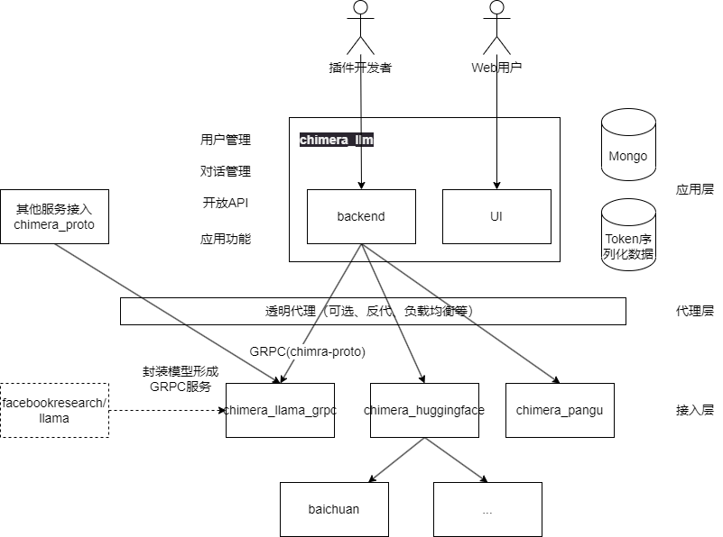
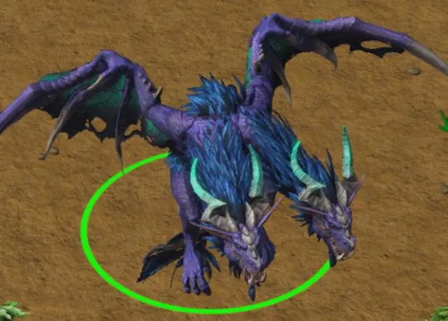

## 起源

我想要做一个AI地牢玩玩，但是又不想用OpenAI等等付费的API，同时我也想私有化部署，以及尝试建设一些个人资料库……

## 奇美拉计划是什么

开源的、中立的、统一的LLM中台，提供统一的API接口，允许用户添加自己的模型、开发自己的应用

## 初步设计

## Roadmap

### 起步

1. 开发[chimera-proto](https://github.com/Wh1isper/chimera_llm_proto)，其中包括了GRPC定义
2. 基于Llama开发[chimera-llama-grpc](https://github.com/Wh1isper/chimera_llama_grpc)，将Llama2包装为GRPC服务
3. 开发中台服务[chimera-llm](https://github.com/Wh1isper/chimera_llm)，提供对话和文本生成的API demo
4. 开发客户端，让用户可以直接尝试

### 发展

1. 接入baichuan2模型、pangu模型
2. 开发[chimera-llm](https://github.com/Wh1isper/chimera_llm) webui和用户系统，逐渐可商用
3. 开始个人知识库建设研究

### 未来

1. 为vscode、Emacs等编辑器开发插件，让用户可以直接在编辑器中使用
2. 尝试接入更多生态，如飞书文档等等
3. 尝试接入更多模态，如文生图、MOE

## 为什么叫奇美拉

奇美拉是一种最基本的嵌合体，融合了多个动物特征的非自然生物。奇美拉计划的目标是融合多个开源LLM模型，形成一个更加强大的项目，提供中立、统一、开放的LLM中台。

