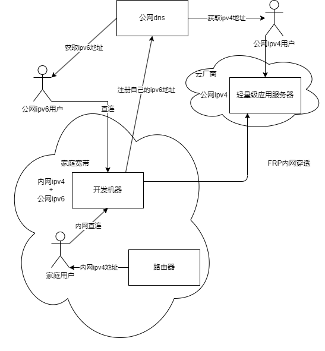

# TLDR

用一个域名实现公网ipv6直连、公网ipv4穿透、内网直连访问

> 此教程并非通用教程，可参考修改



# 案例与效果展示

内网用户访问`yourdomain`，可以直接访问到内网机器

```bash
$ curl -v https://wh1isper.top:8080
*   Trying [::ffff:192.168.31.254]:8080...
* Connected to wh1isper.top (::ffff:192.168.31.254) port 8080
```

外网ipv6用户访问`yourdomain`，可以直接访问到内网机器

```bash
$ curl -v https://wh1isper.top:8080
*   Trying [2408:8256:3284:1522::905]:8080...
* Connected to wh1isper.top (2408:8256:3284:1522::905) port 8080 (#0)
```

外网ipv4用户访问`yourdomain`，可以直接通过跳板机访问

```bash
$ nslookup wh1isper.top
curl -v https://wh1isper.top:8080
*   Trying 42.193.219.110:8080...
Connected to wh1isper.top (42.193.219.110) port 8080 (#0)
```

## 案例：部署一个codeserver

`yay code-server`，安装`aur/code-server-marketplace`和`aur/code-server`

根据文档配置证书、密码等：https://github.com/coder/code-server

证书可以在域名服务商申请，也可以使用免费的letsencrypt，本教程不包含相关内容

`~/.config/code-server/config.yaml`

```
host: "::"
port: 2443
auth: password
password: 
cert: /home/wh1isper/cert/wh1isper.top_bundle.crt
cert-key: /home/wh1isper/cert/wh1isper.top.key
```

然后将2443端口映射到跳板机的2443端口

```ini
[FRP-CODE-SERVER]
type = tcp
local_ip = 127.0.0.1
local_port = 2443
remote_port = 2443
```

> 目前，HTTPS+TCP跳板的方式可以绕过腾讯云域名备案检测，可以使用腾讯云的服务器，否则可能需要境外服务器以绕过备案，或者进行备案


# 场景说明

- 家庭宽带提供ipv6公网地址，但是没有ipv4公网地址
    - 大部分省份的家庭宽带都有这项功能，一般而言，开发机器获得公网ipv6地址可以通过设置光猫为桥接模式，路由器拨号，然后再路由器ipv6处使用DHCPv6协议获取公网ipv6地址
    - 大部分省份手机流量已经支持ipv6，这使得我们在外时可以使用手机流量直连机器，获取满带宽
- 有一台具有公网ipv4地址的服务器，作为内网穿透跳板机
- 家庭使用的路由器可以设置dhcp地址绑定和静态域名解析
    - 这使得在家使用时，可以通过域名直接访问内网机器。dhcp地址绑定是可选的，你也可以静态分配ip
    - 以红米路由器为例，可以破解进入ssh配置静态域名解析
    - 如果有Clash等软路由，一般都支持静态域名解析，甚至可以自动做优选
- 一个域名，选你喜欢的即可

# 重点问题

## 如何将开发机的ipv6地址进行绑定

难点： 由于ipv6地址是动态分配的，所以需要一个机制将ipv6地址绑定到域名上，每次变动后刷新（即DDNS）。如果有任何DDNS的服务商，可以直接使用其提供的API进行绑定，如果没有，可以使用脚本进行绑定。

这里以dnspod（腾讯云dns）为例，给出使用其API的地址绑定方案脚本

```python
import socket
import sys
import smtplib
import subprocess
import time
import urllib.request
from email.header import Header
from email.mime.text import MIMEText

import os
from tencentcloud.common import credential
from tencentcloud.common.exception.tencent_cloud_sdk_exception import (
    TencentCloudSDKException,
)

from tencentcloud.dnspod.v20210323 import dnspod_client, models

# 为了保护密钥安全，建议将密钥设置在环境变量中或者配置文件中，请参考本文凭证管理章节。
# 硬编码密钥到代码中有可能随代码泄露而暴露，有安全隐患，并不推荐。
# cred = credential.Credential("secretId", "secretKey")
cred = credential.Credential(
    os.environ.get("TENCENTCLOUD_SECRET_ID", ""),
    os.environ.get("TENCENTCLOUD_SECRET_KEY", ""),
)
# DOMAIN = "example.com" 是你注册的域名
DOMAIN = os.environ.get("DOMAIN", "")
client = dnspod_client.DnspodClient(cred, "ap-guangzhou")


cmd = "ifconfig"
encoding = "utf-8"
splitter = "inet6"

import socket


def isNetOK(testserver):
    s = socket.socket()
    s.settimeout(3)
    try:
        status = s.connect_ex(testserver)
        if status == 0:
            s.close()
            return True
        else:
            return False
    except Exception as e:
        return False

def isNetChainOK(testserver=("www.baidu.com", 443)):
    isOK = isNetOK(testserver)
    return isOK

def ddns_refresh(v6_address):
    for addr in v6_address:
        if "::" not in addr:
            continue
        print(f"refreshing ddns '{addr}'")

        m = models.DescribeRecordListRequest()
        m.Domain = DOMAIN
        records = client.DescribeRecordList(m)
        for record in records.RecordList:
            # remove all records
            if record.Type == "AAAA":
                req = models.DeleteRecordRequest()
                req.Domain = DOMAIN
                req.RecordId = record.RecordId
                client.DeleteRecord(req)

        # add new record for addr
        req = models.CreateRecordRequest()
        req.Domain = DOMAIN
        req.RecordType = "AAAA"
        req.Value = addr
        req.RecordLine = "默认"

        resp = client.CreateRecord(req)
        print(resp.to_json_string())


def get_v6_address():
    cmd_output = subprocess.run(cmd, capture_output=True).stdout.decode(encoding)
    v6_address = set()
    for line in cmd_output.splitlines():
        if splitter in line and "fe80" not in line:
            addr = line.split(splitter)[1].strip()
            addr = addr.split("/64")[0]
            if addr == "::1":
                continue
            v6_address.add(addr)
    return v6_address


def set_to_str(sets):
    return "\n".join(sets)


if __name__ == "__main__":
    while not isNetChainOK():
        time.sleep(10)
        print("No network connection, waiting...")
    v6_address = get_v6_address()
    ddns_refresh(v6_address)
    for e in send_list:
    print("设备联网，开始监测V6地址")
    while True:
        time.sleep(60)
        new_v6_address = get_v6_address()
        if isNetChainOK() and new_v6_address and new_v6_address != v6_address:
            try:
                ddns_refresh(new_v6_address)
            except Exception as e:
                print(e)
                print("error refreshing ddns...")
            v6_address = new_v6_address
```


## 配置frp

我们使用[frp](https://github.com/fatedier/frp)为例

需要下载frp的release，然后将frps和frpc放到`/usr/bin`目录下（其他目录也都可以，注意一会systemd配置里面执行命令和相对应配置文件的位置）

配置systemd服务，分别放到`/etc/systemd/system/frps.service`和`/etc/systemd/system/frpc.service`中。(一说放在`/usr/lib/systemd/system/`下也可以)。跳板机只需要配置frps，开发机配置frpc

`frps.service`跳板机使用root，这样可以绑定低端口

```ini
[Unit]
Description=Frp Server Service
After=network.target

[Service]
Type=simple
User=root
Restart=on-failure
RestartSec=5s
ExecStart=/usr/bin/frps -c /etc/frp/frps.ini
LimitNOFILE=1048576

[Install]
WantedBy=multi-user.target
```

`frpc.service`开发机配置

```ini
[Unit]
Description=Frp Client Service
After=network.target

[Service]
Type=simple
User=nobody
Restart=always
RestartSec=5s
ExecStart=/usr/bin/frpc -c /etc/frp/frpc.ini
ExecReload=/usr/bin/frpc reload -c /etc/frp/frpc.ini
LimitNOFILE=1048576

[Install]
WantedBy=multi-user.target
```

接着我们配置frp的配置文件，分别放到`/etc/frp/frps.ini`和`/etc/frp/frpc.ini`中

跳板机配置`/etc/frp/frps.ini`

```ini
[common]
# frp服务端口和密码
bind_port = 7000
token = 


# frp管理后台端口，请按自己需求更改
dashboard_port = 7500
# frp管理后台用户名和密码，请改成自己的
dashboard_user = 
dashboard_pwd = 
enable_prometheus = true


# frp日志配置
log_file = /var/log/frps.log
log_level = info
log_max_days = 3
```

开发机配置`/etc/frp/frpc.ini`

```ini
[common]
# 你的跳板机的ip地址
server_addr = 
# 你的跳板机的frp服务端口
server_port = 7000
# frp服务密码
token = 

# 案例：将本地的22端口映射到跳板机的2222端口
# 创建一个叫FRP-SSH的tcp隧道，将本地的22端口映射到跳板机的2222端口
[FRP-SSH]
type = tcp
local_ip = 127.0.0.1
local_port = 22
remote_port = 2222
```

在实际使用的过程中，我们可以将开发机的SSH端口也改为2222（相应，上面的`local_port`应该为2222），这样就可以直接使用`ssh -p 2222 user@yourdomain`统一连接了


## 内网地址解析

以shellclash为例，破解了ssh的红米路由器可以直接安装shellclash，即可实现软路由（科学上网不在本教程内）

然后在shellclash的配置文件中，添加如下配置

这个是某个用户文件的地址，可以通过用户自定义文件的高级功能看到目前的自定义文件地址

`/userdisk/clash/yamls/user.yaml`

```yaml

hosts:
  'yourdomain': 192.168.x.x
```

如果不使用clash的dns，一种方式是在hosts文件(`/etc/hosts`)里配置

```bash
192.168.x.x yourdomain
```