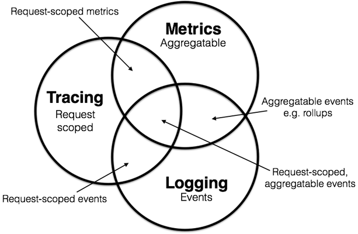

## 1. 可观测性的由来

随着分布式架构渐成主流，[可观测性](https://en.wikipedia.org/wiki/Observability)（Observability）一词也日益频繁地被人提起。最初，它与[可控制性](https://en.wikipedia.org/wiki/Controllability)（Controllability）一起，是由匈牙利数学家 Rudolf E. Kálmán 针对线性动态控制系统提出的一组对偶属性，原本的含义是“可以由其外部输出推断其内部状态的程度”。这一说法足够抽象，以致于我们很难理解这个词是如何在计算机相关领域。我采取的策略是：调研目前火热（和蹭热度）的开源项目和商业项目，看看在他们的视角下，可观测性在是什么，接着我们就可以总结其中涉及的关键技术，并谈谈我对可观测性还能怎么蹭的一些未来构想。

## 2. 不同视角下的可观测性

### 2.1 分布式追踪（Distributed Tracing）下的可观测性

#### 概念定义

现代分布式链路追踪公认的起源，是Google 在2010 年发表的论文[《Dapper : a Large-Scale Distributed Systems Tracing Infrastructure》](https://research.google/pubs/pub36356/)，为了解决如何理解和推理大规模分布式系统的行为和性能问题，从跟踪工具出发从而建设了一个监控平台。

> 一个简单的案例是，如果当前一个用户请求需要经过A->B->C三个微服务，用户反馈请求超时，我们要如何快速地了解是A/B/C三个服务中的哪个出现了问题？A/B/C三个服务的稳定性、错误率如何？一个简单的想法是，如果能把跟踪一个用户请求在A/B/C三个服务的调用过程，以及每个服务的执行情况，都记录下来，那么我们就可以通过分析这些数据来解决上述问题，这就是分布式追踪的基本思想。

目前，学术界一般会将可观测性分解为三个更具体方向进行研究，分别是：[事件日志](http://icyfenix.cn/distribution/observability/logging.html)、[链路追踪](http://icyfenix.cn/distribution/observability/tracing.html)和[聚合度量](http://icyfenix.cn/distribution/observability/metrics.html)，这三个方向各有侧重，又不是完全独立，它们天然就有重合或者可以结合之处，2017 年的分布式追踪峰会（2017 Distributed Tracing Summit）结束后，Peter Bourgon 撰写了总结文章[《Metrics, Tracing, and Logging》](https://peter.bourgon.org/blog/2017/02/21/metrics-tracing-and-logging.html)系统地阐述了这三者的定义、特征，以及它们之间的关系与差异，受到了业界的广泛认可。

- 日志（Logging）：日志的职责是记录离散事件，通过这些记录事后分析出程序的行为。在大量节点、服务的情况下，这将产生大量的日志，因此，日志的收集、存储、分析都是一个很大的挑战。
- 追踪（Tracing）：单体系统时代追踪的范畴基本只局限于[栈追踪](https://en.wikipedia.org/wiki/Stack_trace)（Stack Tracing），即断点的形式。微服务时代，追踪就不只局限于调用栈了，一个外部请求需要内部若干服务的联动响应，这时候完整的调用轨迹将跨越多个服务，同时包括服务间的网络传输信息与各个服务内部的调用堆栈信息。与“全链路追踪”、“[分布式追踪](https://opentracing.io/docs/overview/what-is-tracing/)”（Distributed Tracing）为同义词。追踪的主要目的是减少排除故障的时间，让程序员可以快速定位问题。
- 度量（Metrics）：度量是指对系统中某一类信息的统计聚合。度量的主要目的是监控（Monitoring）和预警（Alert），如某些度量指标达到风险阈值时触发事件，以便自动处理或者提醒管理员介入。

#### 开源标准

[OpenTelemetry](https://opentelemetry.io/)合并了OpenTracing和OpenCensus项目，提供了一组API和库来标准化遥测数据的采集和传输。OpenTelemetry提供了一个安全，厂商中立的工具，这样就可以按照需要将数据发往不同的后端。其最重要的是数据格式[OTel](https://opentelemetry.io/docs/specs/otel/overview/)和其中间件[OTel Collector](https://opentelemetry.io/docs/collector/)支持。

[OpenMetrics](https://openmetrics.io/)基于Prometheus Exposition格式的基础上进行了一些改进，并增加了一些新功能（它们称之为“实施标准”，因为Prometheus的成功）。在**Metrics**方向上，OpenTelemetry与OpenMetrics有一定同类竞争的关系。但由于OpenTelemetry通过标准格式OTel和中间件OTel Collector，因此也可以提供与OpenMetrics的兼容性（体现在对Prometheus后端的支持）。除此之外OpenTelemetry 主要是为推送而设计的，而 OpenMetrics 则是为拉动而设计的，尽管 OpenMetrics 规范同时考虑了推送和拉动机制，这也是Prometheus原本就有的设计。

#### 开源产品

日志收集与分析系统：

- ELK技术栈：ELK是Elasticsearch、Logstash、Kibana三大开源框架首字母，通过Logstash采集并发送数据，存储到Elasticsearch这一分布式搜索引擎中，通过Kibana提供前端易用的界面
- Clickhouse+kafka替换Elasticsearch+Kibana，提供更好的查询性能，filebeat替换Logstash提供更好的采集性能
- 由于Log有很大的历史包袱，OpenTelemetry对Log的[各语言SDK](https://opentelemetry.io/docs/concepts/signals/logs/#language-support)支持还不完善，但其协议设计结合了分布式追踪的要求，是未来的发展方向

分布式跟踪系统：

- [jaeger](https://github.com/jaegertracing/jaeger): uber开源，原生支持OpenTelemetry格式，支持GRPC进行查询交互，有一个供搜索的简单UI
- [zipkin](https://github.com/openzipkin/zipkin): twitter开源，OpenTelemetry Collector支持，Java系常用，有比较好的可视化系统
- [skywalking](https://github.com/apache/skywalking): 华为捐献给apache，不仅提供链路追踪，也提供一些微服务的度量指标因此其与上面两个不同，是通过OpenTelemetry receiver支持OTel的格式以接入链路追踪的能力，而不是由OpenTel提供支持

度量系统：

- [prometheus](https://prometheus.io/): 目前已经是度量系统的事实标准了，目前看没有比较能打的替代方案。用户可以自定义metrics指标，然后在grafana中创建可视化仪表盘，或者直接使用Prometheus的查询器进行查询

#### 商业对标

目前最闪亮的是Datadog公司，它为云端软件的基础设施提供全维度的检测服务，上至最顶端的应用程序，到中间的 Kubernetes／Docker／Hypervisor，到操作系统，以及中间的数据库，第三方服务等全栈的性能监测。

在Datadog出现之前，企业每个团队之间是各自为政，互相割裂的。Datadog乘了公有云、微服务之风，为云上企业提供可观测性平台和服务，Datadog 试图做到的是将企业原本的十几个到最多几十个互相割裂的 IT 监测系统整合成一个，既提高监控效率，又降低企业的 IT 支出。

与之竞争的主要是APM 的服务商（Cisco（AppDynamics），New Relic，Dynatrace），和云平台服务商提供的类似服务。个人认为Log 管理服务商（Splunk 和 Elastic）是其供应商，目前重点竞争在trace和metrics上，Log是一个具有很大历史包袱的问题，很难有新的创新和大的变动。

#### 学术研究

分布式追踪相关议题，TDB

### 2.2 云原生网络（CNF）可观测性

#### 概念定义

> https://lib.jimmysong.io/blog/cloud-native-network-functions/

- 云原生网络不是另一种方式的 SDN，它以一种完全不同的方式来看待网络。
- 虽然 SDN 似乎是把物理网络和机器做了虚拟化，但「云原生网络功能」（Cloud-native Network Functions，下文简称 CNF）不仅仅是容器化的网络和虚拟机，它还将网络功能分割成服务，这是 CNF 与 SDN 的一个主要区别。
- CNF 是 OSI 网络模型中的网络功能（越底层实现起来就越困难），这些功能是根据云原生实践实现的。
- 虽然 SDN 数据平面（这里指的是转发数据包）位于硬件 ASIC 上，或在传统内核网络转发的虚拟化盒子里，但 CNF 探索用户平面转发或更新的 eBPF 数据路径转发。
- 在云原生数据中心中，偏向于三层的解决方案，但 CNF 的一大驱动力是电信服务提供商，他们经常下降到二层的功能。

**CNF不是另一种SDN**，而是以一种完全不同的方式来看待网络。从某种意义（技术实现）上说，CNF 与 SDN 一样，都是基于软件而非硬件的解决方案，**这方便了基于软件的SDN公司的转型，即电信服务提供商**。但云原生网络有一套全新的非功能要求，与 SDN 不同。云原生的非功能要求优先考虑弹性，并推而广之，自动化也比 SDN 多得多。

#### 开源标准

正如上文提到的，我们可以将其看作是一种分布式追踪的应用场景，因此OpenTelemetry也可以作为其标准。

#### 开源产品

与分布式追踪类似不同，CNF的开源产品主要是基于eBPF技术，实现零侵入式的观测，不需要在应用中插入代码。而这同样导致了其在可观测性方面的局限性。

- [Cillium生态](https://cilium.io/): Cillium使用eBPF技术解决CNI网络问题，在此之上提供对服务的可观测性。在此之上构建的[Hubble](https://github.com/cilium/hubble)项目，提供了对服务的依赖跟踪、运维报警、应用监测、安全视图等等功能。其提供了针对OpenTelemetry的适配器。
  
- [DeepFlow](https://deepflow.io/): DeepFlow是[云杉网络](https://yunshan.net/)开发的一款可观测性产品，基于eBPF技术对系统内部进行观测，旨在为复杂的云基础设施及云原生应用提供深度可观测性。其探针支持OpenTelemetry格式。其应用调用链追踪、网络时序等功能需要商业版。其母公司原业务是SDN服务，其通过DeepFlow为用户提供更加细粒度的支持，帮助定位网关、基础设施、客户业务的故障和性能问题。
  

> DeepFlow发文表示相比和Hubble自己的优势很大功能很强，在我看来其是用社区+商业方案+服务对比开源版本的功能，并不是很平等：https://zhuanlan.zhihu.com/p/615790142

#### 学术研究

CNF、安全相关议题，TBD

### 2.3 数据治理与可观测性

> https://www.kdnuggets.com/2022/08/data-governance-observability-explained.html

#### 概念定义

数据可观测性是最近刚刚被提出来的词，目前对这个词聊的最多的是[DataBand](https://databand.ai/)公司（总部在以色列特拉维夫），其在2022年被IBM收购，其将数据治理中“更快地发现数据在哪个环节出了问题”作为可观测性的定义，由此发展它的一整个平台，从而对数据ETL、数据治理全流程的观测。其实现方式和分布式追踪的方式类似，通过在数据流中插入探针，收集数据流中的元数据，通过其平台分析以此快速寻找到数据流中的问题，从而为用户提供价值。

另一家公司monte carlo也将对数据生命周期每个阶段全面了解数据的健康状态定义为数据可观测性，并用数据治理的概念来描述整个系统：https://www.montecarlodata.com/product/data-observability-platform/

> 在DataBand的demo的演讲里，可以明显看出他们做的是数据治理和数据基础设施结合（DataOps）：https://www.youtube.com/watch?v=lmiLSgnptBs

我们可以认为，目前数据可观测性（Data observability）的概念就是用全流程、持续性地收集数据信息、测试数据等数据治理手段来实现数据治理的目标——数据质量的持续观测和改善，将数据可观测性作为一种技术手段和解决方案，将得到一个系统/平台，以逐渐实现该目标，同时支持快速发现数据问题，减少平均处理时间。

#### 关键领域

> 微软在其中介绍了关键领域和成熟度模型，可以看作是下一阶段数据治理服务的新方向：https://learn.microsoft.com/en-us/azure/cloud-adoption-framework/scenarios/cloud-scale-analytics/manage-observability

大多数数据平台都在数据可观测性的这些关键领域运行：

- 数据平台服务监控
- 数据管道性能监控
- 数据质量监控
- 数据脉络
- 数据发现

端到端数据可观察性不仅包括捕获事件和测量所有这些组件的指标，还包括关联这些事件和指标。这样就能全面了解企业数据环境的健康状况和可靠性。

#### 开源标准

N/A

#### 学术研究

数据库、数据治理相关议题，TBD

## 3. 关键技术总结

- **以OpenTelemetry为基础的可观测性架构**：OpenTelemetry为目前的开源生态提供了标准化的数据格式、API接口方式，可以支持不同开源项目或商业项目与其对接，并允许其自定义自己的数据属性。**目前看到的所有项目都有相关工程和方法与OpenTelemetry结合，其已经成为当前开放生态的标准**

> 传统的 APM 无法实现真正的可观测性：一方面插桩行为已经修改了原程序，逻辑上已无法实现原程序的可观测性；另一方面云原生基础设施组件越来越多，基础服务难以插桩导致观测盲点越来越多。实际上，插桩的方式在金融、电信等重要行业的核心业务系统中几乎无法落地。eBPF 由于其零侵扰的优势，避免了 APM 插桩的缺点，是云原生时代实现可观测性的关键技术。—— [DeepFlow: eBPF是实现可观测性的关键技术](https://deepflow.io/zh/ebpf-the-key-technology-to-observability)

- **以eBPF技术为基础的无侵入探针**：eBPF和应用程序的代码之间划上了一道清晰的界限，使得我们能在不对应用程序做任何修改的前提下，通过获取外部数据就能确定其内部状态。**目前看到新一代的观测系统/平台都是以eBPF作为核心技术进行开发的**

## 4. 可观测性的新视角探索

### 4.1 为“X”赋予可观测性，X还可以是什么？

#### 安全可观测性：构建于可观测性上的安全运营与态势感知

> https://www.dynatrace.com/news/blog/data-privacy-by-design/

云原生数据库等新兴概念的出现，大大消除了大家对于存储成本方面的顾虑，使得企业可以更聚焦于提升观测能力本身，而不必在成本和性能方面分神，这方面的发展也有迹可循。比如今年 DataDog 推出了一个名为哈士奇的存储架构，它是一个完全云原生面向可观测性的数据库，得益于云原生的存储能力，可以在同等价格下多存储 5-10 倍数据，以往即使收集到了海量的数据，但面对高昂的存储成本，这些数据也只能被丢弃或者针对这些数据进行采样，本质上看，这对客户需要的结果也是有浪费的。但这也并不意味着使用这种新技术之后并不需要进行采样，只是新的更低成本更高性能的数据库技术，可以大大提升可观测性能够覆盖的范围，降低存储成本，这也是一个很重要的发展。

安全和可观测性的合并，已在全球范围内形成一种趋势。摩根士丹利在《安全分析和可观测性》文章中也提到，在国外，以 DataDog 为代表的公司在上市之后发布的新增功能中有 70% 都是安全相关的，这其中的道理非常简单，可观测性是通过检查其输出来衡量系统内部状态的能力，它收集了系统的方方面面，通过这些数据可以分析出系统的故障，自然也就能够分析出系统有没有被入侵。比如 DataDog 就提供了通过分析当前访问请求，区分哪些可能是黑客在嗅探，或者准备未来做 DDoS 攻击的接口的功能。

> 可观察性工具不仅能够处理系统问题，如记录事件和活动，收集、跟踪、捕获和分析数据和性能行为，甚至在系统性能偏离预期水平时发出警报。这些工具在保护企业重要数据安全方面的能力更上一层楼。可观察性工具可以监控系统日志和指标，以发现可能表明存在安全威胁的异常活动。例如，如果用户试图访问他们没有权限访问的资源，可观察性工具就会对这些行为进行标记。此外，可观察性工具还能识别黑客可能利用的漏洞。为此，它可以监控网络流量，帮助检测不安全的通信协议或未加密的数据，并跟踪内部用户活动，确保员工没有参与未经授权或可疑的行为。在发生潜在的安全漏洞时，可观察性工具可以实时了解潜在事件，使公司能够快速做出反应。—— https://www.computer.org/publications/tech-news/trends/addressing-observability-ethical-concerns

也就是说，采集的数据在安全方面也能够发挥作用，而不像传统安全工具那样，需要针对安全场景再进行一次数据采集。所以，安全和可观测性的合并在全球范围内已经成为一种趋势，当然抗 DDoS 、挖防火墙这些并不会合并，针对攻击现场的追踪，比如国内的态势感知、国外的 SIEM 这些安全产品都选择了和可观测性进行融合。

#### 业务可观测性：互联网业务至上视角下的可观测性

> https://www.infoq.cn/article/v5r45xkttvizcieg6ffs

可观测性的概念起源于工业领域，在该领域中，可观测性被定义为从系统外部输出推断系统内部健康状态的能力；在软件产品和服务领域，可观测性就是从应用系统中收集尽可能多的遥测数据，以便可以调查和解决新出现的复杂问题，确保企业能够主动观察系统，在影响客户体验之前解决故障及问题，安全地进行测试并实施优化，它可以更好地管理和控制业务风险，有助于我们了解“正在发生什么”以及“为什么会这样”。可观测性使团队能够更有效地监控现代系统，帮助他们找到并连接复杂链中的影响，并将其追溯到原因。此外，它还使系统管理员、IT 运营分析师和开发⼈员能够了解他们的整个架构。

如今的 IT 系统，迭代发布更迅速，业务系统更庞大，网络链路更复杂，运行环境更动态。在“业务至上”的互联网时代，技术工程师们保障的核心其实并不是这套 IT 系统或软件，他们保障的核心其实是业务，一笔业务可能会涉及到多个微服务系统，技术工程师们不再追踪一个 API 的全链路调用关系，而是要追踪到整个 API 关联的订单、用户甚至具体到哪一笔交易，这也是可观测性和业务结合的一个重要发展趋势。Gartner 也提到，“未来一切业务皆需可观测性”，简单地讲就是把运营人员、运维人员、IT 人员看到的数据做统一，而不是互相甩锅。

#### 数据使用可观测性：数据分享视角下的可观测性

数据分享是具有重要意义的，其通过数据流通的方式，让数据的价值最大化。由于监管、隐私、商业秘密等考虑，许多研究都关注于在数据分享的过程中，如何保护数据的隐私性、安全性（机密性），从而提出了[Data Station](https://arxiv.org/abs/2305.03842)的数据托管方式，[联邦学习](https://en.wikipedia.org/wiki/Federated_learning)的机器学习算法方式，[同态加密](https://en.wikipedia.org/wiki/Homomorphic_encryption)的加密计算方式，[TEE](https://en.wikipedia.org/wiki/Trusted_execution_environment)的硬件加密方式，以及各种各样的一体化解决方案。这与微服务初期人们开始考虑如何让业务跑起来是类似的，而如何了解到数据分享的过程中，数据被使用的情况，则是数据分享视角下的可观测性需要考虑的。

了解数据被使用的情况有如下好处：

- 隐私政策的实现：用户可以更细粒度地了解、授权自己的数据被使用的手段，从而更好地保护自己的隐私
- 数据使用的监管：数据的使用情况可以被监管机构进行监管，从而保证数据的合法使用
- 数据合约的实现：数据的使用情况可以被记录下来，从而可以实现数据的合约，如数据的使用次数、使用时间、使用范围等等，同时促进数据价值评估的发展

> 我将在[逆转思路：从数据可计量到数据可控](https://wh1isper.github.io/2023/10/30/2023-10-31-%E5%AE%9A%E4%B9%89%E6%95%B0%E6%8D%AE%E4%BD%BF%E7%94%A8%E5%8F%AF%E8%A7%82%E6%B5%8B%E6%80%A7/)中详细聊聊这一系统概念和系统应该如何实现，以及其是如何与目前的数据分享方法相结合的

### 4.2 从符号主义到连接主义：可观测性与LLM

目前，可观测性展现出符号主义的特征，基于目前已有技术对系统遥测信息等内容进行采集、存储、处理，通过人为地对系统进行分析，对业务进行总结的方式，创建出可视化的仪表盘、规划和实现告警系统、建立供人分析的链路，通过上述流程，我们建立起了一个可观测系统，基于此对问题进行快速定位和解决。我们会发现，这个过程中需要富有经验的SRE人员、高级的开发人员共同参与，其困难和投入是巨大的，这也从侧面显示了相关服务商地价值（DeepFlow、isovalent等公司就是提供了帮助用户优化系统的服务，就如同商业数据库一样）。

> DeepFlow提供的用户案例：https://deepflow.io/zh/ebpf-the-key-technology-to-observability

这种情况在运营类的技术活动中屡见不鲜，从安全运营的经验来看，微软基于LLM推出的[Microsoft Security Copilot](https://www.microsoft.com/en-us/security/business/ai-machine-learning/microsoft-security-copilot)为安全团队提供了一个可以持续学习、快速高效的助手，能够让团队更快地处理更多地威胁情报。从这一角度出发，将遥测信息输入LLM大模型，让大模型帮助人们对信息进行提炼，对系统进行分析，对业务进行总结，从而提供更加高效高质量的可观测性，是一个值得探索的方向。

> 在这一回答中，我们看到了类似的观点：中国有没有类似splunk、datadog这种类型的公司吗？ - 共识粉碎机的回答 - 知乎 https://www.zhihu.com/question/355794555/answer/3178453725

## 5. 总结：可观测性是将复杂系统白盒化的过程

可观测性在应用层上的主要应用：分布式追踪的领域，已经趋于成熟，形成了以OpenTelemetry为基础的行业统一标准。基础设施层面，依托云原生的蓬勃发展，从CNF出发，基于eBPF技术对云原生中的基础设施和服务提供观测，是目前蓬勃发展的热点。

从复杂系统的白盒化角度出发，我们可以发现仍有许多角度等待探索，如数据治理、LLM等等。这些领域的探索，将会为我们提供更多的机遇。
