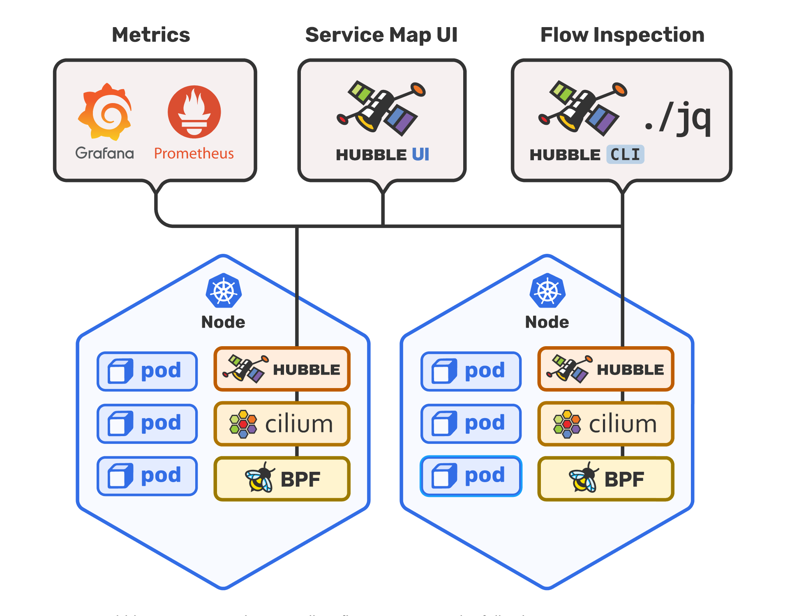

## 1. 可观测性的由来

随着分布式架构渐成主流，[可观测性](https://en.wikipedia.org/wiki/Observability)（Observability）一词也日益频繁地被人提起。最初，它与[可控制性](https://en.wikipedia.org/wiki/Controllability)（Controllability）一起，是由匈牙利数学家 Rudolf E. Kálmán 针对线性动态控制系统提出的一组对偶属性，原本的含义是“可以由其外部输出推断其内部状态的程度”。这一说法足够抽象，以致于我们很难理解这个词是如何在计算机相关领域。我采取的策略是：调研目前火热（和蹭热度）的开源项目和商业项目，看看在他们的视角下，可观测性在是什么，接着我们就可以总结其中涉及的关键技术，并谈谈我对可观测性还能怎么蹭的一些未来构想。

## 2. 不同视角下的可观测性

### 2.1 分布式追踪（Distributed Tracing）下的可观测性

#### 概念定义

现代分布式链路追踪公认的起源，是Google 在2010 年发表的论文[《Dapper : a Large-Scale Distributed Systems Tracing Infrastructure》](https://research.google/pubs/pub36356/)，为了解决如何理解和推理大规模分布式系统的行为和性能问题，从跟踪工具出发从而建设了一个监控平台。

> 一个简单的案例是，如果当前一个用户请求需要经过A->B->C三个微服务，用户反馈请求超时，我们要如何快速地了解是A/B/C三个服务中的哪个出现了问题？A/B/C三个服务的稳定性、错误率如何？一个简单的想法是，如果能把跟踪一个用户请求在A/B/C三个服务的调用过程，以及每个服务的执行情况，都记录下来，那么我们就可以通过分析这些数据来解决上述问题，这就是分布式追踪的基本思想。

目前，学术界一般会将可观测性分解为三个更具体方向进行研究，分别是：[事件日志](http://icyfenix.cn/distribution/observability/logging.html)、[链路追踪](http://icyfenix.cn/distribution/observability/tracing.html)和[聚合度量](http://icyfenix.cn/distribution/observability/metrics.html)，这三个方向各有侧重，又不是完全独立，它们天然就有重合或者可以结合之处，2017 年的分布式追踪峰会（2017 Distributed Tracing Summit）结束后，Peter Bourgon 撰写了总结文章[《Metrics, Tracing, and Logging》](https://peter.bourgon.org/blog/2017/02/21/metrics-tracing-and-logging.html)系统地阐述了这三者的定义、特征，以及它们之间的关系与差异，受到了业界的广泛认可。

- 日志（Logging）：日志的职责是记录离散事件，通过这些记录事后分析出程序的行为。在大量节点、服务的情况下，这将产生大量的日志，因此，日志的收集、存储、分析都是一个很大的挑战。
- 追踪（Tracing）：单体系统时代追踪的范畴基本只局限于[栈追踪](https://en.wikipedia.org/wiki/Stack_trace)（Stack Tracing），即断点的形式。微服务时代，追踪就不只局限于调用栈了，一个外部请求需要内部若干服务的联动响应，这时候完整的调用轨迹将跨越多个服务，同时包括服务间的网络传输信息与各个服务内部的调用堆栈信息。与“全链路追踪”、“[分布式追踪](https://opentracing.io/docs/overview/what-is-tracing/)”（Distributed Tracing）为同义词。追踪的主要目的是减少排除故障的时间，让程序员可以快速定位问题。
- 度量（Metrics）：度量是指对系统中某一类信息的统计聚合。度量的主要目的是监控（Monitoring）和预警（Alert），如某些度量指标达到风险阈值时触发事件，以便自动处理或者提醒管理员介入。

#### 开源标准

[OpenTelemetry](https://opentelemetry.io/)合并了OpenTracing和OpenCensus项目，提供了一组API和库来标准化遥测数据的采集和传输。OpenTelemetry提供了一个安全，厂商中立的工具，这样就可以按照需要将数据发往不同的后端。其最重要的是数据格式[OTel](https://opentelemetry.io/docs/specs/otel/overview/)和其中间件[OTel Collector](https://opentelemetry.io/docs/collector/)支持。

[OpenMetrics](https://openmetrics.io/)基于Prometheus Exposition格式的基础上进行了一些改进，并增加了一些新功能（它们称之为“实施标准”，因为Prometheus的成功）。在**Metrics**方向上，OpenTelemetry与OpenMetrics有一定同类竞争的关系。但由于OpenTelemetry通过标准格式OTel和中间件OTel Collector，因此也可以提供与OpenMetrics的兼容性（体现在对Prometheus后端的支持）。除此之外OpenTelemetry 主要是为推送而设计的，而 OpenMetrics 则是为拉动而设计的，尽管 OpenMetrics 规范同时考虑了推送和拉动机制，这也是Prometheus原本就有的设计。

#### 开源产品

日志收集与分析系统：

- ELK技术栈：ELK是Elasticsearch、Logstash、Kibana三大开源框架首字母，通过Logstash采集并发送数据，存储到Elasticsearch这一分布式搜索引擎中，通过Kibana提供前端易用的界面
- Clickhouse+kafka替换Elasticsearch+Kibana，提供更好的查询性能，filebeat替换Logstash提供更好的采集性能
- 由于Log有很大的历史包袱，OpenTelemetry对Log的[各语言SDK](https://opentelemetry.io/docs/concepts/signals/logs/#language-support)支持还不完善，但其协议设计结合了分布式追踪的要求，是未来的发展方向

分布式跟踪系统：

- [jaeger](https://github.com/jaegertracing/jaeger): uber开源，原生支持OpenTelemetry格式，支持GRPC进行查询交互，有一个供搜索的简单UI
- [zipkin](https://github.com/openzipkin/zipkin): twitter开源，OpenTelemetry Collector支持，Java系常用，有比较好的可视化系统
- [skywalking](https://github.com/apache/skywalking): 华为捐献给apache，不仅提供链路追踪，也提供一些微服务的度量指标因此其与上面两个不同，是通过OpenTelemetry receiver支持OTel的格式以接入链路追踪的能力，而不是由OpenTel提供支持

度量系统：

- [prometheus](https://prometheus.io/): 目前已经是度量系统的事实标准了，目前看没有比较能打的替代方案。用户可以自定义metrics指标，然后在grafana中创建可视化仪表盘，或者直接使用Prometheus的查询器进行查询

#### 学术研究

分布式追踪相关议题，TDB

### 2.2 云原生网络（CNF）可观测性

#### 概念定义

> https://lib.jimmysong.io/blog/cloud-native-network-functions/

- 云原生网络不是另一种方式的 SDN，它以一种完全不同的方式来看待网络。
- 虽然 SDN 似乎是把物理网络和机器做了虚拟化，但「云原生网络功能」（Cloud-native Network Functions，下文简称 CNF）不仅仅是容器化的网络和虚拟机，它还将网络功能分割成服务，这是 CNF 与 SDN 的一个主要区别。
- CNF 是 OSI 网络模型中的网络功能（越底层实现起来就越困难），这些功能是根据云原生实践实现的。
- 虽然 SDN 数据平面（这里指的是转发数据包）位于硬件 ASIC 上，或在传统内核网络转发的虚拟化盒子里，但 CNF 探索用户平面转发或更新的 eBPF 数据路径转发。
- 在云原生数据中心中，偏向于三层的解决方案，但 CNF 的一大驱动力是电信服务提供商，他们经常下降到二层的功能。

**CNF不是另一种SDN**，而是以一种完全不同的方式来看待网络。从某种意义（技术实现）上说，CNF 与 SDN 一样，都是基于软件而非硬件的解决方案，**这方便了基于软件的SDN公司的转型，即电信服务提供商**。但云原生网络有一套全新的非功能要求，与 SDN 不同。云原生的非功能要求优先考虑弹性，并推而广之，自动化也比 SDN 多得多。

#### 开源标准

正如上文提到的，我们可以将其看作是一种分布式追踪的应用场景，因此OpenTelemetry也可以作为其标准。

#### 开源产品

与分布式追踪类似不同，CNF的开源产品主要是基于eBPF技术，实现零侵入式的观测，不需要在应用中插入代码。而这同样导致了其在可观测性方面的局限性。

- [Cillium生态](https://cilium.io/): Cillium使用eBPF技术解决CNI网络问题，在此之上提供对服务的可观测性。在此之上构建的[Hubble](https://github.com/cilium/hubble)项目，提供了对服务的依赖跟踪、运维报警、应用监测、安全视图等等功能。其提供了针对OpenTelemetry的适配器。

- [DeepFlow](https://deepflow.io/): DeepFlow是[云杉网络](https://yunshan.net/)开发的一款可观测性产品，基于eBPF技术对系统内部进行观测，旨在为复杂的云基础设施及云原生应用提供深度可观测性。其探针支持OpenTelemetry格式。其应用调用链追踪、网络时序等功能需要商业版。

#### 学术研究

CNF、安全相关议题，TBD

### 2.3 数据治理与可观测性

> https://www.kdnuggets.com/2022/08/data-governance-observability-explained.html

#### 概念定义

数据可观测性是最近刚刚被提出来的词，目前对这个词聊的最多的是DataBand公司（总部在以色列特拉维夫），其在2022年被IBM收购，其将数据治理中“更快地发现数据在哪个环节出了问题”作为可观测性的定义，由此发展它的一整个平台，从而对数据ETL、数据治理全流程的观测。其实现方式和分布式追踪的方式类似，通过在数据流中插入探针，收集数据流中的元数据，通过其平台分析以此快速寻找到数据流中的问题，从而为用户提供价值。

#### 开源标准

N/A

#### 学术研究

数据库、数据治理相关议题，TBD

## 3. 关键技术总结

- **以OpenTelemetry为基础的可观测性架构**：OpenTelemetry为目前的开源生态提供了标准化的数据格式、API接口方式，可以支持不同开源项目或商业项目与其对接，并允许其自定义自己的数据属性。**目前看到的所有项目都有相关工程和方法与OpenTelemetry结合，其已经成为当前开放生态的标准**
- **以eBPF技术为基础的无侵入探针**：其已经成为无侵入式的基础

## 4. 可观测性的新视角探索

### 4.1 为“X”赋予可观测性，X还可以是什么？

### 4.2 从符号主义到连接主义：可观测性与LLM

## 5. 总结：可观测性是将复杂系统白盒化的过程

符号主义

连接主义
