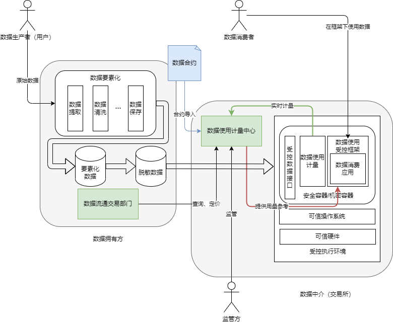

> 数据可控可计量是目的，数据可用不可见是其中的一种技术手段。目前，数据可用不可见的技术不能完全满足数据可控可计量的目的。 —— 《数据要素化100问:可控可计量与流通交易》

## 1. 数据使用可控可计量是什么

数据“使用可控可计量”是指管控数据流通使用的具体目的、方式和次数，保障数据流通使用安全、合法、合规，使数据流通可控与可监管。“可控”主要是管控数据的具体使用目的、方法和次数，避免数据流通使用风险；“可计量”要求数据使用可以量化，使数据要素按贡献参与分配具有可操作性。同时，可计量为监管方发现数据滥用行为、持有方履行数据安全责任义务、使用方自证其清白、可能的受害方举证其收到的伤害和损失创造了条件。

## 2. 数据可用不可见的技术手段

数据可用不可见，主要使用到隐私保护计算技术（Privacy-Preserving Computation Technologies，简称隐私计算技术，国外也有隐私增强技术 - Privacy Enhancing Technologies的类似说法）。其主要特点在于，**数据流通的不再是明文数据本身，而是其计算价值**。多方数据在流通的过程中，每方都不暴露自己的明文数据，只把计算结果给到需求方。

这类技术主要包括安全多方计算（Secure Multi-Party Computation，SMPC）、同态加密（Homomorphic Encryption，HE）、可信执行环境（Trusted Execution Environment，TEE）、联邦学习（Federated Learning，FL）、差分隐私（Differential Privacy，DP）、数据脱敏（Data De-Identification）、仿真数据（Synthetic Data）等。

隐私计算通常被冠以能够实现“数据可用不可见”的称号，解决数据流通信息暴露的难题。同时，随着现代密码学和现代计算机技术的不断发展，隐私计算技术也会结合智能合约和区块链等技术，有效控制数据的使用目的、方式和次数，从而解决数据流通中的“不可控”第二大难题。智能合约技术是用计算机语言取代了法律语言记录条款，并由程序自动化执行的合约，具有数字化、可机读等特点，但无法篡改。从理论上来说，通过智能合约执行的隐私计算相关算法，则可以保证程序不见数据，数据使用可控可计量。但现实是，智能合约还远远无法执行目前数据使用的计算密集型、算力依赖型需求，目前所有的数据使用成果，包括大模型、数据分析等等技术，都需要针对智能合约和隐私计算进行深度改造，甚至有很大部分应用场景还没有相关技术支撑。

因此，在等待智能合约+隐私计算技术的成熟之前（鉴于技术复杂度，我认为或许永远都不会有那一天），我们需要寻找另外的角度实现数据使用可控可计量。

## 3. 从可计量的角度出发实现数据使用可控

### 问题

从目前已有的方案来看，人们往往从数据使用可控出发，例如：针对隐私场景的深度学习训练，人们针对数据本身 vs 深度学习的模型及其参数的关系出发，提出了参数/模型动、数据不动的联邦学习技术。再从这种技术的基础上，发展对于数据使用的计量。这样做的缺点十分明显，就是数据使用计量的维度、细粒度等等细节在每个场景下都需要重新设计，而且很难做到通用。反过来，一个没有被广泛应用的计量技术，也无法满足监管方、数据持有方、数据使用方的需求。

这在某种程度上导致了基于数据可用不可见的技术实现了特定场景下数据使用可控，但数据持有方仍然不敢、不愿支持数据流通的现状——数据使用计量的不完整。

### 启发

分布式可观测性的发展过程给了我们一个新的视角：首先是基于业务的日志及日志收集系统，后来随着分布式服务的发展，人们开发了一系列系统和工具对分布式链路进行追踪，对系统进行指标收集，形成了日志、追踪、指标三大方向；近年来，基于OpenTelemetry这一开放标准，以及eBPF无插桩观测技术，越来越多的无感知的、针对不同方面的可观测系统和软件被开发出来，形成了一个完整的可观测性生态。而基于这一完整的可观测性生态，人们可以从可观测性的角度对态势感知、安全等方面进行颠覆性变革。

> 可观测性相关发展可以参考我的另一篇博客[可观测性行业发展与机遇](https://wh1isper.github.io/2023/10/29/2023-10-30-%E5%8F%AF%E8%A7%82%E6%B5%8B%E6%80%A7%E8%A1%8C%E4%B8%9A%E5%8F%91%E5%B1%95%E4%B8%8E%E6%9C%BA%E9%81%87/)

从数据使用可控可计量的角度而言，我们目前已有了在部分场景下可以实现数据使用可控的技术，但是缺乏对数据使用可计量的相关研究，导致数据使用可计量成为了数据使用可控技术的附加内容。而从可观测性的角度出发，我们可以将数据使用可计量作为一个独立的技术方向，设计可计量方面的标准，从可计量的角度实现数据使用可控，则有以下优势：

- 从可计量的角度出发，可以将数据使用可控的技术方案进行**通用化**，联邦学习、同态加密、差分隐私等等技术方案都可以在可计量的基础协议上进行改造，从而实现数据使用可控。
- 不必依赖于智能合约技术，可以使用现有的技术方案
- 与数据使用前、后的操作（如数据治理、数据确权）等联动，形成一个完整的数据使用生态

### 架构

## 4. 一种可能的未来方向

在上一阶段的探索中，已经有类似的整合型、一体化解决方案出现：如数据沙箱、国际数据空间（IDS），但其主要解决的是数据流通的安全问题，而非数据使用的可控可计量问题。未来的技术方向，可能是基于eBPF的无探针观测技术，结合OpenTelemetry框架，提供针对数据使用的追踪类型，实现针对数据使用的可观测性，达到数据使用可计量的目的。数据受控使用将根据对数据使用的计量进行细粒度的控制，从而实现数据使用可控；这并不意味着数据使用可计量的重要性在数据使用可控之上，而是将二者同等看待，协同工作，相互依赖，因为数据使用的计量系统，往往也依赖于数据受控使用环境的支持。

## 5. 补充：为什么需要数据使用可控可计量

>我国已经将数据上升为生产要素，其主要原因在于，当今世界数字经济规模逐渐上升，国内数字产业飞速发展。在这一前提下，我们发现互联网平台之间的数据垄断现象开始凸显，逐渐限制了基于数据的数字经济的整体发展。数据对生产效率的乘数效应，主要作用于三个方面：效率倍增、资源优化和投入替代，Chat-GPT为首的大模型就是对简单重复工作的一种通用投入替代。
> 数据要素化的本质是流通，流通是数据进入社会化大生产并成为数据要素的必要条件。通过法律法规，国家想要让数据自由有序地流向应用、流向更多地企业组织、流向不同地行业和低于、流向社会生产和人民美好生活需要的地方。

目前，数据流通的朴素方式是明文数据的复制和传播。由于明文数据几乎没有复制成本，以这种方式流通数据面临许多不可控的因素。这导致了数据持有方“不愿流通”和“不敢流通”。明文数据流通从信息学和经济学的角度看，存在两大核心障碍。

- 信息学角度： 数据的价值在于其承载的信息不对称性，即“我知道，你不知道”，但通过复制明文方式传播，则将数据信息完全暴露出去，变成了“我知道，大家都知道”，这一过程就导致了**数据自身价值的灭失**。明文数据流传地越快越广，其价值反而降低得越快。在这一情况下，数据拥有方将**失去对该数据的控制**，无法管控该数据再复制之后得使用目的、方式和次数，也无法厘清双方之间的“责、权、利”。
- 经济学角度：数据的无限复制和传播，边际成本几乎为0，从理论上说，就会造成无限的供应和无限的需求，则违背了市场供需定价的稀缺性原理，导致数据价格约等于零，即数据不再稀缺，也就无法进行定价，则数据无法通过市场方式进行大规模流通。

因此，数据实现流通，有两大核心问题需要解决：

- 数据在流通过程中信息泄露的问题： 可通过各类”可用不可见“技术进行解决
- 数据流通不可控问题：所谓可控，是对其使用目的、方式和次数进行管控，这是一个更高层次的问题，需要从数据的使用角度出发进行解决。

数据流通不可控问题对应的即是数据可控可计量，”可计量“要求数据使用可以量化，使得数据要素按贡献参与分配具有可操作性。同时，可计量为监管方发现数据滥用行为、持有方履行数据安全责任义务、使用方自证其清白、可能的受害方举证其收到的伤害和损失创造了条件。
