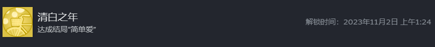

> 本文涉嫌剧透，但个人认为剧透并不怎么影响游戏体验，毕竟我也是看了一大堆剧透之后才开始玩的
> 本文可能涉及一部分过度解读，纯属本人脑子一热，异想天开

《完蛋！》讲述的就是一个众美女环绕，争着抢着和男主谈恋爱的故事。而第一人称扮演的主角顾易，只不过是一个远走他乡、身负债款且工作屡屡碰壁的“失败者”。光这句话本身就已经很科幻了，开发团队也将游戏称为“大型科幻爱情片”。

据蓝鲸财经报道，资深游戏玩家Bruce是最早体验该游戏的玩家之一，他认为《完蛋》本质是男性向的乙女游戏，Bruce告诉记者：它的游戏性并不好，人物不够立体、情节也经不起推敲，“玩完以后，我甚至不知道作为男主的‘我’顾易，他的魅力在哪里。”

> 以上内容摘自：每日经济新闻： https://www.stcn.com/article/detail/1020568.html

我完全认同包括Bruce在内的大部分网友的评价，从现实角度出发，这就是一个魅男的、自恋的、片面化的男性向乙女游戏，就如同日剧男主只会亚萨西一样让人摇头。但我在男主躺在兄弟老六的床上的时候，忽然发现，或许这是一位普通工友的白日做梦。从这个角度出发，似乎一切都合理了起来。

> 以下开始为本人的过度解读环节

## 重新叙述这个故事

男主是老六的舍友，没上过大学，中专毕业后就来到城里工作，工作内容无非是画展小时工、保安、服务员。那天，他躺在床上，昏昏欲睡，做了一个梦。

梦里的场景是他之前当小时工的画展现场，在梦中他和两个在画展中亮眼的妹子产生了互动：郑梓妍和李云思，梦中的自己和郑搭讪去喝酒，和李赏画表现出自己的鉴赏能力，又在喝醉了之后打电话给李。接着开始了一系列故事。在梦中的场景里，他变成了一个受过艺术教育，成长环境较好，有绘画天赋的人，但是因为自己生意失败而负债累累。

从这一视角，剧中的荒唐之处从粗糙的逻辑漏洞变为了若即若离的设计：

- 现实中，郑梓妍和李云思两人或许根本没有联系，因为在后续的剧情里也没有看出来他们俩之间有很熟悉的关系
- 男主根本不懂画，他只是一个受过中专教育（或者义务教育）的底层打工人，他对艺术和艺术家的理解在于那些风流故事，就和抖音上的五分钟了解xxx，你真的了解xxxx一样离谱。李云思会欣赏男主说的东西，本质上是男主梦里的自恋
    - 看到李云思的未完画作时却没有相关评价，反而开始给人家按摩，李云思反而更喜欢他了
    - 男主在包下店之后无法开张、糊弄记者、自我放弃，从正面视角来看是不能理解的自暴自弃，没什么好怜悯的，但从梦的视角看，男主根本没有相关体验，如果强行带入，则其中的不自然会让男主很快醒来
    - 从男主作画之类的剧情，包括和肖鹿一起画画也可以看出他对这类创作没有感觉
    - 男主若真有天赋，真的会一些作画，应该有李云思线，走三色绘恋男主邱诚的路子（这就是另一个烂故事了）
    - 李云思或许才是那个陪她看展的人，男主在现实里一直都是一个保安，只是想象这一段故事
- 男主的生意经大概率是道听途说，其可以训斥李总不懂做生意，摆出一道自己很懂的样子，做销售又直接业绩垫底抬走
    - 要么这是男主眼高手低，要么就是这一切都来自于零碎信息的拼凑，好像“当老板很简单”的成功学，一转眼又是“龙王赘婿，女总裁倒贴司机”的爽文
- 男主可能在酒吧当过服务员，看过很多男男女女喝的烂醉然后被其他光鲜亮丽的人带走，将这一剧情代入到了自己
- 男主可能有的现实体验是和当年暗恋的对象翻栅栏，这一场景投射到了肖鹿身上
- 男主可能没有过比较高级的恋爱体验，这也是为什么没有和李云思结合的结局的原因，李云思应当是脱离了其接触的低级趣味的无法想象对象，最多是隐藏结局中的“逃婚”，最终也是落到了郑梓妍类似的浪漫剧情，在这里郑梓妍和李云思成为了一类人。
- 父亲的缺位，似乎只有青梅竹马沈彗星的父亲与男主的父亲有联系，但是到底发生了什么，是大幅度的留白
- 男主可能真的有一个沈彗星，只不过自己才是那个沈彗星，而沈彗星是自己求而不得的对象，如果男主选择青梅竹马线，实际上是对自己渴望的投射
- 单亲妈妈倒贴纯属爽文剧情，好像是“为了孩子”，但是实际上是“为了屏幕前的观众”（或者为了做梦的人）爽一下的春梦剧情

## 本我的映射

> 借用弗洛伊德之观点，不代表我认为其机械唯物主义是正确的
> 搜到一篇分析龙王爽文的，有类似：https://zhuanlan.zhihu.com/p/181426773

- **代表浪漫，性感，放浪形骸的郑梓妍**：男主并不知道那些酒吧里的富姑娘的生活是怎么样的，但是从那些短视频里，她们喜欢到处玩、到处旅行，她们喜欢酒吧买醉、蹦迪，喜欢尽情玩乐。在梦里给自己创造一个这样少女，迷恋自己，而自己也可以顺势成为平时自己羡慕的，陪着这些姑娘的人。
- **代表理性、阶级，高级趣味的李云思**：男主只在那些高级趣味的场所看到过她们，而男主在潜意识里以为自己看到的那些艺术家的风流趣事，耍嘴皮子可以赢得她们的欢心，她们还会无条件地支持自己。本质上是男主的自卑，同时也不理解、不愿理解，最终以“看不起艺术”的方式退出，又幻想自己能够以“一厢情愿”挽回，而自恋的最高峰是“逃婚”的隐藏结局（甚至埋了一个高中就是网友的伏笔）
- **代表纯真、无邪、青春的肖鹿**：这或许是男主最无忧无虑的一段时光，也或许是男主不曾有过的时光，在自己十七八岁的年纪，和一个同样青春的女孩感受青春的魅力，畅想以后的生活，用自己的双手规划自己的生活，两个人平平淡淡地走下去。我倾向于这是男主最现实的渴望，但他一个底层工作，又能奢望什么青春靓丽大学生呢？
- **代表童年渴望的、无法触及的沈彗星**：沈彗星的倒贴映照出男主在童年的自卑，这或许和其父亲的缺位有关，这个角色也是唯一和其父亲有关联的人。无尽的自卑带来了无尽的幻想，最后童年梦中的那个女孩成了自己的舔狗，自己也通过这种爱慕东山再起，这才补偿了自己的童年阴影。
- **代表色欲、自恋的林乐清：色欲剧情**，附带大和抚子属性，大男子主义，无聊
- **代表虚荣、物质的钟甄**：爽文剧情，资本主义软饭，无聊
