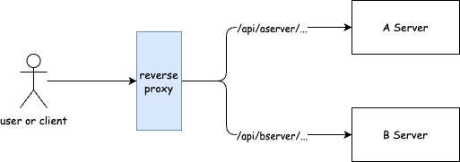
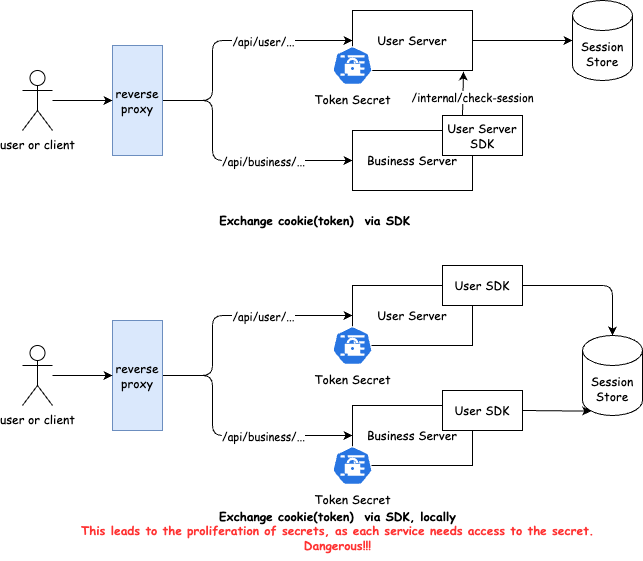
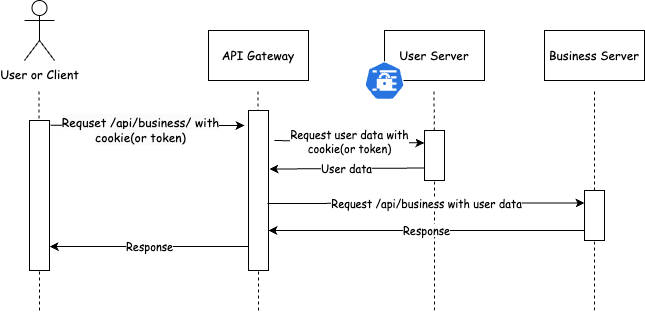

## Introduction about API Gateway

> I'm currently working on writing blog posts in English. If anything is unclear, feel free to leave a comment.

When building microservices, we often use a reverse proxy to expose different services through a single endpoint, which just looks like this:

In practical, we usually design the user system separately from the core business system and manage user login status using a cookie-session approach. Cookies are typically stored in an encrypted format on the client side, and decrypting them requires a server-side secret. In this kind of architecture, an internal HTTP request is often needed to convert the cookie into plaintext user information for use by the business system.

This means that every service within the business system needs to implement an HTTP request and handle potential failures of the user system. While we could address this by providing a unified SDK, which would shift the challenge to SDK implementation and library management, the concept of a service mesh offers an alternative solution.

By leveraging an API Gateway, we can centralize this process and effectively manage user authentication across services. Additionally, an API Gateway has the advantage of enabling permission management, auditing, and observability for each API route. However, I don't plan to go into detail about these aspects in this blog post.

The only task we need to undertake is moving the work previously handled by the User Server SDK into our reverse proxy. Before forwarding requests to the business system, the reverse proxy converts the cookie into plaintext user data and injects it into a specific request header. This way, the business system can directly access the user data and respond accordingly.

## Why OpenResty?

If you're already familiar with Nginx, you likely know that it allows custom logic in the proxy process through Lua scripts. OpenResty builds on this by integrating a set of Lua libraries with Nginx. With OpenResty, you can implement cookie exchange without significantly modifying the existing Nginx configuration—just by writing a simple Lua script.

You should consider using OpenResty when the following conditions apply:

- You have previous experience with Nginx or are already using it.
- You're looking for a lightweight API gateway that doesn’t need complex features but can handle user authentication efficiently.

When you need more advanced features like circuit breaking, retries, or rate limiting, you might want to consider a service mesh or an enterprise-level API gateway, such as Kong or Traefik.

## The Implementation(WIP)

> You can find the source code of this post in [Github](https://github.com/Wh1isper/openresty-api-gateway-example)

Here, I plan to provide a production-ready implementation example. While it may be somewhat complex, it ensures a high level of security.
