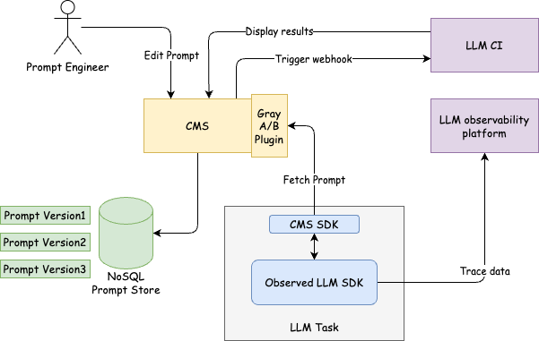

In the [previous article](https://blog.wh1isper.top/2024/12/14/2024-12-15-human-in-loop/), I discussed what and why we need prompt management CMS. In this blog, I want to dive deeper into the role of Prompt CMS in LLM-driven products and explore some design principles and real-world architectures.

## Design principles

Let’s recap the key points from our last post:

- **Usability**: Look for an intuitive admin panel suitable for managing prompts.
- **API-first design**: Supports REST or GraphQL for integration.
- **Versioning**: Support multiple versions of prompts.

We might need additional work to address the following issues:

- **Dynamic Prompt Distribution**: Ensuring prompts can be dynamically delivered to various systems and environments with minimal latency.
- **Version Control and Rollbacks**: Managing multiple versions of prompts, enabling easy rollbacks in case of errors or poor performance.
- **A/B Testing and Experimentation**: Supporting experimentation to evaluate the performance of different prompts under various conditions.
- **Scalability and High Availability**: Ensuring the system can scale to handle high traffic and remain operational during peak demand.
- **Integration with LLM Observability Tools**: Providing insights into how prompts impact LLM outputs and enabling fine-tuning.
- **Security and Access Control**: Safeguarding sensitive prompts and controlling who can access or modify them.

Let’s set aside security requirements for now and focus purely on functional implementation:

1. **Dynamic Prompt Distribution**:

   - Implement a centralized repository for prompts.
   - Use APIs to fetch prompts in real-time based on context or conditions.
   - Introduce caching mechanisms to reduce latency and improve responsiveness.

2. **Version Control and Rollbacks**:

   - Store prompt versions in a database with metadata like timestamps and change logs.
   - Build a user interface to browse, compare, and restore previous versions.

3. **A/B Testing and Experimentation**:

   - Add a configuration module to define testing groups and criteria.
   - Develop logic to randomly assign requests to different prompt versions.
   - Collect and analyze feedback or performance metrics for each variant.

4. **Integration with LLM Observability Tools**:

   - Enable logging and tracking of prompt performance (e.g., response accuracy, user satisfaction).
   - Provide hooks or APIs for LLM observability platforms to gather metrics directly.

5. **Extensibility and Modularity**:
   - Design the system as a modular framework, with components like prompt management, delivery, and observability as separate but integratable services.

By focusing on these core functionalities, the platform can deliver a flexible and developer-friendly toolset to optimize prompts in LLM-driven workflows.

## Let's build it together

Among these, 3 (A/B Testing and Experimentation), 4 (Integration with LLM Observability Tools), and 5 (Extensibility and Modularity) are optional features that can be implemented through future engineering efforts.

For now, the focus should be on building a solid foundation with the following:

1. **Dynamic Prompt Distribution**: Ensuring efficient and real-time delivery of prompts.
2. **Version Control and Rollbacks**: Providing a reliable mechanism to manage and revert prompt changes.

For a better user experience, we need to support local debug and upload in CMS SDK, in which they can debug, test, and upload prompts directly.

## Adding all components

For continuous integration, we can use webhook to trigger a new integration for LLM tasks. It may be a series of metrics tests to test the metric scores of this version of prompt or parrallelly generate many projects for many scenarios. In this stage, we don't need local debug and upload in CMS SDK cause we can use webhook to trigger a new integration and the number of scenarios we need to test does not allow us to test in local way.

For LLM observability tools, we only need to replace the native LLM SDK to _Observed LLM SDK_ for automated data collection.

For A/B Testing and Experimentation, we can add a new module to define testing groups and criteria, in plugin way.
