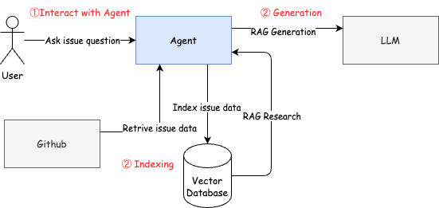

After getting used to using ChatGPT and other LLMs for assistance, I’ve found that GitHub’s Issue search functionality has become increasingly difficult to use. People often struggle to describe the issues they encounter, simply using error messages as titles. At the same time, when searching for issues, I find it hard to search effectively by describing the problems and requirements I’m facing. This forces me to resort to external search engines like Google, but even then, the results aren’t always satisfactory.

So, why not equip the LLM with knowledge about issues and have it help us find the information we need?

## Architecture

I’m planning to build a GitHub Issue search assistant based on RAG (Retrieval-Augmented Generation), with the following architecture. If necessary, it could have internet access.

## User Case: Searching for Issue Solutions by Describing the Problem

### Scenario:

A user encounters a problem during development, such as an error or unexpected behavior in their code or a tool they are using. Instead of searching through GitHub Issues manually or relying on vague error messages, they describe the problem in natural language to the search assistant and get back relevant issue reports, possible solutions, or related discussions.

---

### Steps for the User:

1. **User Input:**
   The user enters a natural language query describing the issue they are facing. For example:

   - _"I’m getting a TypeError when trying to call a function from a third-party library."_
   - _"The application crashes after I update the dependency, with no clear error message."_

2. **Query Understanding & Preprocessing:**

   - The system preprocesses the user query to identify key information, such as error messages, affected components (e.g., function, library, dependency), and context.
   - The query is broken down into more structured elements like:
     - Error type (e.g., TypeError)
     - Library or tool name
     - Context of the issue (e.g., after updating a dependency)

3. **RAG Model (Retriever):**

   - The retriever searches GitHub Issues (either locally indexed or via the internet) for relevant discussions, bug reports, or solutions.
   - The model looks for matching keywords, error types, and similar scenarios that align with the user’s problem description.
   - It could also look for mentions of similar libraries, dependencies, or technologies.

4. **RAG Model (Generator):**

   - Once relevant issues are retrieved, the generator processes this information and synthesizes potential solutions or insights.
   - For example, the model could return:
     - A list of GitHub issues that mention the same error or dependency.
     - Step-by-step solutions or workarounds mentioned in the issues.
     - Common causes and fixes related to the error.
     - Related discussions or pull requests that may contain useful fixes.

5. **Final Output:**
   - The assistant returns a summary of the relevant GitHub Issues or solutions, including:
     - Links to specific issues or PRs.
     - Direct solutions or fixes suggested by the community.
     - Possible troubleshooting steps based on similar problems.
   - Example output:
     - _"Found 5 related issues: Issue #12345 suggests updating the library to version 2.0.1 to resolve the TypeError."_
     - _"Issue #67890 provides a workaround for the crashing issue when updating dependencies. It suggests downgrading to version 1.5.3."_

---

### Example Interaction:

**User:**
_"I'm getting a TypeError when trying to call a function from the `axios` library after upgrading to version 0.21.0. Has anyone else faced this?"_

**Search Assistant Output:**
_"I found 3 related issues:_

- _Issue #1123: A user reported a similar TypeError after upgrading to version 0.21.0. Suggested fix: Downgrade to version 0.20.0._
- _Issue #2456: Another user encountered the same problem but resolved it by updating their Node.js version. See solution here: [Link]._
- _Issue #3764: A temporary workaround was proposed involving setting a custom timeout. Full details here: [Link]._

_Additionally, pull request #1245 includes a patch that addresses this error in version 0.21.1."_

---

### Benefits:

1. **Efficiency**: The user does not need to sift through countless issues manually or interpret error messages alone.
2. **Context-Aware Results**: The assistant understands the problem context and brings back solutions that are directly relevant.
3. **Real-Time Updates**: If the system has internet access, it can pull the latest discussions or solutions, ensuring the user gets the most current and accurate information.
4. **Enhanced User Experience**: Instead of relying on vague search terms, the user interacts with the system in natural language, making it more intuitive and faster to get solutions.

## User Case: Searching for Issues Based on Desired Features or Requirements

### Scenario:

A user wants to implement a specific feature or solve a problem, and instead of manually searching through documentation or repositories, they describe their desired functionality or requirement to the search assistant. The system then checks if there are any existing GitHub Issues or discussions related to that need.

---

### Steps for the User:

1. **User Input:**
   The user enters a natural language query describing the feature or requirement they want to implement. For example:

   - _"I need to implement role-based access control in my app using Node.js."_
   - _"I want to automate the process of deploying Docker containers through GitHub Actions."_

2. **Query Understanding & Preprocessing:**

   - The system processes the query to extract key concepts, such as the desired feature (e.g., "role-based access control", "automated Docker deployment") and relevant technologies or frameworks (e.g., "Node.js", "GitHub Actions").
   - The system identifies the components that are part of the desired feature, such as:
     - Feature type (e.g., role-based access control, automated deployment)
     - Technology stack (e.g., Node.js, Docker, GitHub Actions)
     - Any specific constraints or requirements mentioned (e.g., "automated", "through GitHub Actions")

3. **RAG Model (Retriever):**

   - The retriever searches through GitHub Issues or external sources (if enabled) for discussions or issues that mention or relate to the desired feature.
   - The model looks for related use cases, previous feature requests, and ongoing work related to the requested feature.
   - It retrieves issues where similar functionalities have been proposed, discussed, or even partially implemented.

4. **RAG Model (Generator):**

   - After retrieving relevant issues, the generator synthesizes the information to provide detailed insights, suggestions, or solutions.
   - It could return:
     - Links to issues or pull requests discussing similar requirements.
     - Steps or methods that have been tried by others to implement similar features.
     - Discussions of potential problems or limitations when implementing the feature.
     - Best practices or workarounds shared by the community.

5. **Final Output:**
   - The assistant returns a summary of the related GitHub Issues, including:
     - Links to specific discussions or feature requests.
     - Suggested solutions, methods, or code snippets shared by other users.
     - Possible blockers or considerations to keep in mind.
   - Example output:
     - _"Found 4 related issues: Issue #2345 discusses implementing role-based access control using `passport.js` with Node.js. You may find it useful. See solution here: [Link]._
     - _"Issue #4567 proposes a GitHub Actions workflow for automating Docker deployments. Here’s the detailed guide: [Link]."_

---

### Example Interaction:

**User:**
_"I want to implement role-based access control in my Node.js application where users can have different levels of access to specific routes. Has anyone already done this?"_

**Search Assistant Output:**
_"I found 3 related issues:_

- _Issue #1024: A user has implemented role-based access control with `passport.js` and `express` in Node.js. Suggested implementation here: [Link]._
- _Issue #3345: Another user shared a Node.js middleware for handling role-based access. Here’s the code: [Link]._
- _Issue #5789: This issue discusses the challenges of implementing granular access control in a multi-role environment with Node.js. See the discussion: [Link]._

_Additionally, pull request #4567 includes a comprehensive approach to handling different user roles with specific route permissions in Express."_

---

### Benefits:

1. **Feature Discovery**: Instead of manually searching for how to implement a feature, the user can describe their needs and let the assistant find relevant discussions.
2. **Context-Aware Search**: The system understands the requested feature in the context of the technology stack, making the results more accurate and tailored.
3. **Real-Time Collaboration**: Users can immediately tap into community-driven discussions, solutions, and pull requests that may already contain code snippets or strategies.
4. **Saves Time**: The assistant cuts down the time spent browsing documentation, reading through multiple issues, and figuring out if others have faced similar challenges.
5. **Learning from the Community**: The assistant brings together solutions, workarounds, and best practices shared by others, offering a wealth of knowledge for users trying to implement new features.
