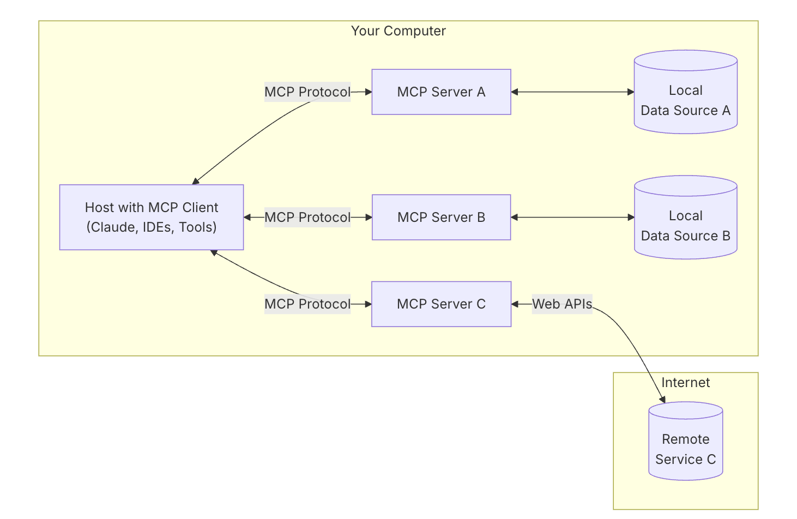

最近在研究 Agent 系统，重新整理了一下 Agent 相关的发展和实现，有两个认识，记录一下

## AIOS 互联基础研究：MCP 协议

我们在开发 Agent 的过程中会发现，基于开发者定义的 Function Call 模式缺乏灵活度，人们必须要在获得 Agent 源代码的情况下，才能根据自己的数据进行二次开发。这也就导致了各种 Agent 实际上是封闭的，无法从外部有效获得自定义数据的。

为此，人们考虑将通过 Function Call 获取并操作数据这件事进行依赖倒转，从 Agent 内部实现变为将 Server 注册进 Client 中，Host（如 Claude Desktop）将 Client 中注册的 Server 作为 Function Call 的目标，从而实现数据的获取和操作。

> MCP 协议的提出者 Anthropic 还有一些安全性和合规性的考虑，可以参考 MCP 的[Introduction](https://modelcontextprotocol.io/introduction)，但我认为这是架构设计带来的好处，因为人们可以将 Server 部署在本地，从而实现数据不出域

## AIOS 自进化

就算有了 MCP 协议加持，LLM 仍然有可能无法正确地执行某些困难任务，因为 MCP 只能提供数据的操作性，而复杂的业务逻辑，包括各种冲突条件、竞争、数据一致性等，都需要进一步地编程技巧解决。在这方面，人们想要使用类似[Devin](https://devin.ai/)的 AI 自主化方案解决，即通过一个 Agent 来编写、测试、修改代码，从而实现软件的自进化。

但我认为，这将把生产软件的上限限制在 Devin-like Agent 的实现以及 LLM 底层能力上，而 Agent 的能力仍然来自于程序员，所以，如果我们可以将 Agent 也作为一种软件，使用一种针对 Agent 进行自进化的方式，类似“左脚踩右脚”的方式，那么我们就可以实现 AIOS 自进化。

Outstanding Paper (NeurIPS 2024 Open-World Agent Workshop): [Automated Design of Agentic Systems](https://arxiv.org/abs/2408.08435)就设计了这样的一个系统，类似 AutoML 的思路，使用一个 Meta Agent 对 Agent 的实现进行搜索（Coding），从而达到比手工编写 Agent 更有效的架构和实现。
