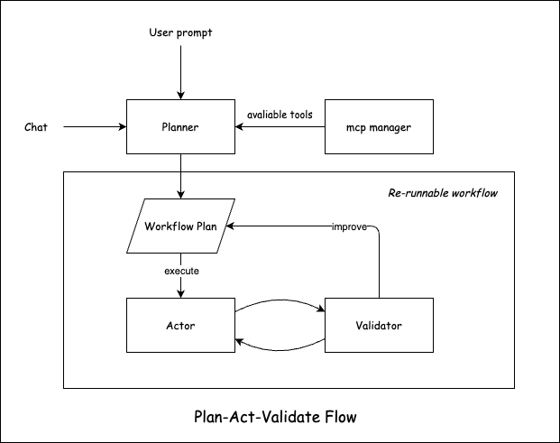

> More agents is all you need.

## Architecture

After researching the agent designs of products like [Cline](https://github.com/cline/cline) and [Nanobrowser](https://github.com/nanobrowser/nanobrowser), it is evident that the current state-of-the-art approach involves dividing agent responsibilities to form a fully automated workflow. Drawing inspiration from Cline’s workflow, I aim to retain human-in-the-loop design at the Plan stage, use a validator to make corrections during the Act stage, and finally update and record (possibly revise) the Plan.

## Key Points

Some key design considerations:

1. **Plan versioning, readability, and user interaction**
2. **Overall state transitions**
