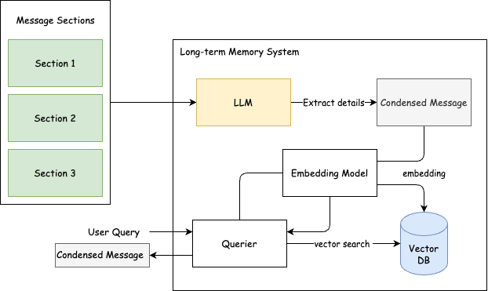
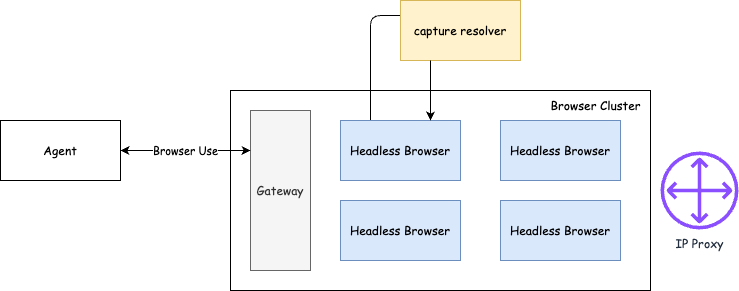
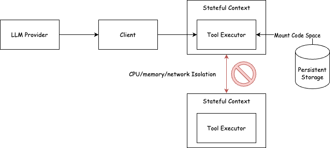

记录一些最近调研的 Agent 系统的架构。

## Long-term Memory System

参考[Mem0](https://github.com/mem0ai/mem0)和[AWS Bedrock AgentCore Memory](https://github.com/awslabs/amazon-bedrock-agentcore-samples/blob/main/01-tutorials/04-AgentCore-memory/02-long-term-memory/01-single-agent/using-strands-agent-memory-tool/culinary-assistant.ipynb)，长期记忆一般是 LLM 蒸馏用户消息，形成浓缩消息和对应 embedding，从而支持语义化检索。

核心组件：

- LLM：浓缩消息
- Embedding：对浓缩消息进行Embedding并支持语义化检索
- Vector Database：Embedding的索引，支持快速检索

## Browser-use Tool & System Design

参考[browser-use](https://github.com/browser-use/browser-use)进行工具设计，并针对工作负载进行优化。

核心设计：

- Browser Tool设计
  - 基础的操作有打开、滑动、点击等
  - 更复杂的是2FA、验证码等自动化操作，可能需要更细节的工具封装和工程化解析工作
  - 有时可以总结某些网页为流程，通过AI进行启发式测试，再通过非AI的方式重放以提高效率
- 无头浏览器的负载分离和安全隔离
  - 页面内容不受信任，可能存在恶意代码
  - 页面可能存在bug，导致资源耗尽
  - 控制爆炸半径，当浏览器崩溃时，只影响当前用户的浏览器实例
- 与反爬虫手段对抗：capture resolver、ip proxy等

## Code Execution Sandbox

与LLM的交互只需要全量的消息历史作为上下文，LLM会返回两类响应：`Tool Call Request`（工具调用）和`Text Message`（文本消息），而相对应的，Client需要对`Tool Call Request`进行处理，并将结果返回给LLM，暂且称之为`Tool Result Response`。Client处理则是依赖于“假设的环境”中，例如我们假设Agent运行在某台Linux机器上，并为LLM提供了编写代码和执行代码的工具，则Client在处理工具调用时，需要维护这个假设的环境的一致性：即编写了代码执行的时候，需要正确地执行代码并返回结果。此外，Client还需要关注工具的副作用，执行代码是一个非常好的例子，当两个用户在同一台机器上执行代码，则可能会互相影响，因此对于有副作用的工具调用，我们需要设计合理的隔离和沙箱机制。

而其他工具，比如搜索、浏览器等工具，则大部分不需要维护环境的一致性，则可以认为他们是无状态的。

为了更高的资源利用率和用户体验，我们需要同时解决隔离环境的启动速度和资源利用率的问题，目前有两种架构选择：

- gVisor：定制化内核路线，更好性能但更多网络/系统调用限制，可能需要定制化开发
- Firecracker：vm(kata container)技术路线，开箱即用，更好的兼容性，但启动速度较慢一些（对比gVisor）

这里不展开细节，不使用runC(docker)的原因是其容易受到内核漏洞的影响，且启动速度较慢（1-10s）级别，在初期可以考虑使用runC进行PMF，但在后期需要考虑替换。
