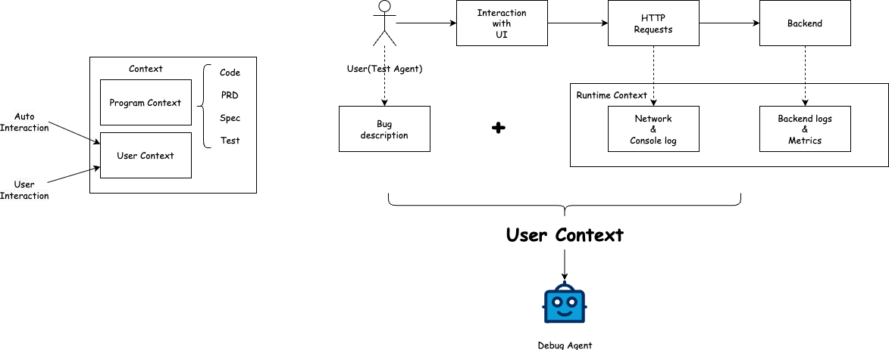

简单记录一些对于Debug Agent的思考，与Coding Agent不同，Debug Agent需要包含更多的环境感知，需要更多的细节设计

## Context

Debug Agent应当由三个重要部分组成：用户上下文、程序上下文和自动化交互方案

### 用户上下文

当人们深入地使用Agent进行编程的时候，常常陷入debug困难的境地，表现为：

1. 很难描述自己遇到了什么问题，一种方案是进行截图或者录屏，然后交给一个有视觉、甚至可以处理视频（一般而言webp或者gif也可以）的agent来分析解决
2. 很难给出问题栈，比如点击某个按钮之后，http请求出错了，如何把问题提交给Agent进行解决

我希望通过“用户上下文”来描述此类场景，对应用户在使用产品的过程中遇到的bug和各种现象，也包括了运行时产生的各种上下文

### 程序上下文

程序上下文实际上是Agent来理解软件的工程，软件不仅仅是代码组成，还包括了对代码业务的理解和说明，类似所有Spec-drive开发，对于需求文档、技术选型、代码仓库的长短期记忆与规划和代码本身构成了程序上下文。Agent基于对程序上下文进行决策，理解和解决问题。

### 自动化交互方案

自动化交互方案是自动化测试在Agent上的实现，通过Agent进行交互来自动化地获取“用户上下文”。通过不同细粒度的自动化交互方案设计，如Browser use/Unit test/End-to-end test都对应了不同的用户上下文收集方式。

## 工作流程

## 发展阶段

我们分方面来看，程序上下文其实和Coding Agent基本一致，主要问题是保持软件开发过程中的文档和知识能够持续传承和更新；用户上下文与自动化交互相辅相成，是Debug Agent的重点。

### 程序上下文

第一阶段，引入最基本的记忆文件，类似AGENTS.md, CLAUDE.md，记录项目的重要信息

第二阶段，结构化记忆，使用或结合memory文件夹/RAG/抽取等方案，自动地存取用户对项目的一些要求、用户的偏好

第三阶段，规范驱动，结合用户体验一起，设计交互模式来推进产品需求、设计、功能开发和测试的全套程序上下文记忆存储

### 用户上下文与自动化交互

第一阶段，我们可以设计一系列工具（交互），让用户尽可能简单的反馈正确的用户上下文，同时集成一些简单的自动化交互来进行测试，比如截图、单元测试支持。目前看到良好的用户交互有：
- 截图标注
- gif/webp录屏

第二阶段，我们将设计一系列采集工具，对用户交互的运行时上下文进行自动化收集和分析，与分布式系统追踪类似，例如：
- network & console日志自动捕获
- 后端日志自动化收集
- 其他指标监控

第三阶段，我们需要自动化交互，并为自动化交互构建收集系统，这是自动化测试和监控的进阶，需要为LLM特别优化的输出才能得到足够好的效果
