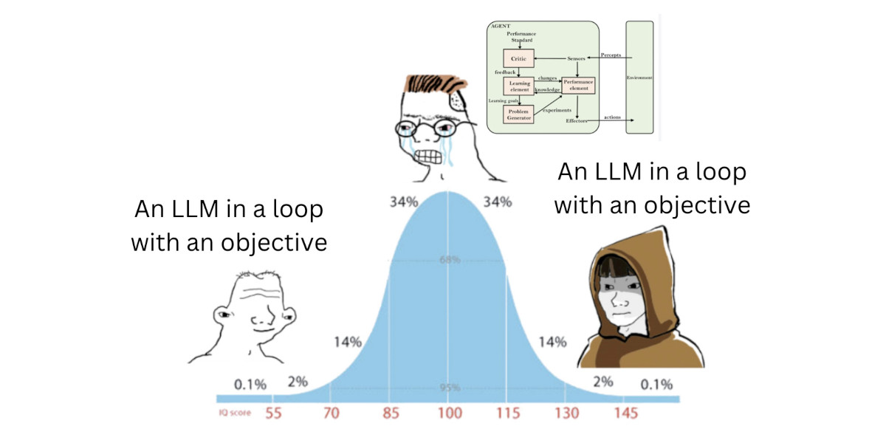

是时候思考如何构建一个可扩展的云原生Coding Agent系统了。

## Agentic Workflow

自[Claude code](https://www.claude.com/product/claude-code)横空出世，人们越来越倾向于采用一个[简单的定义](https://simonwillison.net/2025/Sep/18/agents/)来描述Agent：大型语言模型在循环中自主使用工具来完成某个目标。

## Agent Design Considerations

鉴于大模型的消息是无状态的，我们很容易拆分出LLM消息和工具实现两部分，MCP协议给了我们这样的一个example，通过streamable http或者本地stdio的方式，基于JSONRPC对工具定义进行分离。

接下来，我们很自然地思考，工具本身是否是有状态的？这就回到了Agent所针对的目标中。对于Coding Agent来说，其所处环境应是与人类程序员编程时使用的环境一样的开发环境，由以下组成：

- 代码和相关文件，或者说repo
- 运行时及运行依赖（编译和调试容器、其他已部署的服务、数据库、本地需要安装的调试库等等）

Agent本质上是在通过工具与上述两个环境进行交互，我们可以得出这样的描述：Agent通过不变的工具对环境进行改变，从而获得观察（observation），再指导其下一步动作。

这里及引出两个问题：

1. 工具一定是同步执行的吗？
2. 环境如何与Agent消息进行同步？

## Async Tool Calling(and other jobs)

大多数API都允许Tool Response与User Message同时包含在一次请求中，只需要满足Tool Call和Tool Response在一次LLM请求和响应之间是成对出现的即可。因此，我们可以通过User Message，或包装Tool Response来提醒Agent哪些任务已经完成可以再次获取，或者将其他的系统异步任务添加到消息中。

另一种方式是让Agent直接管理异步任务，但由于自动压缩等上下文管理策略，我们需要确保Agent不会忘记已经启动的任务，并观测其结果

## Sync Message and Environment

现在，我们需要将消息和环境进行绑定，如果我们想在任意时刻进行回滚重试，那么对于每一次工具调用都对应了一个环境快照，当这一依赖影响到数据库等不一定能回滚的资源时，我们就必须针对这类资源进行特别设计。

基于不同的开发模式，我们可以为用户提供不同程度的重试和回滚策略，从最基本的staging环境+prod环境，再到通过脚本自动创建本地环境模拟等等方式，一种思路是通过Infrastructure as code (IaC)+unit test的方式，使用脚本来确保开发环境的可重现，另一种思路则是在基础设施层就支持这一特性。而针对Agent消息，我们可以通过各类durable execution的基础设施来实现，搭配RPC Tool Calling，实现Agent消息的编排，具体可以参考：

- https://temporal.io/blog/what-is-durable-execution
- https://langchain-ai.github.io/langgraph/concepts/durable_execution/#using-tasks-in-nodes
- https://ai.pydantic.dev/durable_execution/overview/

## User experience

用户体验通常是Agent系统设计忽略的一环，实际上工具调用可能长时间的无法流式输出，特别是编辑特别大的代码文件时，这会造成很大的用户体验问题。**良好的用户体验常常可以让用户享受创作和解决问题的过程，而非仅仅交付物本身**。我认为我们可以通过拆解工具调用的流式阶段，再通过一个非常轻量化的模型来进行流式输出，以提供流畅、易懂的用户体验。如果我们将异步任务视为一个消息系统，则可以考虑“Agent发起任务” - “Agent等待任务完成” - “任务已完成，等待Agent响应” - “Agent正在处理响应并进行下一步”的循环流程，而不是只能向用户展示“Agent调用工具中” - “Agent调用工具完成”的序列，用户也可以更清楚的了解系统的工作流程。
