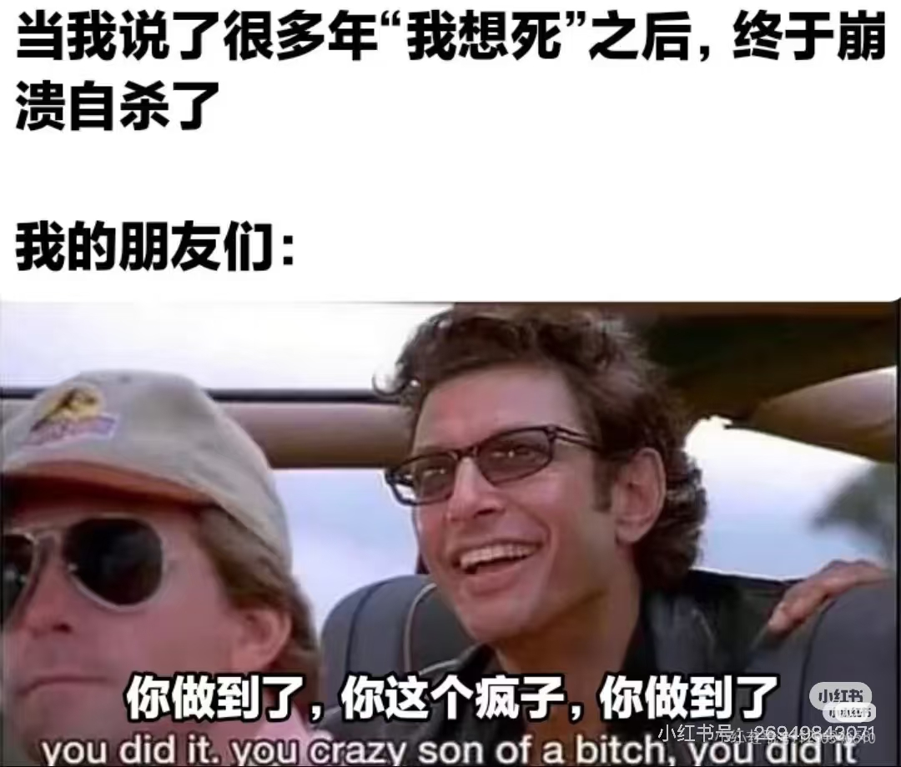
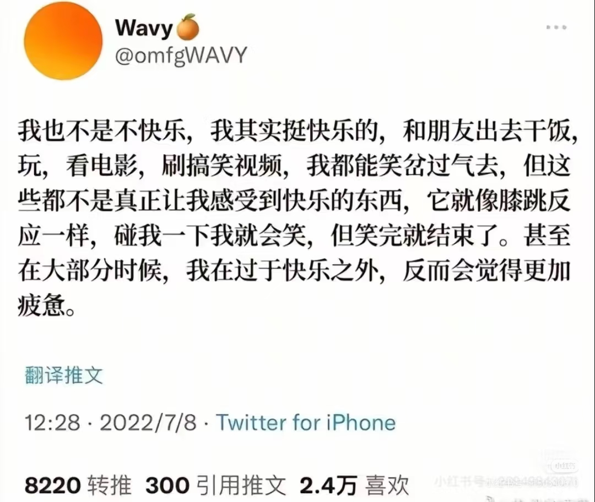

> 当我开始搜索死亡时，我开始平静下来了。

我是一个自认为有严重焦虑症和抑郁症的人，之所以没有确诊，是因为我在自己去麦当劳买冰淇淋这件事上都觉得不安，我想人生中的很多事，或许我都没有力量面对。也许这与你看到的我完全不一样，不用怀疑，那是假扮的我。

从小我是一个迟钝的人，是一个胆小的人，我总是装作自己强大，用想象中的自己来面对困难，总是欺负那些抱有善意的人，总是把世界想象成囚徒博弈，而我一定是背叛的那一方。

于是，我曾因为这些原因，让很多人觉得我很强，很有能力，于是委以重任，而我在短暂地享受到这些强者光环之后，变得踌躇、焦虑、具有攻击性，最后亲手毁掉一切。从我的小学好友、初中好友、高中好友，我的第一个大学作业、我的第一份工作、第一次独当一面，也许我碰巧做成了某些事，也许是总有些事足够简单，总之，我处于一个对自己失望，却又觉得自己有所能力的状态。我一直在面具下生活，一直保持着一副不属于我的面孔，亦体验不到人们所谓的情绪。

直到我的父亲重病，或者恰好是我脱离家庭环境，来到大学的时候，我开始体验到各种感情，但我仍然处理不好他们。我仍是自私的、无谓的、甚至是更不稳定的。

后来我没有勇气面对身怀绝症的父亲，没有勇气陪伴他的最后时光，没有勇气了解他的内心，直到他去世，我甚至没有勇气出席他的葬礼，收殓他的遗骨，或许是我恨他，但是我更希望自己原谅他。

我曾相信新自由主义，相信美国梦般的叙事，相信优绩主义，我亲密的人教导我一分耕耘一分收获，努力读书并过上自己想过的生活，后来我发现人们被规训为一种资源，一种资本主义再生产的方式，没有人在其中是开心的，有意义的，那么，又怎么能以《像我们一样疯狂》所说，是因为商业利益而输出“心理疾病”呢？或许这些心理疾病，实际上与低生育率一样，是后现代社会特点之一。

于是我读了很多心理学的书，却找不到其中属于我的意义。我知道存在主义对抗虚无主义，我知道做一个西西弗斯是对虚无的最大抗争，而真正的哲学问题只有一个，那就是自杀。可如果存在主义正是社会规训的一部分，西西弗斯正是所痛恨之无意义的虚无，即意义本身亦是虚无，我找不到有什么活下去的理由。

即使我努力追逐炫酷的东西，追逐有意义的生活，追逐自我的感受，我仍然觉得，意义本身也许亦是虚无，意义本身被建构的世界，是多么的令人厌恶，令人想要逃避。

现在，我有两只小猫，一只美短叫布布，是个男生，他是那种“一米猫”，不喜欢和人类贴贴，但是照看着家里的每一个人（和动物），最近他学会了要吃的，一看到人走出房门就会带人去放冻干的柜子上，他是家里最聪明的宝宝，或许也是最像我的宝宝；另一只英短叫娜娜，她是黏人类型的小猫，虽然有点笨笨的，但是一叫就会应，一摸就会响，一醒就会找人。我和我的爱人共同抚养他们，爱护他们，他们也不至于将我们弃养。我和我的爱人还没有结婚，但我们已经分享了彼此接近一半的人生，我很希望我能陪她走到永远。我希望能够赚一些钱，做出一些属于真正的我而不是面具之人的事情，使之有获得感，能够和爱人、猫猫体验人生与猫生，在猫猫寿终正寝的时候陪在他们身旁，诉说着他们陪伴我的时光。

但我找不到这些东西的意义，我并非不快乐，并非悲伤，但这些东西都像是膝跳反射一样，体验之时觉得真切，有过去之后，我仍然一直在想存在的意义是什么，它就像“不要想大象一样”，我仍然没有找到房间里的大象——那个存在的意义。

我想要以自杀终结这些虚无，包括西西弗斯式的虚无。

我刷了些关于自杀的内容，忽然看到，人们在说自己自杀之前希望吃一顿妈妈做的饭、人们在诉说每个爱自己的人、自己的猫猫，以及那些猫猫文学。我知道我的猫不懂这些，我的爱人或许也不懂这些，但我知道我的感觉是真实的，我的悲伤、不舍，和幸福。

于是，我在想如果我今天就要死，有什么事想要体验:
- 我想再回家吃一次妈妈做的饭，还有姑妈做的饭，还有外婆做的饭，可能还有那些我在中学时期很喜欢和朋友们吃的饭
- 我想再走过那些我成长时走过的路，我在清晨的公交车上学习，在那个球场打球，在大雨中奔跑，在夕阳下赶回家，在约好的餐厅与爱人相见，在那个我最爱的小书桌前学习、看书
- 我想看着我的猫猫长大，和他们享受每一个清晨、傍晚、午后与夜晚
- 我想永远陪伴在爱人身边，和她煮咖啡、逛商场、看日出与日落
- 我想一个人读书、研究、做一些手工、学一些乐器、写一些代码、思考一些哲学

有一些事情或许是我的终身遗憾，无法挽回了：
- 我想问问我父亲，让他讲讲他的一生，讲讲他对我的看法
- 我想问问我姑爹，他在人生冒险，他的信仰与精神

我为我这一生的龌龊、无耻、懦弱道歉，它们支撑着我前进，却是最终压垮我的。我感谢那些相信我的，爱护我的人，我不想再给你们添麻烦，但我也总是被那些念头困扰，我无法想象你们的悲伤，也无意为你们带去悲伤，但如果我认为悲伤亦是虚无，而人们总会找到其出路，似乎亦无不可……

既然你已经读完了全文，我希望有人能够发现这篇文章。如果我死了，请帮我公开，作为我对所有爱我与恨我的人的道歉，作为我对所有对我怀有善意的人的感谢。如果我尚且在世，或许是我还没做出决定，或许是我还在游荡着，或许是我真的找寻到了意义，如果你对这些事感兴趣，也欢迎你和我聊聊这些事，如果你被我伤害过，抱歉，我没有勇气当面对你说对不起，但是我希望在某刻获得你的原谅。
