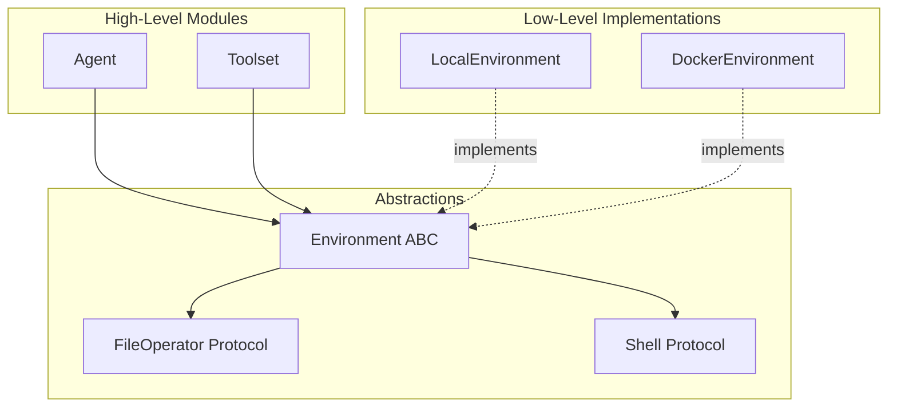
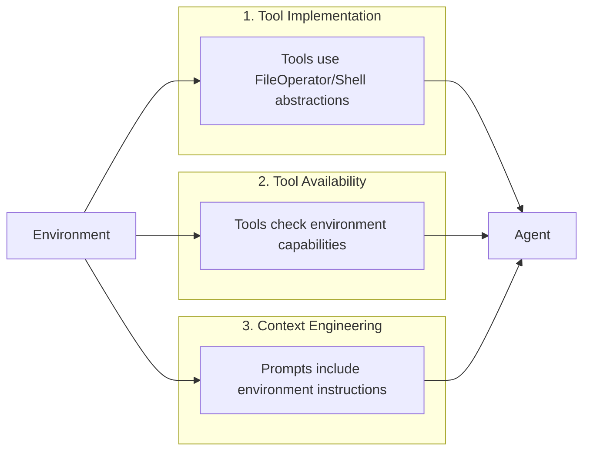

When building AI agents, developers almost instinctively reach for file system operations and shell commands as their first tools. This isn't accidental - it reflects a deeply ingrained assumption: **the operating system is the natural environment for agents to act in**.

In this post, we explore how the `Environment` abstraction in pai-agent-sdk implements dependency inversion, why this design embeds OS-centric assumptions, and how it shapes everything from tool implementation to context engineering.

## The Instinctive Path

Watch any developer build their first agent. The conversation typically goes:

1. "I need my agent to do things"
2. "Doing things means reading/writing files and running commands"
3. "Therefore, I need FileOperator and Shell"

This mental model is so pervasive that it feels like the only way. But it's actually a specific architectural choice that assumes agents operate in OS-like environments.

## Dependency Inversion: The Code Level

From a pure code perspective, pai-agent-sdk implements classic dependency inversion:



Tools don't know whether they're running locally or in a container:

```python
class ViewTool(BaseTool):
    async def call(self, ctx: RunContext[AgentContext], file_path: str) -> str:
        # Uses abstraction, not concrete implementation
        file_operator = ctx.deps.file_operator
        content = await file_operator.read_file(file_path)
        return content

class ShellTool(BaseTool):
    async def call(self, ctx: RunContext[AgentContext], command: str) -> ShellResult:
        # Same pattern - abstract Shell interface
        shell = ctx.deps.shell
        exit_code, stdout, stderr = await shell.execute(command)
        return ShellResult(stdout=stdout, stderr=stderr, return_code=exit_code)
```

This is textbook dependency inversion:

- High-level modules (Agent, Tools) depend on abstractions
- Low-level modules (LocalEnvironment, DockerEnvironment) implement abstractions
- Abstractions don't depend on details

## The Conceptual Leakage

But here's the subtle issue: **the shape of our abstractions is molded by OS concepts**.

| Abstraction | Derived From |
|-------------|--------------|
| `FileOperator` | POSIX filesystem semantics |
| `Shell` | Unix shell execution model |
| `ResourceRegistry` | Process resource management |
| `tmp_dir` | `/tmp` directory concept |

Even when we successfully invert dependencies at the code level, we're still thinking in terms of "files", "directories", "commands", and "environment variables". The abstraction has absorbed the OS worldview.

This isn't necessarily wrong - it's a pragmatic choice. But it limits our imagination when considering alternative environments.

## The Ripple Effect: Tool Availability

The OS-centric design manifests in how tools check their availability:

```python
class ShellTool(BaseTool):
    def is_available(self, ctx: RunContext[AgentContext]) -> bool:
        # Tool becomes unavailable if shell isn't configured
        if ctx.deps.shell is None:
            return False
        return True
```

This creates an implicit contract: environments without shell capability simply can't use shell-based tools. The tool system gracefully degrades, but the degradation path is defined by OS capabilities.

## Context Engineering: Environment Shapes the Prompt

Perhaps the most profound impact is on context engineering. The environment doesn't just provide tools - it shapes how we communicate with the model.

```python
# From filters/environment_instructions.py
async def inject_environment_instructions(
    ctx: RunContext[Any],
    message_history: list[ModelMessage],
) -> list[ModelMessage]:
    # Get environment-specific instructions
    instructions = await env.get_context_instructions()

    # Inject into the conversation
    env_part = UserPromptPart(content=instructions)
    last_request.parts = [*last_request.parts, env_part]
```

What does `get_context_instructions()` typically return? Something like:

```xml
<environment-context>
  <file-system>
    <default-directory>/home/user/project</default-directory>
    <allowed-paths>/home/user/project, /tmp/workspace</allowed-paths>
  </file-system>
  <shell-execution>
    <default-timeout>30s</default-timeout>
    <working-directory>/home/user/project</working-directory>
  </shell-execution>
</environment-context>
```

The model receives instructions framed entirely in OS terminology. We're not just providing tools - we're teaching the model to think in terms of paths, directories, and shell commands.

## The Three Layers of Environment Influence



1. **Tool Implementation**: Tools operate through environment abstractions
2. **Tool Availability**: Tools self-disable based on environment capabilities
3. **Context Engineering**: System prompts are shaped by environment context

All three layers reinforce the OS-as-environment paradigm.

## Alternative Perspectives

What if we didn't assume OS as the default? Consider alternative environment types:

| Environment Type | Core Abstractions | Use Case |
|-----------------|-------------------|----------|
| **OS Environment** | FileOperator, Shell | Code agents, automation |
| **API Environment** | HTTPClient, AuthProvider | API-only agents |
| **Data Environment** | QueryExecutor, SchemaProvider | Data analysis agents |
| **Conversation Environment** | MessageBus, StateStore | Pure dialogue agents |
| **Browser Environment** | DOMOperator, NavigationController | Web automation agents |

Each would require different:

- Tool implementations
- Availability checks
- Context instructions

## Takeaways

1. **Dependency inversion at code level**: Achieved through Environment/FileOperator/Shell abstractions

2. **Conceptual dependency on OS**: The abstractions themselves reflect OS-centric thinking

3. **Three-layer influence**: Environment shapes tool implementation, availability, and context engineering

The next time you build an agent and instinctively reach for file system tools, pause and ask: "Is this the right environment for my agent?" The answer might still be yes - but it's worth asking the question.
