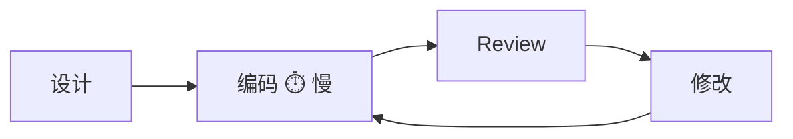
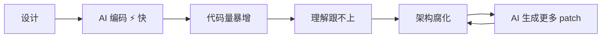
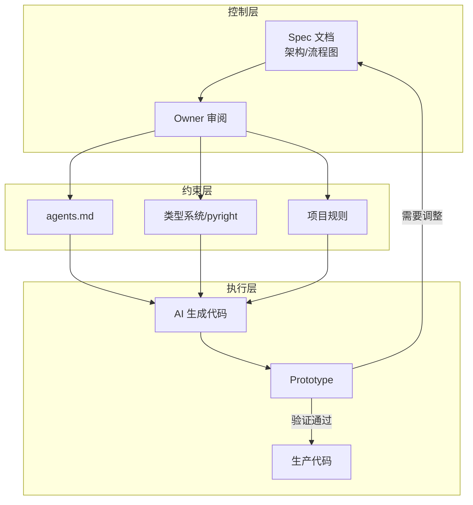
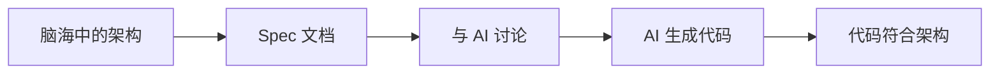
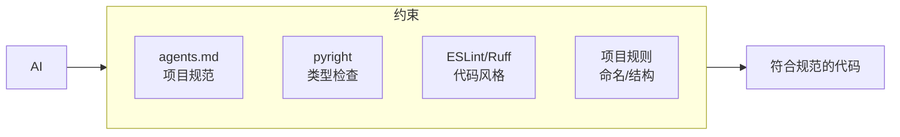
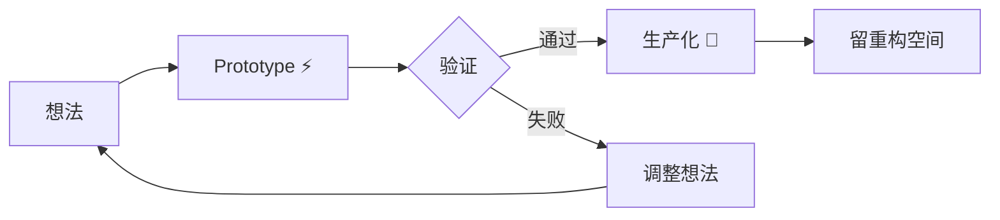
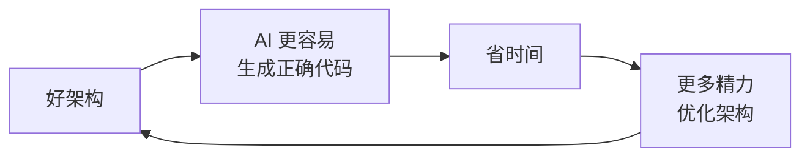
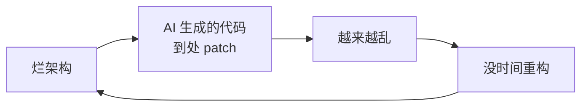
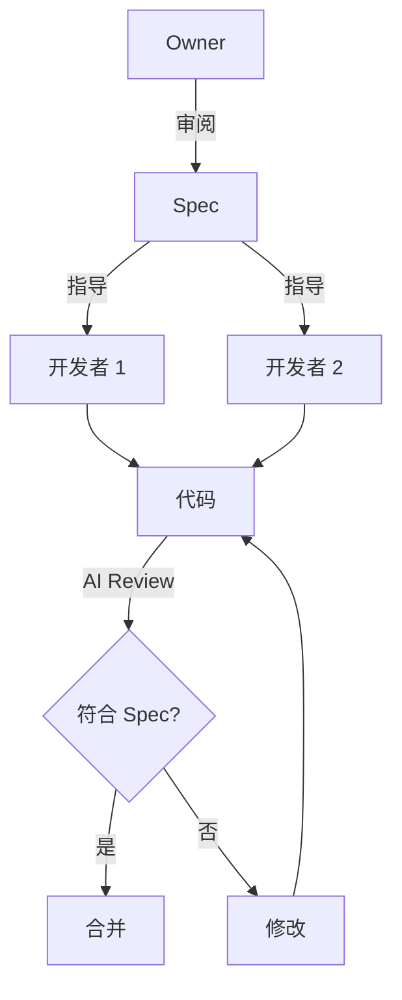

AI 正在改变软件开发的方式。Cursor、Claude Code、Copilot 这些工具让编码速度提升了数倍，但也带来了新的挑战：**代码写得太快，理解跟不上，项目很容易腐化**。

这篇文章分享我在 AI 辅助开发中保持项目一致性的一些实践。

## 核心洞察：瓶颈变了

传统软件开发的瓶颈是编码。设计完成后，大量时间花在实现上。

AI 辅助开发打破了这个瓶颈。编码变得很快，但新的问题出现了：

**编码不再是瓶颈，理解和架构才是。**

## 方法论：控制点上移

要打破这个负循环，关键是把控制点从"代码"上移到"架构"。

### 1. Spec 文档驱动

把脑海里的架构变成和 AI 讨论的 spec 文档：

- **概要设计**：系统边界、模块划分、核心流程
- **架构图/流程图**：用 mermaid 或手绘，让 AI 理解上下文
- **DDD 思路**：bounded context、聚合、领域语言

不需要细到接口签名。模块边界清晰，AI 就不会跨模块乱搞。

### 2. 自底向上构建

很多人习惯自顶向下：先设计接口，再实现细节。但在 AI 辅助开发中，我发现**自底向上更有效**：

- **先做配置**：配置是系统的"骨架"，定下来后 AI 生成的代码就有约束
- **先定类型**：类型系统是天然的约束，让 AI 在框里活动
- **从不易变的开始**：基础设施、工具函数、配置管理

这样做的好处：
- 更容易获得良好的抽象
- 更容易进行测试覆盖
- AI 生成的代码有锚点，不会飘

### 3. 约束前置

与其事后 review 代码，不如事前约束 AI：

- **agents.md / AGENTS.md**：写清楚项目的架构、约定、禁忌
- **类型系统**：pyright、TypeScript，静态分析是最好的约束
- **项目规则**：命名规范、目录结构、commit 格式

AI 读了这些约束，生成的代码一致性会好很多。

### 4. 早期重构

重构应该在**最早的时候**进行，而不是等代码堆积成山：

- 代码量小，重构成本低
- 最容易利用 AI 的生成能力
- 最不容易受幻觉影响

等到项目复杂了再重构，AI 会产生更多幻觉，因为它无法完全理解所有上下文。

### 5. 快速验证，慎重生产

- **尽快 prototype**：用 AI 快速验证想法
- **慎重生产**：验证通过后再决定是否生产化
- **留重构空间**：不要过早固化，保持灵活性

## 正反馈循环

好的实践会形成正反馈：

差的实践会形成负反馈（要避免）：

## 团队协作

在多人协作中，一致性更重要：

- **项目有 Owner**：Owner 审阅 spec，保持架构一致性
- **Review spec，不只是 review 代码**：比传统 code review 更高效
- **AI review 辅助**：让 AI 检查代码是否符合 spec

## 工程师角色转变

AI 辅助开发正在改变工程师的角色：

| 传统 | AI 辅助 |
|------|---------|
| 写代码 | 设计架构 |
| Debug | 审阅 spec |
| 重复劳动 | 创造性思考 |

工程师的核心价值变成了：
- **架构抽象能力**：基于当前理解设计合理的架构
- **业务理解**：对当前情况和未来进行抉择
- **质量把控**：确保 AI 生成的代码符合预期

这本就是架构师的任务。有了 AI 辅助编码，我们可以有更多时间放在设计更容易维护的架构上，反过来又方便了 AI 编码，实现正反馈。

## 总结

AI 辅助开发的核心是**人机协作**：

- **人负责**：架构决策、业务理解、质量把控
- **AI 负责**：快速实现、重复劳动、代码生成

保持项目一致性的关键：

1. **控制点上移**：从代码到 spec
2. **约束前置**：用规则和工具约束 AI
3. **早期重构**：趁代码量小的时候
4. **快速验证**：prototype 快，生产慢
5. **正反馈循环**：好架构 → 好代码 → 更好架构

AI 不会取代工程师，但会取代不会用 AI 的工程师。掌握 AI 辅助开发的方法论，才能在这个时代保持竞争力。
