> 总结一下目前看到的Agent服务设计，主要放在那些不那么“传统”，或者交叉领域上。

# Chatbot

最开始出现的是Chatbot应用。Chatbot 是一个状态系统。每轮请求执行四个步骤：读取上下文、构造 prompt、调用模型、写回状态。系统设计的重点不在模型接口，而在状态组织方式。

会话状态建议分为两层：

- **显示层（Display Layer）**：保存原始事件流，面向 UI 展示、回放与审计。
- **业务层（Business Layer）**：保存推理就绪上下文，面向 prompt 构造与成本控制。

该分层支持一条工程约束：业务层允许静默压缩与摘要，显示层保持完整历史，不做语义改写。

## 1) 分层职责图

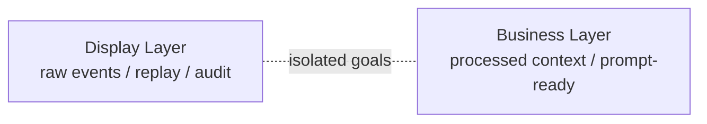

这张图定义职责边界。两层的输入输出、服务对象、演化策略均不同。混用单层存储会产生三类问题：

1. prompt 长度随轮次线性增长，推理成本和时延同步上升。
2. 展示格式、系统指令、工具中间消息进入模型输入，降低上下文信噪比。
3. 压缩策略直接作用于用户可见历史，破坏回放一致性与审计可读性。

## 2) 写路径图

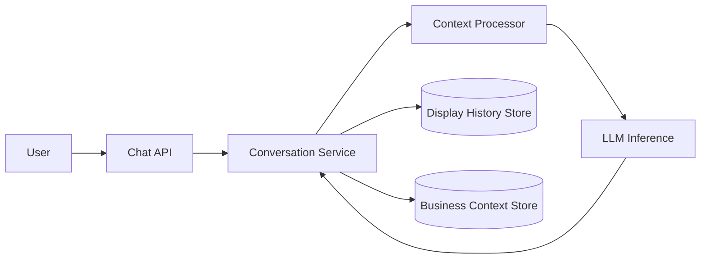

写路径采用双写：同一轮请求同时更新显示层与业务层。

- `Display History Store` 记录 raw user/assistant events。
- `Business Context Store` 记录 processed context。

`Context Processor` 负责从“展示消息”生成“推理上下文”，常见操作为：

- truncate（窗口裁剪）
- compress（信息压缩）
- summarize（阶段摘要）
- metadata filtering（移除展示噪声字段）

## 3) 推理读路径图

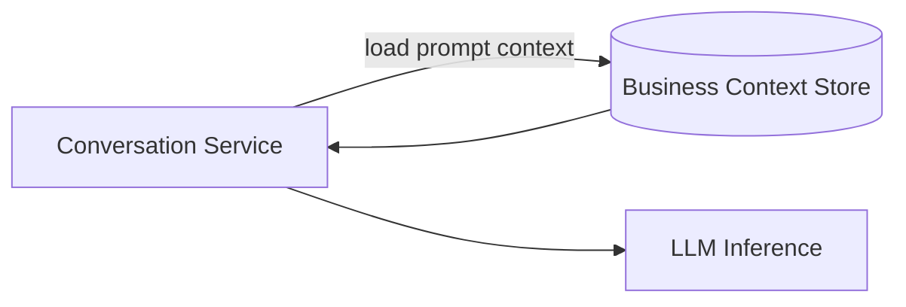

推理路径只读取业务层。该约束保证三点：

- 输入长度可预测。
- 关键语义可延续。
- prompt 结构可标准化。

## 4) 显示回放图

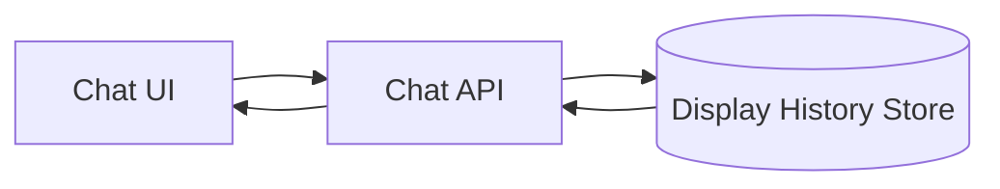

展示路径只读取显示层。UI 获取的是原始事件轨迹，不依赖推理优化后的上下文快照。该路径为回放、排障、审计提供稳定数据源。

## 5) Context Engineering

在 Chatbot 阶段，Context Engineering 关注两个问题：

1. **上下文压缩**：在 token budget 固定的前提下，保留任务相关信息。
2. **用户记忆 / 偏好**：在跨轮次交互中维持行为一致性。

这一阶段的重点是定义问题边界和评估标准，不在于引入复杂机制。

**结论**

- Chatbot 架构已经形成显示层与业务层的初步分层：前者负责事件回放与审计，后者负责推理上下文组织。
- Chatbot 阶段已经出现上下文管理问题：上下文压缩与用户记忆/偏好管理成为后续架构演进的核心输入。

# Agent in VM

第二种形态是 **Agent 与用户共处同一台 VM**。与 Chatbot 阶段相比，这一形态把“对话系统”扩展为“执行系统”：Agent 不再只组织上下文，还直接操作 Shell、文件系统、浏览器和桌面环境。

这个形态的核心变化是：

- 执行环境从 API 工具调用，转为真实操作系统环境。
- 状态边界从会话消息，扩展为 VM 全状态（文件、进程、浏览器、环境变量）。
- 用户可通过 VNC/SSH 与 Agent 并行操作同一环境。

## 1) 形态定义与架构边界

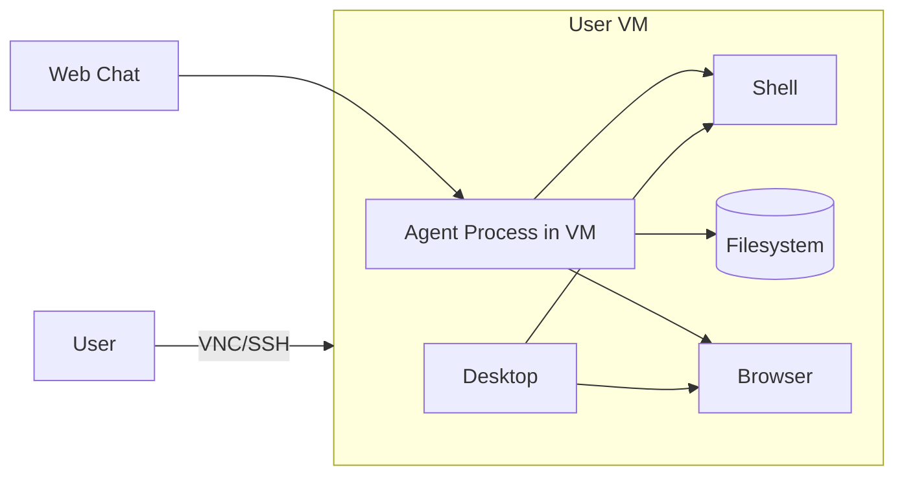

该架构的边界很直接：Agent 和用户共享同一运行时。系统一致性高，系统隔离弱。

## 2) 运行时交互流

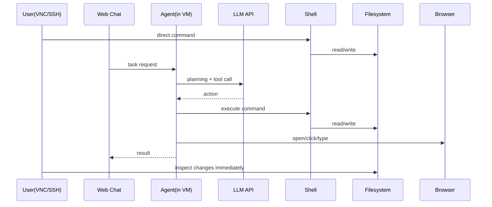

这一形态的优势在于“可观察 + 可干预”：用户可以实时看到 Agent 的执行结果，也可以随时接管。

## 3) 状态持久化：从会话状态到 VM 快照

Chatbot 阶段主要持久化消息与上下文。Agent-in-VM 阶段需要持久化完整环境状态，通常依赖 VM Snapshot。

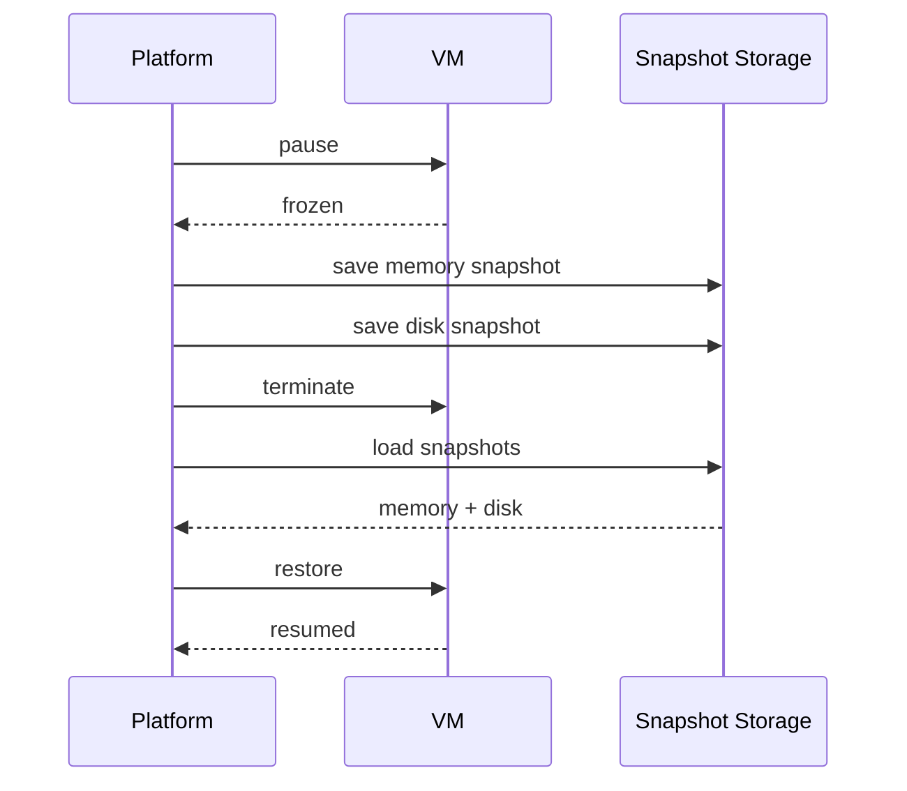

快照带来的工程收益是“连续执行上下文”：文件、进程、浏览器状态可以跨会话恢复。典型场景是开发服务器和调试现场的延续。

## 4) 主要约束与风险

这个形态在通用性上很强，但成本与安全边界会前置成为架构问题：

- **成本约束**：每用户独占 VM，空闲成本高，扩展效率低于共享计算架构。
- **调度约束**：VM 启停与快照恢复时延高于无状态容器调度。
- **安全约束**：Agent 进程与用户共域，密钥管理、权限边界、篡改防护更复杂。
- **持久化风险**：恶意进程或敏感凭证可能通过快照跨会话保留。

## 结论

- Agent in VM 形态把系统能力从“对话组织”推进到“环境执行”，获得了强交互、强观察、强持久化能力。
- 这一形态同时引入了新的主问题：多租户安全边界、VM 成本模型与快照生命周期治理。

# Agentic LLM API

第三种形态可以定义为 **Agentic LLM API**：交互入口仍是 Chatbot，但执行能力已经升级为 Agent，并由模型 API 厂商托管执行环境。与 Agent in VM 的区别在于，用户不直接进入执行环境；与第一阶段 Chatbot 的区别在于，系统不仅维护消息状态，还维护可执行环境状态。

这一形态的目标是把“对话编排”与“环境执行”做成一条端到端链路：

- 对用户暴露稳定的聊天接口。
- 对系统内部暴露可控的工具与执行环境。
- 在 token 成本、延迟与可观察性之间取得工程平衡。

## 1) 形态定义与系统边界

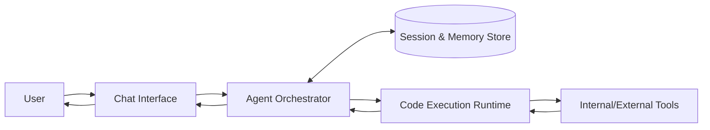

边界定义：

- **Control Plane**：会话、记忆、策略、路由。
- **Execution Plane**：代码执行容器或沙箱运行时。
- **Tool Plane**：数据库、检索、业务 API、浏览器等外部能力。

## 2) 执行流：从直接工具调用到程序化工具调用

Agentic Chatbot 的关键变化，是把多步工具调用下沉到执行环境中，以减少模型轮次开销。典型实现是 Programmatic Tool Calling（PTC）模式：模型生成可执行代码，在运行时中循环调用工具、过滤中间结果，再回传高价值输出。

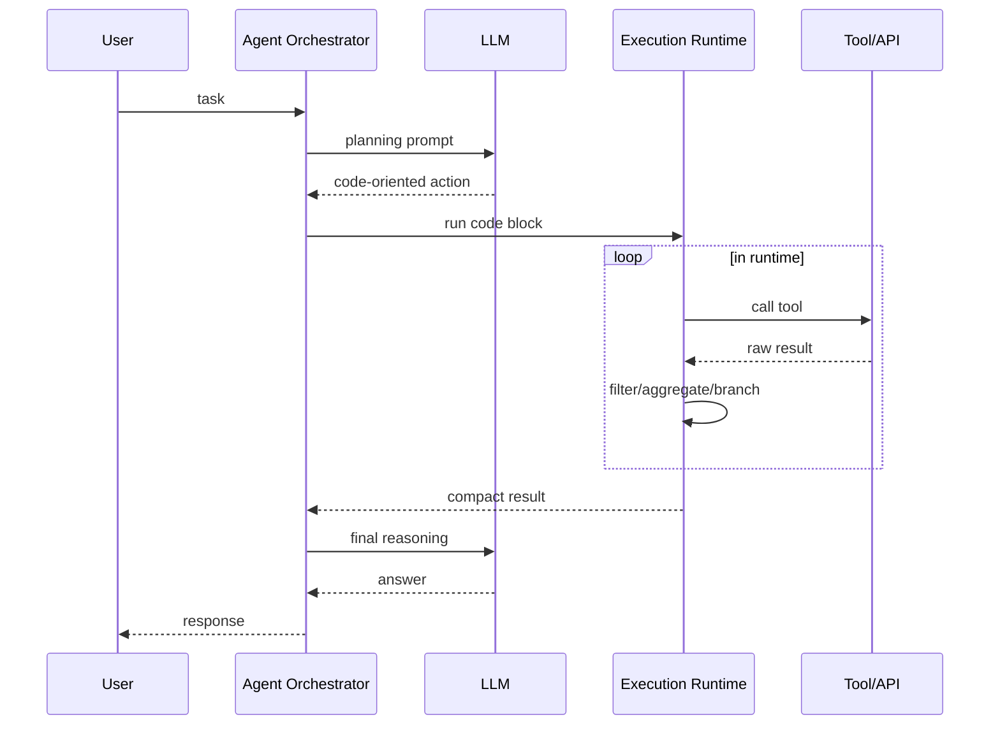

该流程的工程意义是：中间数据处理不进入主上下文窗口，模型只消费压缩后的关键结果。

## 3) 状态模型：消息状态 + 环境状态 + 运行状态

Chatbot 阶段主要管理消息状态；Agentic Chatbot 需要三类状态并存。

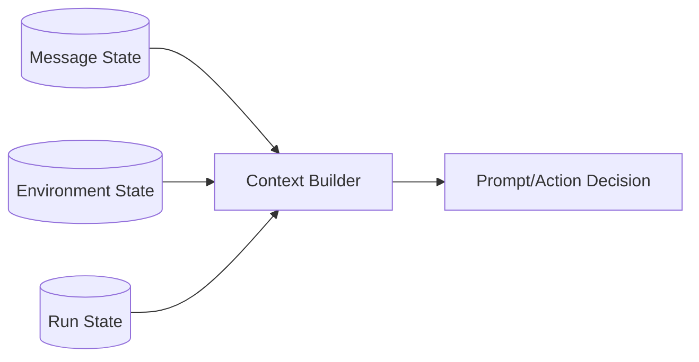

- **Message State**：对话历史、摘要、用户偏好。
- **Environment State**：容器 ID、文件系统变更、工具上下文。
- **Run State**：任务阶段、工具调用链、重试与超时信息。

系统可恢复性依赖于这三类状态的一致性，而不是单一会话历史。

## 4) 主要约束

Agentic LLM API 的主要工程约束集中在五点：

- **安全约束**：执行环境必须隔离，工具调用需要 caller 权限边界与 allowlist。
- **时效约束**：执行容器存在 TTL，跨步调用需要超时恢复和幂等设计。
- **观测约束**：需要保留 action trace、tool I/O、版本化 prompt 以支持回放。
- **成本约束**：执行时长、容器复用、上下文压缩共同决定单位任务成本。
- **供应商锁定约束**：执行环境上下文（container state、intermediate artifacts、tool-call runtime state）主要保存在 API 厂商侧，迁移到其他模型供应商时，状态可移植性与行为一致性难以保证。

关于供应商锁定，这一形态有两个具体后果：

1. **状态不可携带**：迁移供应商时，通常只能带走消息历史，难以带走运行时上下文。
2. **行为不可等价**：即使接口相似，不同厂商在执行容器、超时策略、工具调用协议上的差异会导致任务行为漂移。

锁定面的核心不在 API schema，而在运行时语义：

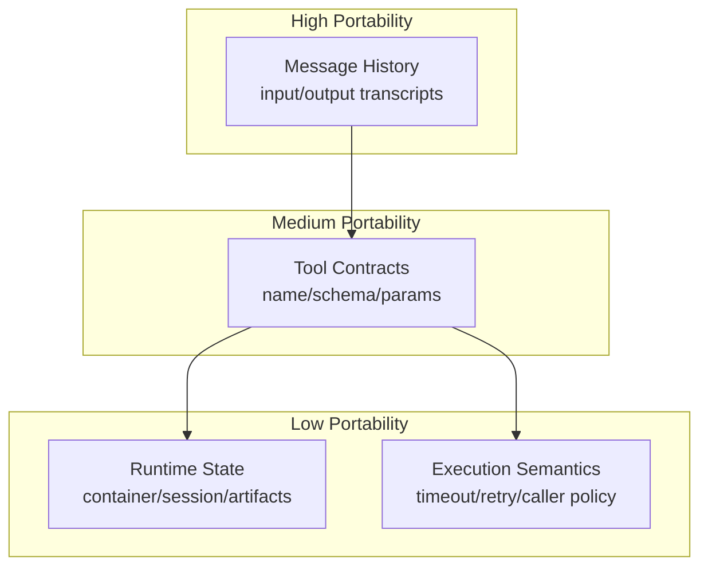

可迁移性通常呈分层下降：消息层 > 工具协议层 > 运行时状态层。

> 这里和很多厂商（OpenAI & Gemini）在API中隐藏自己的thinking过程不同，环境状态的丢失使得迁移供应商是不可能的，而非之前的“丢失一些中间思考”。

## 结论

这对于模型厂商获取数据和用户锁定都有积极意义，也为第一方应用提供了非常强大的能力，但对于开发者来说，几乎不可能选择这类方案，其供应商锁定和不透明问题带来的风险太高了。

# Next: Agent Mounts Environment

Agent in VM 形态虽然提供了强交互能力，但存在两个核心问题：一是每用户独占 VM 的成本模式导致空闲成本高；二是 Agent 与用户共域，API Keys 与内部逻辑暴露在 VM 环境，难以安全整合私有服务。

**Agent Mounts Environment** 将 Agent 与执行环境解耦：Agent 仍运行在平台侧（可访问私有服务、密钥隔离），但将执行环境降级为一个"挂载点"。VM 内仅运行轻量级 Executor，负责接收 Agent 的指令（Shell 命令、文件操作、浏览器控制）并反馈结果。

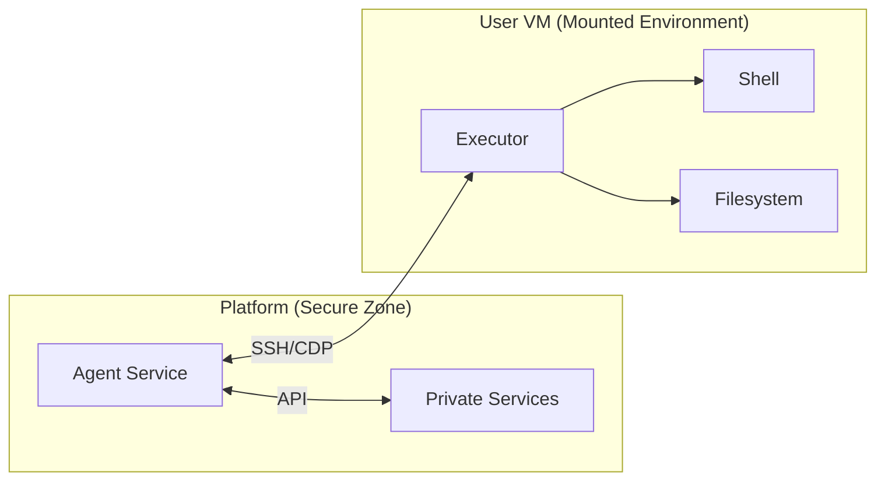

## 好处

**1. 安全隔离**：Agent 与用户环境物理分离，密钥与内部逻辑不暴露在 VM 中。Agent 可安全访问私有数据库、内部 API，而无需在 VM 中存储凭证。

**2. 成本优化**：Agent 进程不与用户 VM 绑定，可跨多用户复用（或采用共享计算资源池）。VM 仅作为执行容器，不需要持续为每用户保留计算资源。

**3. 权限边界清晰**：Executor 可施加细粒度权限控制：允许的工具集、可访问的文件路径、外部 API 调用权限均由平台策略决定，用户无法绕过。

**4. 与 Agentic LLM API 兼容**：该架构天然支持多模型厂商，Agent 逻辑独立于执行环境实现，迁移或切换 LLM 供应商时，运行时语义保持一致。

## 挑战

**1. 通信协议复杂性**：Agent 需要通过 SSH、SFTP、CDP Over SSH Tunnel 等多种协议与 VM 通信。每种协议的超时、重试、错误恢复策略都需要精心设计。协议层的不稳定会导致任务中断或重复执行。

**2. 状态一致性困难**：Agent 侧的任务状态与 VM 侧的执行状态可能不一致（如网络分区、超时导致的半成功操作）。需要设计操作幂等性、事务语义与恢复协议来保证最终一致性。

**3. VM 快照与 Git 同步**：若采用 VM 快照持久化完整运行时状态，需要在恢复后重新同步 Git 状态，否则磁盘内容与 Remote 不一致。这引入了额外的状态管理层。

## 结论

Agent Mounts Environment 是 Agent in VM 与 Agentic LLM API 之间的中间态：保留了本地执行环境的完整可观察性和持久状态能力，同时恢复了平台侧的安全边界与成本效率。代价是需要投入工程力量处理分布式系统的一致性问题。

# Bonus: Durable Execution

Agentic Loop 中的执行容易失败：网络中断、超时、工具错误、模型幻觉都可能中断任务。要支持重试与恢复，需要把任务状态分层管理，而不是盲目地快照整个 VM 或重新执行任务。

关键是认识到不同类型的状态有不同的恢复语义：

## 1) 上下文（Context）

**定义**：LLM 模型推理所需的信息，包括prompt、当前目标、已执行步骤。

**恢复策略**：上下文应完全可重建，无需从快照恢复。重试时重新加载上一步的结果，让模型基于完整的执行历史做出新的决策。

**为什么**：即使模型上一次的决策有误，完整的history 能让它在第二次重试中做出不同的选择。

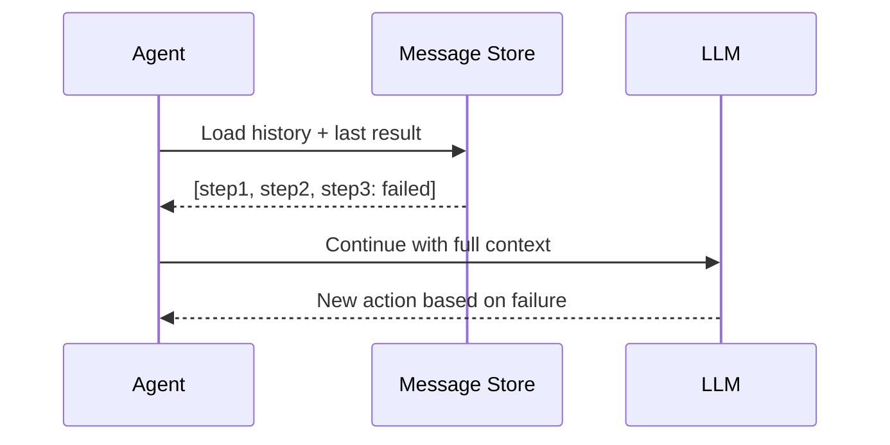

## 2) 消息状态（Message State）

**定义**：对话历史、用户请求、AI 响应。

**恢复策略**：消息状态应仅追加（append-only），支持版本化重试。一次重试对应一条新分支，记录"第一次尝试失败"与"第二次重试成功"的完整轨迹。

**存储方案**：

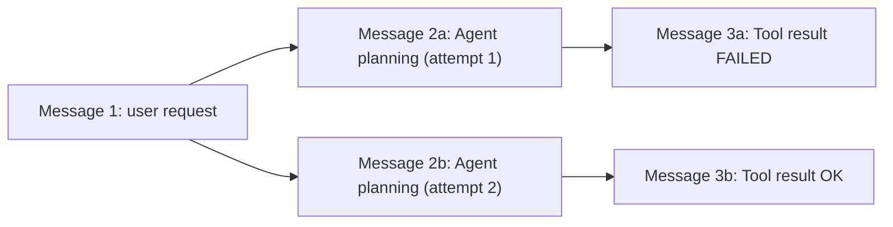

通过消息树（而非单线性链表）记录重试分支，支持审计与故障分析。

## 3) 文件系统状态（Filesystem State）

**定义**：VM 或容器内的文件、目录、权限。

**恢复策略**：文件系统状态通过 git commit 或 VM 快照持久化。重试时的关键决策是：**是否需要恢复到操作前的状态还是基于当前状态重新操作**。

**两种模式**：

**模式 A：Ephemeral + Rollback（容器/Sandbox 方案）**
- 每次工具调用在隔离容器内执行
- 失败时容器销毁，文件系统回滚
- 下一次重试从 Git Checkout 状态开始

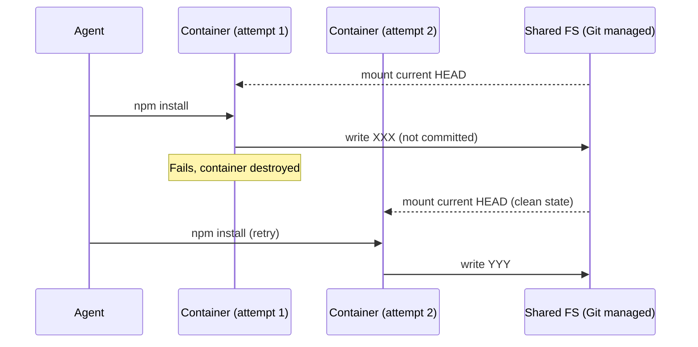

优点：简单、可预测。缺点：无法利用前一次的中间成果（如部分安装的依赖）。

**模式 B：Persistent VM + Checkpoint（VM 快照方案）**
- 使用 Firecracker Snapshot 保存完整运行时状态
- 失败时从快照恢复，保留内存中的进程、缓存
- 需要额外的 checkpoint 机制记录"哪些文件修改可以撤销"

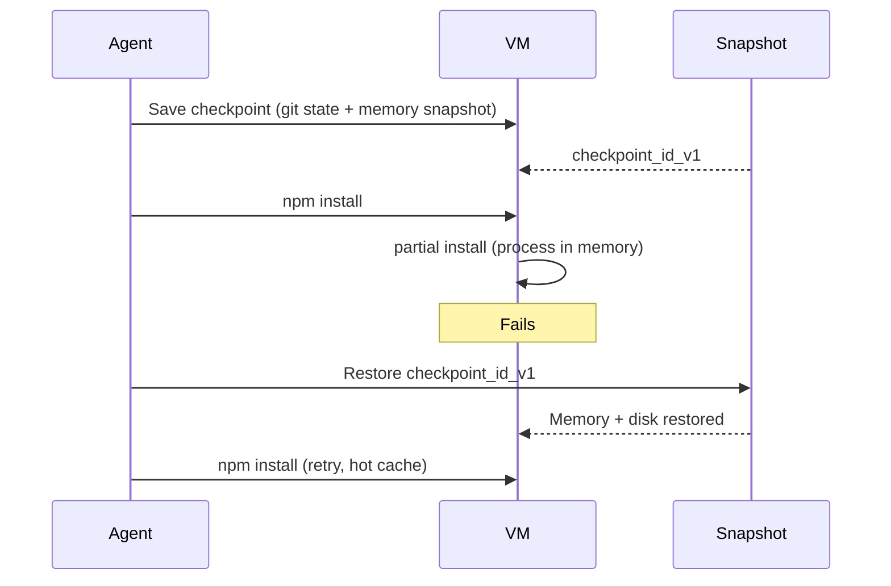

优点：快速恢复、热启动。缺点：快照本身占用存储空间，恢复涉及内存一致性问题。

## 4) 外部资源状态（External Resource State）

**定义**：API 调用、数据库事务、第三方服务的执行结果。

**恢复策略**：外部资源操作的可恢复性取决于操作是否幂等。

**分类**：

| 操作类型 | 幂等性 | 恢复策略 |
|---------|------|--------|
| Read DB | ✓ | 直接重试 |
| GET API | ✓ | 直接重试 |
| Create resource | ✗ | 需要 idempotency key，防止重复创建 |
| Update resource | ✓/✗ | 需要检验当前状态是否已更新 |
| Delete resource | ~ | 重试返回 404，需要 idempotent delete semantic |
| Payment / Charge | ✗ | 必须通过事务 ID 检查是否已执行 |

**实现模式**：Idempotency Key

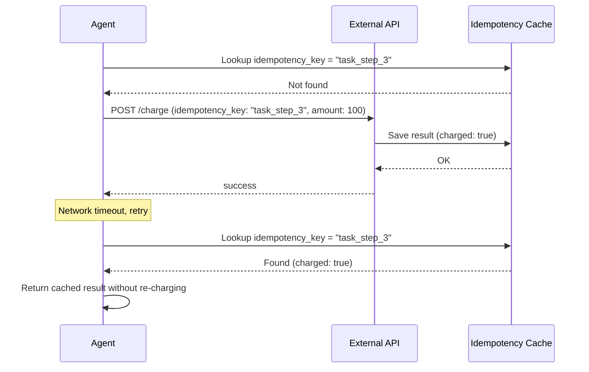

系统需要为每个工具调用分配全局唯一的 idempotency_key，存储每次调用的结果。重试时先查询缓存，避免重复操作。

## 综合设计

完整的 Durable Execution 系统需要四层状态管理：

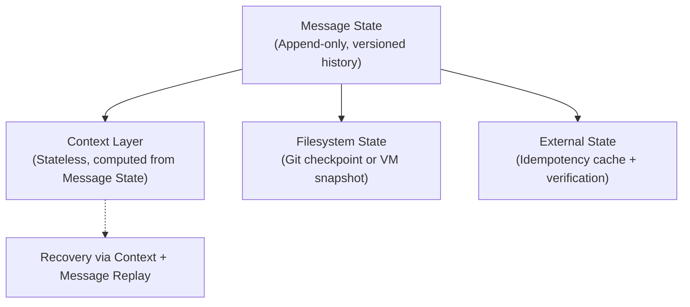

在故障发生时，恢复顺序为：

1. 检查外部资源状态（是否已执行）→ 如有缓存结果则直接返回
2. 检查文件系统状态（Snapshot 或 Git HEAD）→ 重建执行环境
3. 加载消息历史 → 重建 LLM 上下文
4. 重新执行失败的步骤

## 结论

Durable Execution 的核心是认识到：**系统的可恢复性不源于单一快照，而源于分层的状态管理与操作的幂等性设计**。不同类型的状态有不同的持久化需求与恢复成本，混为一谈会导致过度的快照成本或无法恢复的局面。
