> 本文从时间线说起，看看以文本对话为主要交互方式的LLM应用是如何架构的，接着讨论一下云上Agent架构将如何演进，以及我认为的较为均衡的设计方案。

# Chatbot

最开始出现的是Chatbot应用。Chatbot 是一个状态系统。每轮请求执行四个步骤：读取上下文、构造 prompt、调用模型、写回状态。系统设计的重点不在模型接口，而在状态组织方式。

会话状态建议分为两层：

- **显示层（Display Layer）**：保存原始事件流，面向 UI 展示、回放与审计。
- **业务层（Business Layer）**：保存推理就绪上下文，面向 prompt 构造与成本控制。

该分层支持一条工程约束：业务层允许静默压缩与摘要，显示层保持完整历史，不做语义改写。

## 1) 分层职责图

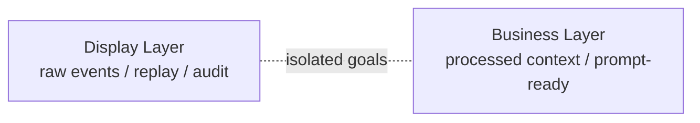

这张图定义职责边界。两层的输入输出、服务对象、演化策略均不同。混用单层存储会产生三类问题：

1. prompt 长度随轮次线性增长，推理成本和时延同步上升。
2. 展示格式、系统指令、工具中间消息进入模型输入，降低上下文信噪比。
3. 压缩策略直接作用于用户可见历史，破坏回放一致性与审计可读性。

## 2) 写路径图

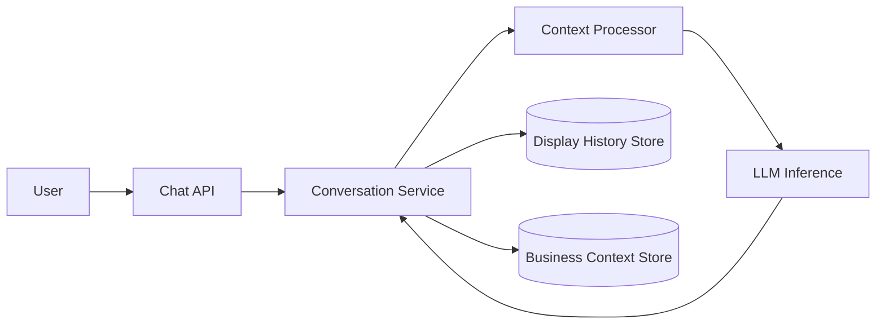

写路径采用双写：同一轮请求同时更新显示层与业务层。

- `Display History Store` 记录 raw user/assistant events。
- `Business Context Store` 记录 processed context。

`Context Processor` 负责从“展示消息”生成“推理上下文”，常见操作为：

- truncate（窗口裁剪）
- compress（信息压缩）
- summarize（阶段摘要）
- metadata filtering（移除展示噪声字段）

## 3) 推理读路径图

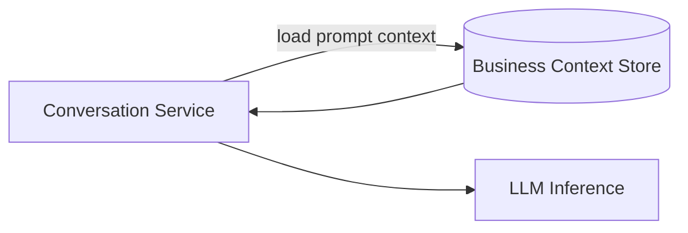

推理路径只读取业务层。该约束保证三点：

- 输入长度可预测。
- 关键语义可延续。
- prompt 结构可标准化。

## 4) 显示回放图

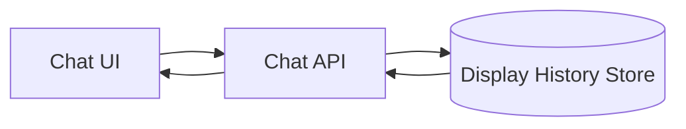

展示路径只读取显示层。UI 获取的是原始事件轨迹，不依赖推理优化后的上下文快照。该路径为回放、排障、审计提供稳定数据源。

## 5) Context Engineering

在 Chatbot 阶段，Context Engineering 关注两个问题：

1. **上下文压缩**：在 token budget 固定的前提下，保留任务相关信息。
2. **用户记忆 / 偏好**：在跨轮次交互中维持行为一致性。

这一阶段的重点是定义问题边界和评估标准，不在于引入复杂机制。

**结论**

- Chatbot 架构已经形成显示层与业务层的初步分层：前者负责事件回放与审计，后者负责推理上下文组织。
- Chatbot 阶段已经出现上下文管理问题：上下文压缩与用户记忆/偏好管理成为后续架构演进的核心输入。

# Agent in VM

第二种形态是 **Agent 与用户共处同一台 VM**。与 Chatbot 阶段相比，这一形态把“对话系统”扩展为“执行系统”：Agent 不再只组织上下文，还直接操作 Shell、文件系统、浏览器和桌面环境。

这个形态的核心变化是：

- 执行环境从 API 工具调用，转为真实操作系统环境。
- 状态边界从会话消息，扩展为 VM 全状态（文件、进程、浏览器、环境变量）。
- 用户可通过 VNC/SSH 与 Agent 并行操作同一环境。

## 1) 形态定义与架构边界

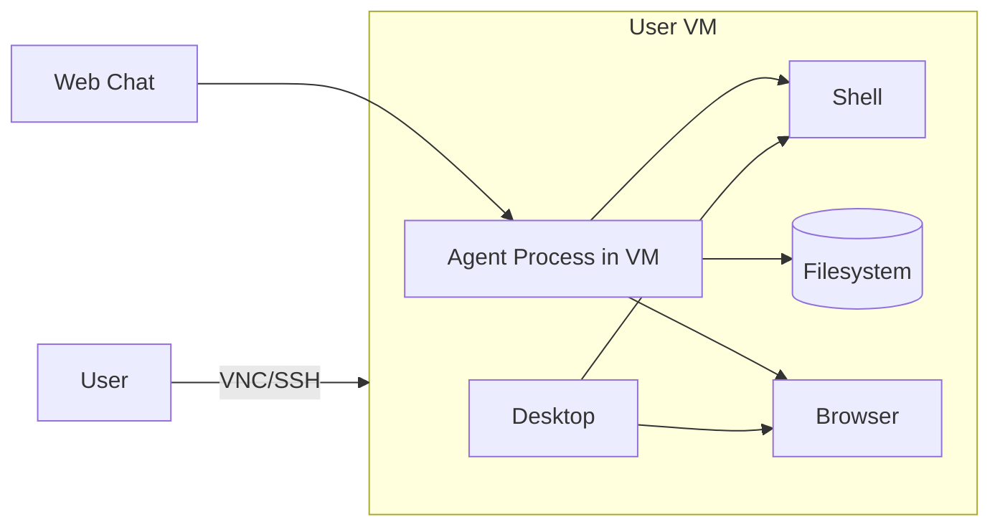

该架构的边界很直接：Agent 和用户共享同一运行时。系统一致性高，系统隔离弱。

## 2) 运行时交互流

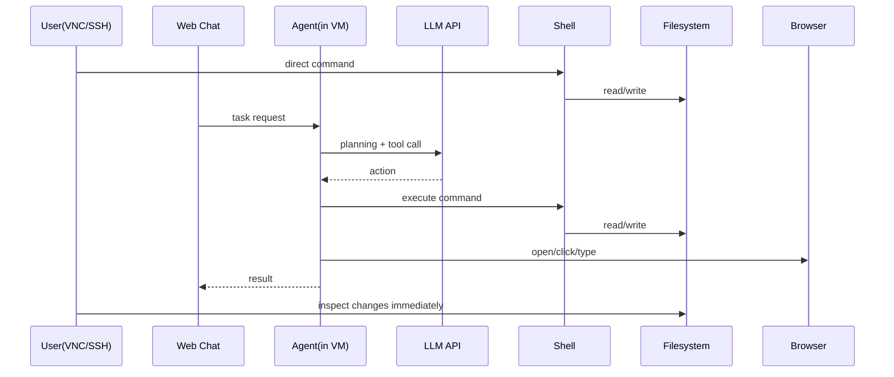

这一形态的优势在于“可观察 + 可干预”：用户可以实时看到 Agent 的执行结果，也可以随时接管。

## 3) 状态持久化：从会话状态到 VM 快照

Chatbot 阶段主要持久化消息与上下文。Agent-in-VM 阶段需要持久化完整环境状态，通常依赖 VM Snapshot。

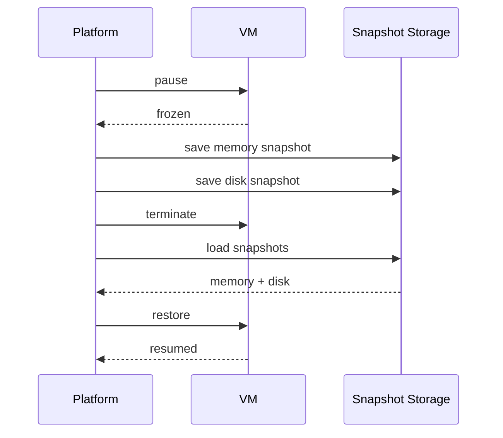

快照带来的工程收益是“连续执行上下文”：文件、进程、浏览器状态可以跨会话恢复。典型场景是开发服务器和调试现场的延续。

## 4) 主要约束与风险

这个形态在通用性上很强，但成本与安全边界会前置成为架构问题：

- **成本约束**：每用户独占 VM，空闲成本高，扩展效率低于共享计算架构。
- **调度约束**：VM 启停与快照恢复时延高于无状态容器调度。
- **安全约束**：Agent 进程与用户共域，密钥管理、权限边界、篡改防护更复杂。
- **持久化风险**：恶意进程或敏感凭证可能通过快照跨会话保留。

## 结论

- Agent in VM 形态把系统能力从“对话组织”推进到“环境执行”，获得了强交互、强观察、强持久化能力。
- 这一形态同时引入了新的主问题：多租户安全边界、VM 成本模型与快照生命周期治理。

# Agentic LLM API

第三种形态可以定义为 **Agentic LLM API**：交互入口仍是 Chatbot，但执行能力已经升级为 Agent，并由模型 API 厂商托管执行环境。与 Agent in VM 的区别在于，用户不直接进入执行环境；与第一阶段 Chatbot 的区别在于，系统不仅维护消息状态，还维护可执行环境状态。

这一形态的目标是把“对话编排”与“环境执行”做成一条端到端链路：

- 对用户暴露稳定的聊天接口。
- 对系统内部暴露可控的工具与执行环境。
- 在 token 成本、延迟与可观察性之间取得工程平衡。

## 1) 形态定义与系统边界

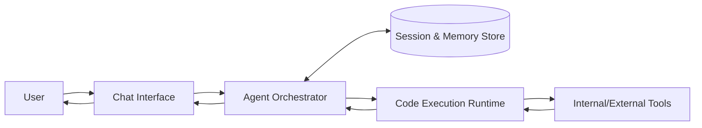

边界定义：

- **Control Plane**：会话、记忆、策略、路由。
- **Execution Plane**：代码执行容器或沙箱运行时。
- **Tool Plane**：数据库、检索、业务 API、浏览器等外部能力。

## 2) 执行流：从直接工具调用到程序化工具调用

Agentic Chatbot 的关键变化，是把多步工具调用下沉到执行环境中，以减少模型轮次开销。典型实现是 Programmatic Tool Calling（PTC）模式：模型生成可执行代码，在运行时中循环调用工具、过滤中间结果，再回传高价值输出。

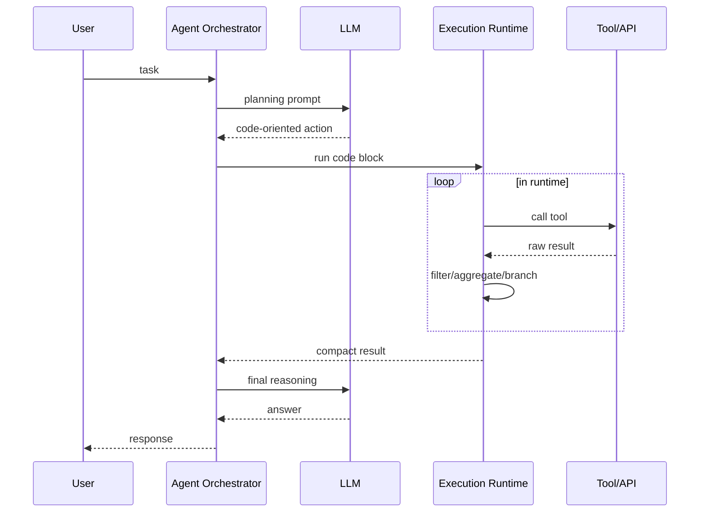

该流程的工程意义是：中间数据处理不进入主上下文窗口，模型只消费压缩后的关键结果。

## 3) 状态模型：消息状态 + 环境状态 + 运行状态

Chatbot 阶段主要管理消息状态；Agentic Chatbot 需要三类状态并存。

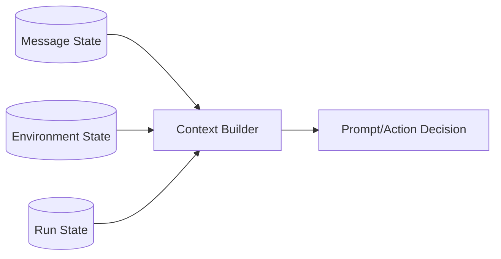

- **Message State**：对话历史、摘要、用户偏好。
- **Environment State**：容器 ID、文件系统变更、工具上下文。
- **Run State**：任务阶段、工具调用链、重试与超时信息。

系统可恢复性依赖于这三类状态的一致性，而不是单一会话历史。

## 4) 主要约束

Agentic LLM API 的主要工程约束集中在五点：

- **安全约束**：执行环境必须隔离，工具调用需要 caller 权限边界与 allowlist。
- **时效约束**：执行容器存在 TTL，跨步调用需要超时恢复和幂等设计。
- **观测约束**：需要保留 action trace、tool I/O、版本化 prompt 以支持回放。
- **成本约束**：执行时长、容器复用、上下文压缩共同决定单位任务成本。
- **供应商锁定约束**：执行环境上下文（container state、intermediate artifacts、tool-call runtime state）主要保存在 API 厂商侧，迁移到其他模型供应商时，状态可移植性与行为一致性难以保证。

关于供应商锁定，这一形态有两个具体后果：

1. **状态不可携带**：迁移供应商时，通常只能带走消息历史，难以带走运行时上下文。
2. **行为不可等价**：即使接口相似，不同厂商在执行容器、超时策略、工具调用协议上的差异会导致任务行为漂移。

锁定面的核心不在 API schema，而在运行时语义：

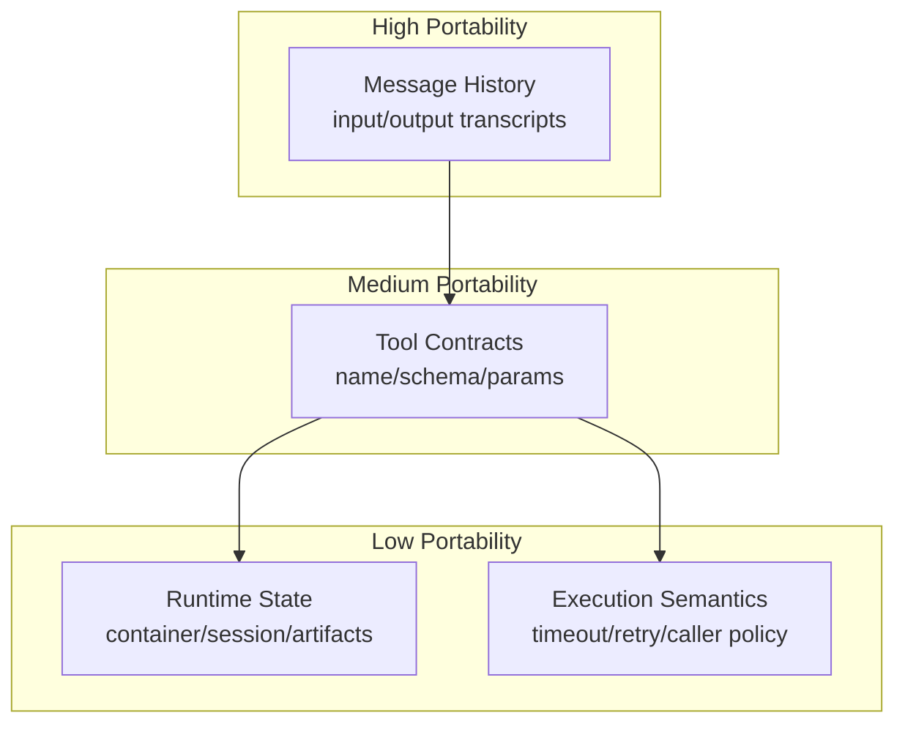

可迁移性通常呈分层下降：消息层 > 工具协议层 > 运行时状态层。

## 结论

这对于模型厂商获取数据和用户锁定都有积极意义，但对于开发者来说，几乎不可能选择这类方案，而非自行构建Agent系统。

<!-- # Next: Agent Mounts Environment

我们继续Agent in VM的发展，上文提到的Agent in VM形态虽然提供了强交互能力，但成本和安全问题突出。下一阶段的演进方向是**Agent Mounts Environment**：Agent不再直接运行在用户VM中，而是通过远程工具调用的方式“挂载”一个隔离的执行环境。

我们可以很明显地看出，LLM的API请求其实不需要有文件系统或者进程状态，只需要加载上一次的Context，

TODO: 论述一下挂载的好处、挑战
-->

<!-- # Bonus: Durable Execution

这里我们聊一聊Durable Execution的概念。因为在Agentic Loop里还是容易失败的，那么我们重试的这个工作流构建、checkpoiont构建还是有一些挑战的。

分开讨论一下上下文、消息、文件系统状态、外部资源状态
 -->
