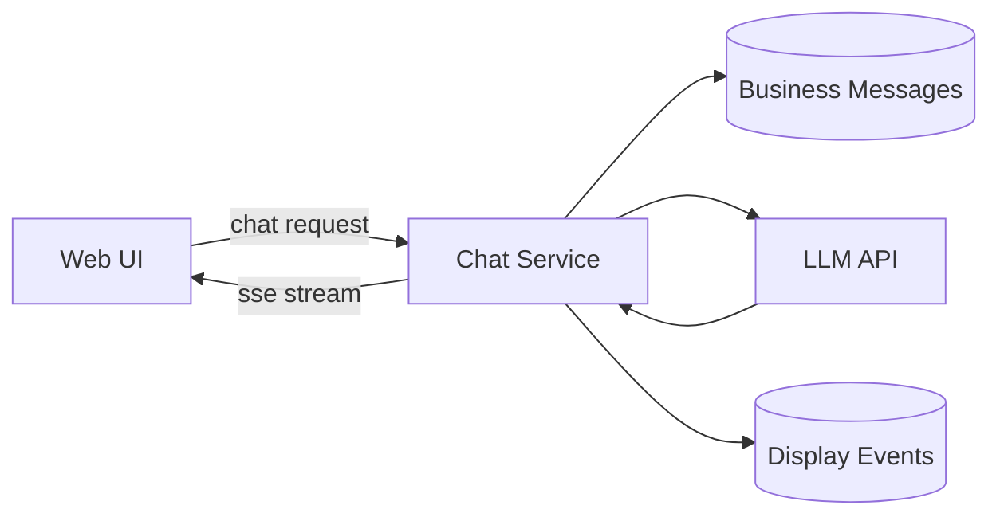
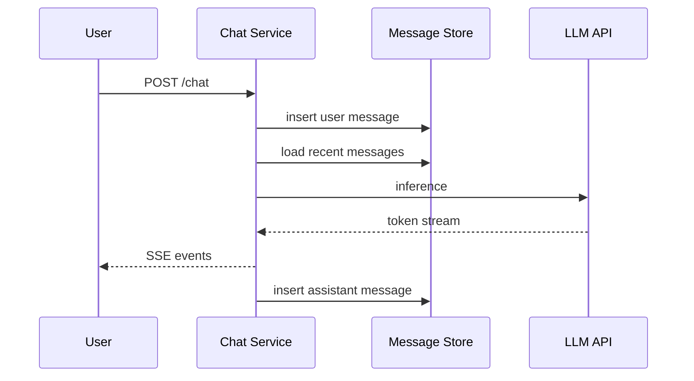
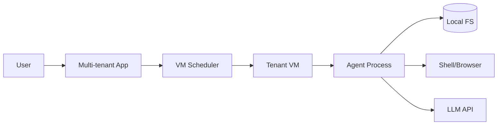
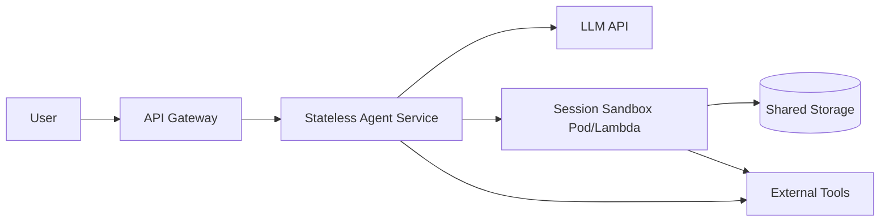
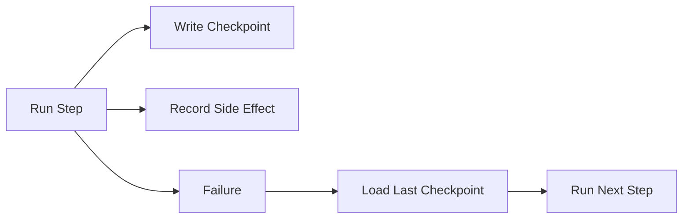
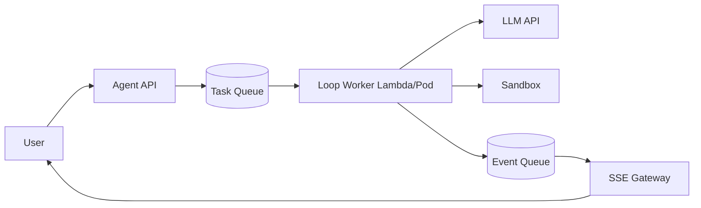
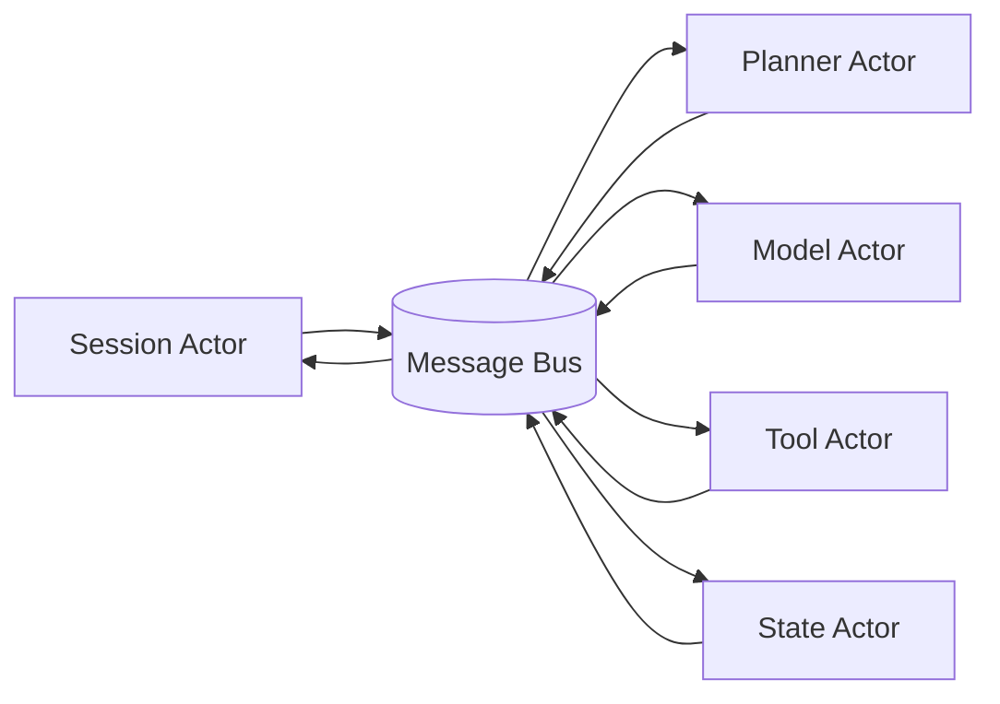
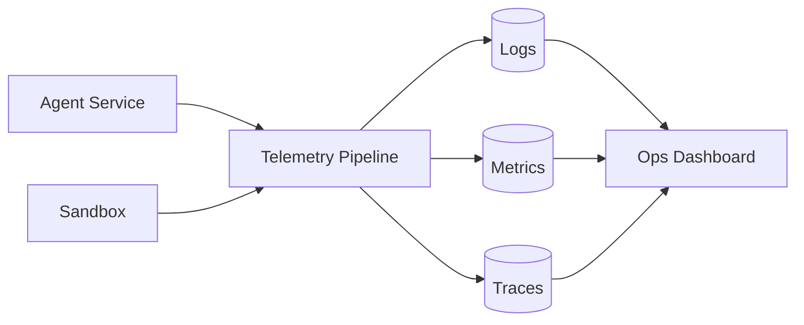
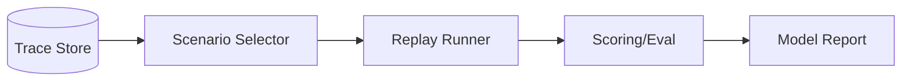

# 从SSE服务说起

先从一个可运行的 Chatbot 服务开始：前端通过 `POST /chat` 发起请求，通过 `GET /stream/:conversation_id` 接收 `SSE` 事件流。
这里把职责拆成两层：

- Display Layer：向 UI 输出事件，服务展示与回放。
- Business Layer：维护消息历史，服务 prompt 构造与推理。

对应的最小存储模型：

- `conversation(id, created_at)`
- `message(id, conversation_id, role, content, created_at)`

单轮写路径：

1. 接收用户输入并落库 `role=user`。
2. 读取最近 `N` 条消息构造 prompt。
3. 调用 LLM，按 token 生成 `SSE` 事件并写入 Display Layer。
4. 推理结束后落库 `role=assistant`。

约束保持简单：单进程、单副本、不处理并发写冲突。

下一段再进入“引入文件系统后”的架构分叉：`stateless agent service + sandbox` vs `agent in vm`。

# 扩展文件系统

## Agent in VM

> 这个模式下，Agent没有多租户的概念，面对的是一台专用的虚拟机，所有多租户的概念在外部业务层实现

当 Agent 需要稳定操作本地开发环境、浏览器和长生命周期进程时，`Agent in VM` 是最直接的方案。
它的核心思想是：平台做“VM 分配与调度”，Agent 只面对“单租户执行环境”。

设计重点：

1. 租户隔离天然清晰：每个会话绑定一台 VM。
2. 状态恢复简单：文件、进程、缓存都在 VM 内。
3. 代价是资源成本和调度时延：空闲 VM 成本高，启动/恢复慢于无状态服务。

案例：Manus、利用Claude Code SDK构建多租户agent

## Stateless Agent Service + Sandbox

该方案将控制逻辑与执行环境解耦：Agent Service 保持无状态，Sandbox 承载会话执行状态。

分层如下：

- Agent Service：无状态，负责规划、路由、工具编排。
- Sandbox：有状态，负责执行命令和访问会话文件。
- Shared Storage：跨 Sandbox 挂载同一会话目录。

可行性前提：Agentic loop 依赖“状态可引用”，不依赖“进程常驻”。只要 session 可以绑定到可恢复的文件和执行上下文，服务就可以无状态扩缩容。

关键约束：

1. 边界必须明确：哪些工具在 Agent Service 执行，哪些必须进 Sandbox。
2. 安全默认收敛：出网控制、域名/IP 白名单、速率限制、租户目录隔离。
3. 存储性能决定体验：高频读写场景要评估本地盘缓存或更高性能分布式存储。

# Durable Execution（Stateless + Sandbox 的可靠性拓展）

在 `Stateless Agent Service + Sandbox` 中，实例漂移是常态。重试不能依赖进程内存。
Durable Execution 的目标是将一次 loop 分解为可恢复步骤，并在步骤边界写入 checkpoint。

引入原因：

1. 实例漂移是常态：Pod 重建、请求重路由都会打断内存态执行。
2. 工具调用有副作用：整轮重放会产生重复写入或重复外部调用。
3. 长任务跨多分钟：必须允许中断后继续，而不是从头开始。

最小状态拆分建议：

1. `message_state`：会话消息、摘要、token budget。
2. `filesystem_state_ref`：工作目录版本、挂载路径、快照 ID。
3. `execution_state`：当前 step、计划版本、上一步输出。
4. `effect_log`：已执行副作用记录（外部请求 ID、写操作哈希）。

实现规则：

1. 每个 step 必须可重入：相同输入重复执行，结果语义不变。
2. 每个副作用必须可去重：通过 `idempotency_key` 或外部事务键避免重复提交。

## 语义恢复

在工程实践中，很多工具调用不可回滚，或回滚成本远高于收益。
因此，失败处理可以优先采用“语义恢复”，而不是“强事务回滚”。

例如三个工具并行执行时其中一个报错，不必强制撤销其余两个工具的副作用。可采用以下策略：

1. 将消息历史恢复到这组并行工具调用之前。
2. 保留本次工具调用返回（包含不确定状态）。
3. 对失败或不确定结果注入系统说明：`上次调用出错，可能已部分执行成功，请先确认状态再继续`。
4. 让模型基于这条说明继续规划下一步（先确认，再补偿，或跳过）。

> 这里还可以向外暴露重试事件，以确保显示层不会出现未定义行为

该策略的取舍很明确：放弃严格事务语义，换取更低实现复杂度和更高恢复连续性。

# Loop 级隔离编排（优化Agent Service的可扩缩容性）

这是一种中间态方案：保持 loop 代码结构不变，只隔离 loop 实例。
实现方式是“每个 turn 启动一个 Worker/Lambda”，由队列驱动执行；SSE 由事件通道异步转发到流网关。

适用原因：

1. 保持调试模型稳定：单个 loop 代码路径不变，问题定位更直接。
2. 缩小爆炸半径：单个任务异常只影响当前 worker。
3. 提升发布速度：无状态 worker 镜像可快速滚动升级。

实现要点：

1. `turn_id` 作为任务主键，保证同一轮只有一个 active worker。
2. Worker 事件写入 `event queue`，由 `SSE gateway` 统一推送，避免函数实例直接持有长连接。
3. 失败重试由队列控制，重试前先加载 checkpoint，继续执行而非整轮重跑。

在演进路径中的位置：

1. 它依赖 Durable Execution 提供可恢复状态。
2. 它不要求 Actor 拆分，适合作为高并发阶段的低改造增量方案。
3. 当单 loop 内部并发仍成瓶颈，再演进到 Actor Model。

# Actor Model（优化Agent Service的可扩缩容性）

当 `Stateless Agent Service` 进入高并发、多工具、长链路阶段，单体 loop 的主要瓶颈是调度耦合和故障扩散。
Actor Model 是下一阶段的实现方式：将 loop 拆成可独立扩缩容的执行单元。

推荐的最小 Actor 拆分：

1. `Session Actor`：会话入口，维护 turn 生命周期。
2. `Planner Actor`：生成步骤计划与重规划。
3. `Model Actor`：封装模型调用策略（路由、重试、限流）。
4. `Tool Actor`：执行工具调用（可按工具类型分片）。
5. `State Actor`：集中处理 checkpoint、effect log、恢复逻辑。

与前一节的关系：

1. Durable Execution 依赖 `State Actor` 统一写入恢复点。
2. Sandbox 调度可以下沉到 `Tool Actor`，实现按工具类型弹性扩缩容。
3. 故障隔离更细：单个 Tool Actor 失败不会直接拖垮整个会话调度。

代价是消息一致性、乱序处理和链路追踪复杂度上升。
建议顺序是：先稳定单体 Stateless loop，再按瓶颈引入 Actor 化拆分。

# 可观测性

可观测性目标不是“记录更多日志”，而是回答三个问题：慢在哪里、错在哪里、哪类任务不稳定。

建议指标分两层：

1. LLM 层：QPS、TTFT、P95 延迟、错误率、token 成本。
2. Tool 层：调用次数、成功率、执行时长、超时率。

Trace 结构建议绑定 `session_id + turn_id + step_id`，以便还原完整 trajectory。

## Benchmark

有了 Trace 和可恢复执行能力后，可以把线上真实任务沉淀为 benchmark 回放集。

评测重点不只看“是否成功”，还要看：

1. 端到端时延与成本。
2. 工具调用效率和失败恢复能力。
3. 不同模型在同一任务族上的稳定性差异。
