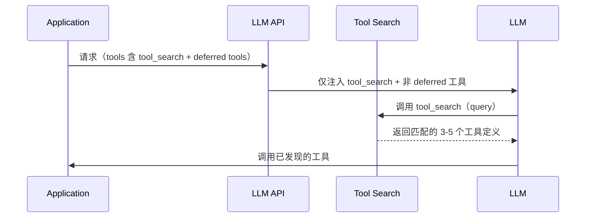
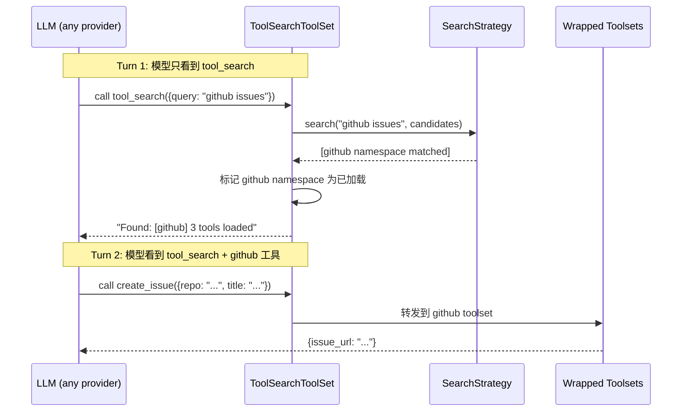
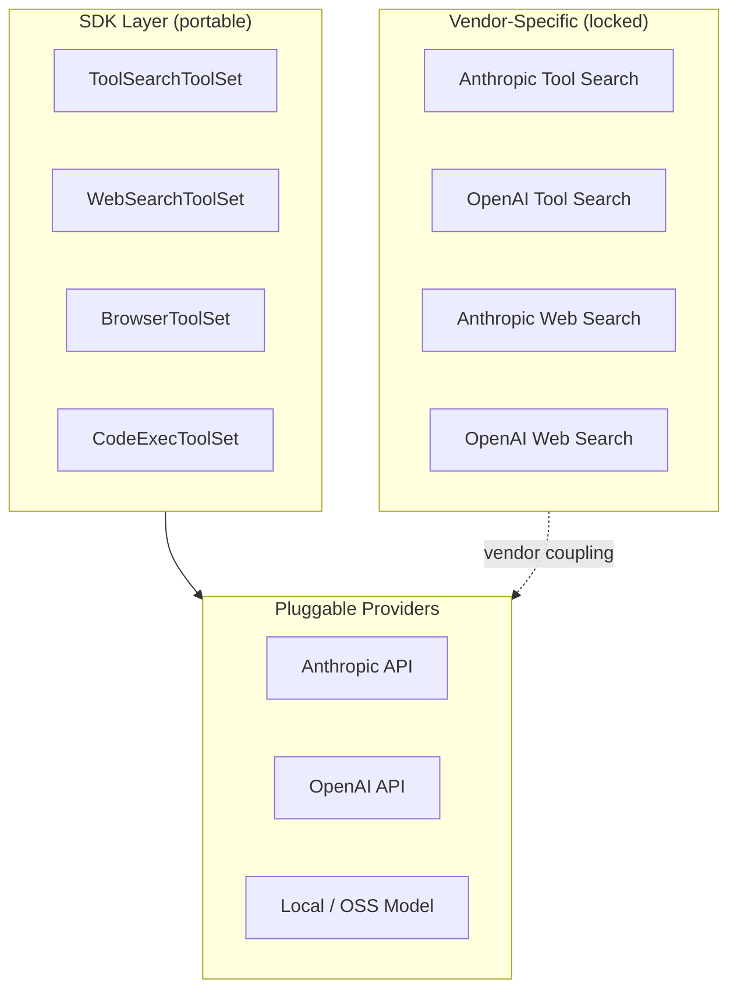

> 当 Agent 接入 5 个 MCP Server、200+ 工具时，光工具定义就能吃掉 55K token。工具多了选不准，上下文还不够用。这篇文章聊聊各家怎么解决这个问题，以及如何在 SDK 层做到供应商无关。

# 问题：工具规模与上下文窗口的矛盾

Agent 应用从"聊天机器人"演进到"工具调用代理"之后，核心约束从"对话质量"转向"工具管理"。一个典型的企业级 Agent 可能同时接入 GitHub、Slack、Sentry、Grafana、数据库等多个服务，每个服务暴露 10-50 个工具函数。

这带来两个工程问题：

1. **上下文膨胀**。每个工具的 JSON Schema 定义占 200-500 token，200 个工具就是 40K-100K token。在 200K 上下文窗口的模型里，还没开始做事就用掉了一半预算。
2. **选择精度下降**。实践表明，当可用工具数超过 30-50 个时，模型正确选中目标工具的概率显著下降。工具越多，噪声越大。

这两个问题互相加强：工具多导致上下文长，上下文长又进一步稀释模型对单个工具描述的注意力。

解决思路是一致的：**按需加载**（on-demand loading）。不把所有工具定义塞进初始上下文，而是让模型在需要时通过搜索发现并加载工具。

# 厂商方案：Anthropic 与 OpenAI 的 Tool Search

Anthropic 和 OpenAI 都在 2025 年推出了各自的 Tool Search 功能。它们的核心思路相同，但在实现细节和架构选择上有差异。

## 共同的设计模式

两家方案共享一个基本流程：

关键概念：

- **defer_loading**: 标记工具为"延迟加载"。初始请求时模型看不到这些工具的完整定义。
- **tool_search**: 一个特殊的内置工具。模型通过调用它来搜索和加载延迟工具。
- **tool_reference**: 搜索结果的引用。API 自动将引用展开为完整的工具定义。

## Anthropic 的方案

Anthropic 提供两种搜索变体：

| 变体 | 搜索方式 | 适用场景 |
|------|---------|---------|
| `tool_search_tool_regex` | 模型构造 Python 正则表达式 | 精确匹配工具名 |
| `tool_search_tool_bm25` | 模型使用自然语言查询 | 语义模糊搜索 |

搜索在服务端执行。客户端只需要在 tools 列表中声明 tool_search 工具和带 `defer_loading: true` 的工具定义，API 在一次请求内完成搜索、展开和调用。

Anthropic 同时支持 MCP 集成。可以对 MCP Server 的所有工具设置 `defer_loading` 默认值，并对个别工具单独覆盖。这意味着整个 MCP Server 可以作为一个延迟加载单元。

Anthropic 也支持客户端自行实现搜索逻辑：返回 `tool_reference` 类型的 content block 即可，API 会自动展开引用。

## OpenAI 的方案

OpenAI 的设计引入了两个额外概念：

**Namespace**。工具可以按命名空间分组。模型初始只看到 namespace 的名称和描述，搜索时按 namespace 为单位加载。这比逐个工具加载更节省 token，也更符合"一个 MCP Server 对应一个 namespace"的直觉。OpenAI 建议每个 namespace 不超过 10 个工具。

**Hosted vs Client-executed**。OpenAI 明确区分了两种执行模式：
- **Hosted**: 工具定义全部在请求中声明，搜索由 OpenAI 服务端执行。模型在单次请求内完成搜索和调用。
- **Client-executed**: 模型输出 `tool_search_call`，客户端自行执行搜索逻辑，返回 `tool_search_output`。适用于工具库动态变化、依赖租户状态等场景。

两种模式的区别在于搜索逻辑的控制权：Hosted 模式省事但不灵活，Client-executed 模式灵活但需要额外的请求轮次。

## 厂商方案的局限

两家方案都解决了上下文膨胀问题，但存在一个共同的结构性限制：**供应商锁定**。

- 搜索协议是各家私有的。Anthropic 用 `server_tool_use` + `tool_search_tool_result`，OpenAI 用 `tool_search_call` + `tool_search_output`，两者不兼容。
- 工具定义的延迟加载标记（`defer_loading`）嵌入在各自的 API 参数中。
- 服务端搜索的索引算法不透明，无法定制。
- 如果你的 Agent 需要在 Anthropic 和 OpenAI 之间切换（或同时使用多个 provider），工具管理逻辑需要写两套。

这个问题不仅存在于 Tool Search。Web Search、Code Interpreter、Computer Use 等"增强工具"都有类似的供应商耦合。每家厂商都在往 API 里塞越来越多的内置能力，而这些能力的接口互不兼容。

# SDK 方案：客户端实现 Tool Search

另一条路线是在 SDK（客户端）层面实现 Tool Search，完全绕开厂商的服务端搜索。这是 [ya-agent-sdk](https://github.com/Wh1isper/ya-agent-sdk) 的 `ToolSearchToolSet` 所采取的方式。

## 基本思路

不依赖任何厂商的 Tool Search API。把 `tool_search` 实现为一个普通的客户端工具函数，对模型而言它和 `read_file`、`run_shell` 没有区别。

核心差异：搜索发生在客户端进程内，不经过 LLM API 服务端。模型只是调用了一个返回文本结果的普通工具。下一轮对话时，SDK 的 `get_tools()` 方法动态返回已加载的工具列表。

## Namespace 与 Loose 加载

SDK 支持两种加载粒度：

| 类型 | 条件 | 行为 |
|------|------|------|
| **Namespace** | Toolset 设置了 `toolset_id` | 命中任意一个工具即加载整个 namespace 的所有工具 |
| **Loose** | Toolset 未设置 `toolset_id` | 每个工具独立加载 |

Namespace 加载对应的直觉是：一个 MCP Server 是一个原子单元。如果模型需要用 GitHub 的某个工具，大概率也需要同一 Server 下的其他工具。Loose 加载适用于零散的工具函数。

## 可插拔的搜索策略

搜索算法不是硬编码的。SDK 定义了 `SearchStrategy` 协议，内置两种实现：

**KeywordSearchStrategy**（默认）。零外部依赖。对工具名称、描述、参数名做正则匹配，按命中位置加权打分。适合工具命名规范的场景。

**EmbeddingSearchStrategy**。基于 FastEmbed 的本地向量搜索。把工具元数据编码为向量，用余弦相似度排序。适合自然语言查询和语义模糊匹配。依赖约 50MB 的 ONNX 模型，CPU 上单次查询约 5ms。

还有一个 `create_best_strategy()` 工厂函数：优先尝试 Embedding 策略，如果 fastembed 未安装则自动降级到 Keyword 策略。

开发者也可以实现自己的策略，比如基于远程向量数据库的搜索、基于 LLM 的重排序等。

## Session Restore

已加载的工具状态持久化在 `AgentContext` 中，通过 `ResumableState` 跨会话恢复。恢复会话时，之前加载过的工具和 namespace 立即可用，不需要重新搜索。

这意味着工具发现的结果可以跨越多轮对话甚至多次会话存活。

# 三种方案的对比

| 维度 | Anthropic Tool Search | OpenAI Tool Search | SDK ToolSearchToolSet |
|------|----------------------|--------------------|-----------------------|
| 搜索执行位置 | 服务端（支持客户端自定义） | 服务端 / 客户端 | 客户端 |
| 搜索算法 | Regex / BM25 | 不透明（Hosted）/ 自定义（Client） | Keyword / Embedding / 自定义 |
| Namespace 支持 | MCP toolset 级别 | Namespace 原生支持 | toolset_id 原子加载 |
| 模型绑定 | Claude 系列 | GPT 系列 | 任意模型 |
| 协议兼容 | Anthropic Messages API | OpenAI Responses API | 标准工具调用 |
| Session 恢复 | 自动展开历史引用 | Cache 友好设计 | AgentContext 持久化 |
| 搜索算法可定制 | 否（客户端模式除外） | 否（Hosted）/ 是（Client） | 是 |

# 更广泛的问题：供应商锁定

Tool Search 只是一个缩影。类似的供应商耦合模式出现在多个领域：

**Web Search**。Anthropic 有内置的 web search tool，OpenAI 有 web search connector。两者的输入输出格式不同，搜索引擎不同，结果质量也不同。如果你在 SDK 层把 web search 实现为一个普通工具（调用 Google/Bing/SearxNG API），就完全不依赖厂商的内置能力。

**Code Interpreter**。两家都提供沙盒代码执行环境，但执行环境的配置、可用库、超时策略都不同。SDK 方案是启动自己的沙盒容器（E2B、Docker 等）。

**Computer Use / Browser**。Anthropic 的 Computer Use 和 OpenAI 的 Computer Use 接口不兼容。SDK 方案是对接 Playwright 或 Browser MCP Server。

**MCP 本身**。虽然 MCP 是一个开放协议，但两家厂商对 MCP 的集成方式不同——Anthropic 在 API 层支持 `mcp_servers` 参数直连，OpenAI 通过 Responses API 的 connector 机制接入。SDK 层面则通常直接管理 MCP Client 的生命周期。

这些案例指向一个工程决策：**把供应商特有的能力转化为 SDK 层面的可替换实现**。

这不是说厂商的方案没有价值。服务端 Tool Search 省去了客户端的计算和索引维护开销，对小团队来说是合理的选择。但当你的系统需要：

- 跨多个 LLM Provider 工作
- 定制搜索算法（比如租户级别的工具权限过滤）
- 在离线/私有化部署环境运行
- 控制工具发现的确定性行为

客户端实现就成为更稳健的架构选择。

# 工具管理的实践建议

基于以上分析，给出几条工具管理的实践建议：

**1. 10 个工具以下不需要 Tool Search**。工具少的时候，全部加载到上下文反而更简单，模型选择准确率也足够高。

**2. 高频工具常驻，低频工具按需加载**。把 3-5 个核心工具（如文件读写、Shell 执行）直接注册，其余工具通过 Tool Search 按需发现。

**3. 按服务边界划分 Namespace**。一个 MCP Server或一套工具集 对应一个 Namespace。Namespace 描述写清楚这组工具能做什么，不需要列举具体工具名。模型根据描述决定是否加载。

**4. 工具描述是搜索质量的关键**。无论用哪种搜索策略，工具的 name 和 description 都是最重要的检索信号。命名用 `verb_noun` 格式（如 `create_issue`、`search_papers`），描述用一句话说明输入输出。

**5. 搜索策略按场景选择**。工具命名规范、数量可控时，Keyword 策略就够了。工具来自多个第三方 MCP Server、命名不统一时，Embedding 策略更鲁棒。

**6. 评估供应商耦合的成本**。如果你的产品只用一家 LLM Provider 且不打算换，用厂商的内置 Tool Search 完全合理。如果你在构建需要支持多 Provider 的 SDK 或平台，客户端实现是更安全的选择。

# 写在最后

上述实践来自 [ya-agent-sdk](https://github.com/Wh1isper/ya-agent-sdk)（[PR #39](https://github.com/Wh1isper/ya-agent-sdk/pull/39)），ya-agent-sdk是我积极维护的agent-sdk，用于原型创建和研究。构建于[Pydantic AI](https://github.com/pydantic/pydantic-ai)之上，希望提供SOTA的上下文管理和开发体验。

关注本站 RSS，我会持续分享 Agent 构建过程中的架构思路和工程实践。
