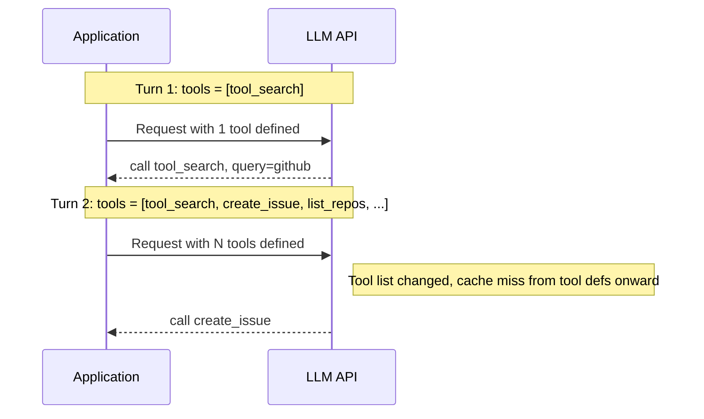
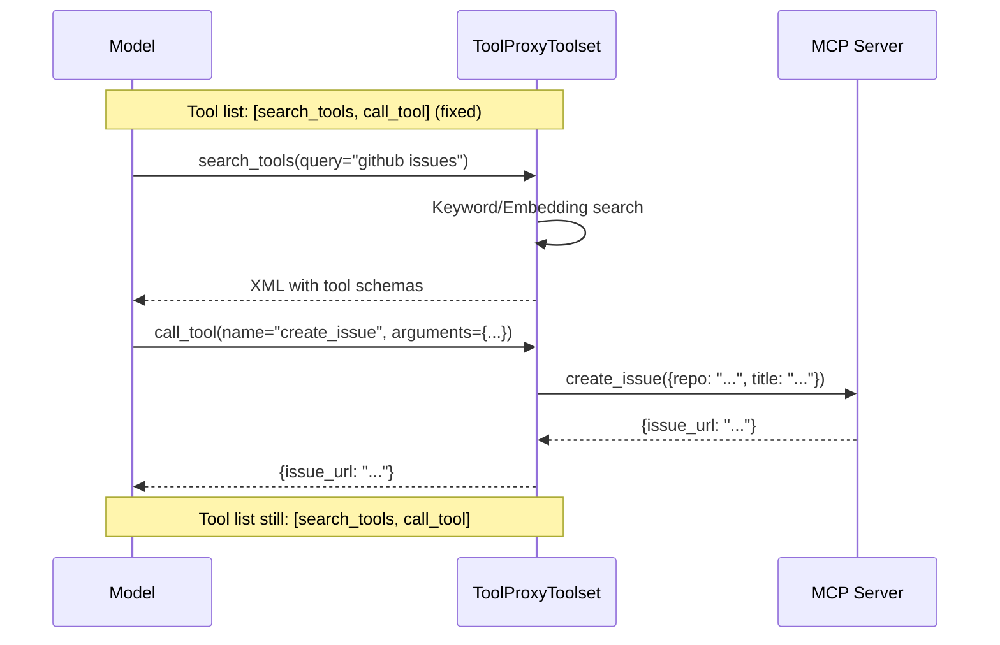
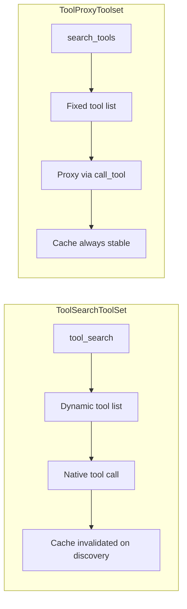
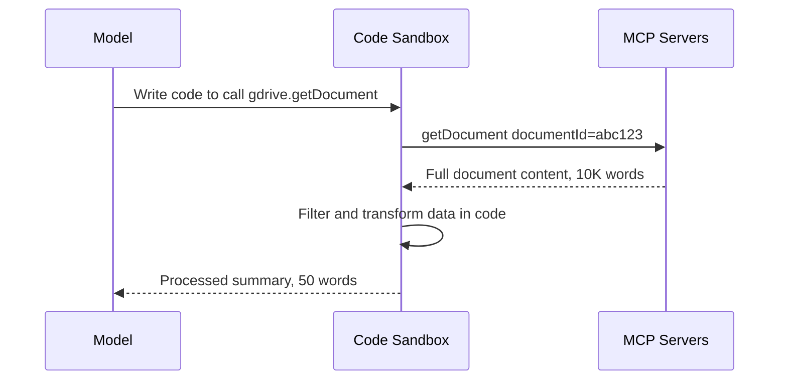

> 上一篇[《Agent 工具发现：从上下文膨胀到按需加载》](/2026/03/06/tool-search-for-agents/)介绍了 ToolSearchToolSet——通过搜索发现并动态加载工具到模型的工具列表中。方案解决了上下文膨胀问题，但引入了一个新的工程约束：每次加载新工具都会改变工具列表，导致 Prompt Cache 失效。本文讨论这个问题的成因和一种不改变工具列表的替代方案。

# 问题回顾：ToolSearchToolSet 做了什么

先简要回顾上一篇的方案。ToolSearchToolSet 的核心逻辑是：

1. 初始状态下，模型只看到 `tool_search` 这一个搜索工具。
2. 模型调用 `tool_search` 发现目标工具后，SDK 将其加入工具列表。
3. 下一轮对话时，模型直接看到并调用新工具。

这个方案的优点是模型通过原生工具调用（native tool call）与工具交互，调用体验和普通工具一致。但"动态加入工具列表"这一步带来了一个成本问题。

# Prompt Cache 的工作原理

理解问题之前，需要先了解 Prompt Cache 的机制。

Anthropic 和 OpenAI 都提供了 Prompt Cache 能力。核心思路是：当连续的 API 请求共享相同的前缀内容时，服务端可以缓存这部分内容的 KV Cache，后续请求跳过前缀的重新计算，降低延迟和成本。

对于 Anthropic Claude，缓存的输入 token 费用是标准价格的 10%；对于 OpenAI，缓存命中时输入 token 费用减半。对于长上下文的 Agent 应用来说，这是一个显著的成本差异。

缓存命中的前提是**前缀完全一致**。以 Anthropic Claude 为例，一次 API 请求的前缀结构是：

```
[Tool Definitions] + [System Prompt] + [Conversation History...]
```

工具定义排在最前面。这意味着工具列表一旦发生变化——哪怕只是新增了一个工具——从变化点开始，System Prompt 和整个对话历史的缓存全部失效。

# 动态工具列表为什么破坏缓存

ToolSearchToolSet 的工作流程中，工具列表在运行时变化：



Turn 1 的请求缓存了 `[System Prompt] + [tool_search definition]` 这段前缀。Turn 2 的工具列表变成了 `[tool_search, create_issue, list_repos, ...]`，前缀从工具定义部分开始就不同了。之后对话历史中积累的所有 token 都无法命中缓存。

对于长对话的 Agent（比如一个编程 Agent 可能一次会话有 50-100 轮对话、100K+ token 上下文），每次工具发现都触发缓存失效，累积的成本开销不可忽略。

更具体地量化：假设一个 Agent 会话在发现工具后还有 80K token 的对话历史。如果使用 Anthropic Claude，缓存命中时这 80K token 的输入费用是标准价的 10%。缓存失效意味着每次请求都要按全价计算这 80K token。对于一个每天处理上千个会话的系统，差异会体现在账单上。

# ToolProxyToolset：固定工具列表的方案

解决思路直接：**不改变工具列表**。

ToolProxyToolset 把所有外部工具藏在两个固定的代理工具背后：

- **`search_tools`**: 搜索可用工具，返回工具名称、描述和完整参数 Schema
- **`call_tool`**: 通过名称调用任意已发现的工具

工具列表始终是 `[search_tools, call_tool]`，不会因为发现新工具而变化。



模型不再直接调用 `create_issue`，而是通过 `call_tool` 间接调用。工具定义前缀从始至终不变，Prompt Cache 始终命中。

# search_tools 的信息传递

工具列表不变，意味着模型永远不会在工具定义中看到目标工具的 Schema。那模型怎么知道如何构造参数？

答案是 `search_tools` 的返回值中包含完整的参数 Schema。结果以 XML 格式返回：

```xml
<search-results query="github issues" count="3">
<tool name="create_issue" namespace="github">
  <description>Create a new issue in a repository</description>
  <parameters>{"type": "object", "properties": {"repo": {"type": "string"}, "title": {"type": "string"}, "body": {"type": "string"}}, "required": ["repo", "title"]}</parameters>
</tool>
<tool name="list_issues" namespace="github">
  <description>List issues in a repository</description>
  <parameters>{"type": "object", "properties": {"repo": {"type": "string"}, "state": {"type": "string", "default": "open"}}, "required": ["repo"]}</parameters>
</tool>
<tool name="close_issue" namespace="github">
  <description>Close an existing issue</description>
  <parameters>{"type": "object", "properties": {"repo": {"type": "string"}, "issue_number": {"type": "integer"}}, "required": ["repo", "issue_number"]}</parameters>
</tool>
</search-results>
```

模型从这段对话内容中读取 Schema，然后构造 `call_tool` 调用。Schema 信息在对话历史中而不在工具定义中——对话历史本身不会影响前缀缓存的有效性（对话历史追加在前缀之后）。

# 错误处理与自修正

原生工具调用时，参数校验由框架（pydantic-ai）自动完成，模型收到的是结构化的验证错误。ToolProxyToolset 中，工具调用通过 `call_tool` 代理，校验逻辑由代理层捕获并转换为 XML 格式的错误信息：

```xml
<tool-call-error tool="create_issue">
  <message>Missing required argument: repo</message>
  <parameters>{"type": "object", "properties": {"repo": {"type": "string"}, "title": {"type": "string"}}, "required": ["repo", "title"]}</parameters>
</tool-call-error>
```

错误信息中附带完整的参数 Schema，模型可以据此修正参数并重试。实践表明，主流模型（Claude、GPT-4o）在看到这种结构化错误后的修正成功率与原生验证错误基本一致。

# 跳过搜索直接调用

`call_tool` 不要求模型必须先搜索。如果模型已经知道工具名称和参数（比如从对话上下文、历史搜索结果、或 Session 恢复后的动态指令中获知），可以直接调用：

```
call_tool(name="create_issue", arguments={"repo": "org/repo", "title": "Bug fix"})
```

这避免了"搜索 -> 调用"的强制两步流程。在 Session 恢复场景中，ToolProxyToolset 通过动态指令列出之前已发现的工具摘要，模型看到摘要后可以直接发起 `call_tool`，不需要重新搜索。

# 与 ToolSearchToolSet 的权衡

两种方案并非简单的替代关系，而是不同约束下的不同选择。



| 维度 | ToolSearchToolSet | ToolProxyToolset |
|------|-------------------|------------------|
| 工具列表 | 发现后动态增长 | 始终 2 个工具 |
| Prompt Cache | 发现时失效 | 始终稳定 |
| 模型调用方式 | 原生工具调用 | 通过 call_tool 代理 |
| Schema 可见性 | 模型在工具定义中看到 Schema | 模型从搜索结果文本中读取 Schema |
| 参数校验 | 框架原生校验 | 代理层捕获，XML 错误反馈 |
| 模型认知负荷 | 低（标准工具调用） | 较高（需理解代理模式） |
| 状态存储 | AgentContext | AgentContext（共享） |
| 搜索策略 | 相同接口 | 相同接口 |
| HITL | 相同行为 | 相同行为（re-raise ApprovalRequired） |

核心权衡是 **Cache 稳定性 vs. 模型交互简单性**。

ToolSearchToolSet 对模型更友好——模型直接看到工具定义并原生调用，这是 LLM 训练时最常见的交互模式。ToolProxyToolset 要求模型理解"通过一个间接层调用工具"的模式，这对较弱的模型可能是个挑战。

但对于成本敏感的生产系统，ToolProxyToolset 的 Cache 稳定性带来的成本节省往往更重要。尤其是当 Agent 接入大量 MCP Server、单次会话上下文较长时，Cache 命中率的差异会直接体现在延迟和费用上。

# 选择建议

基于上述分析：

**选 ToolProxyToolset 的场景**：
- MCP Server 数量多、工具总数大（30+）
- 单次会话上下文长（50K+ token）
- 成本敏感，需要最大化 Prompt Cache 命中率
- 使用的模型能力强（Claude Sonnet/Opus、GPT-4o），能可靠处理代理调用模式

**选 ToolSearchToolSet 的场景**：
- 工具数量适中（10-30），发现行为不频繁
- 使用较小的模型，代理模式可能导致调用错误率上升
- 会话较短，Cache 失效的成本影响有限
- 优先考虑调用可靠性而非成本优化

**10 个以下工具**：两种方案都不需要。直接全部加载到工具列表即可。

# 实现细节

ToolProxyToolset 复用了 ToolSearchToolSet 的基础设施：

- **SearchStrategy 接口**：相同的 `KeywordSearchStrategy` 和 `EmbeddingSearchStrategy`，可互换。
- **ToolMetadata**：相同的工具元数据提取逻辑。
- **AgentContext 状态字段**：`tool_search_loaded_tools` 和 `tool_search_loaded_namespaces`，两种方案共享状态存储，甚至可以在两种方案之间切换而不丢失已发现的工具状态。
- **Namespace / Loose 加载**：相同的原子加载语义。
- **Optional Namespaces**：相同的可选命名空间机制，适配不稳定的 MCP Server。

新增的设计点：

- **动态指令（Dynamic Instructions）**：ToolProxyToolset 生成包含命名空间列表、已发现工具摘要的动态指令，注入到 System Prompt 中。以 Anthropic 为例，Tool Definitions 排列在 System Prompt 之前，因此 System Prompt 的变化不会破坏工具定义部分的缓存前缀。（System Prompt 的变化会影响其之后的对话历史缓存，但工具发现通常发生在会话早期，后续轮次中指令保持稳定。）
- **XML 格式的搜索结果和错误信息**：选择 XML 而非 JSON，是因为 XML 的标签结构对模型的解析更友好，在对话上下文中的可读性也更好。

# 延伸：Code Execution 方案——更激进的思路

Anthopic 在 2025 年 11 月发表了一篇工程博客 [Code execution with MCP](https://www.anthropic.com/engineering/code-execution-with-mcp)，提出了一个更激进的方案来解决同一类问题。

其核心思路是：不让模型通过工具调用（tool call）与 MCP 交互，而是让模型**写代码**来调用工具。MCP Server 的每个工具被映射为文件系统上的一个 TypeScript 函数，模型通过浏览文件系统发现工具定义，然后编写代码在沙盒中执行。



这个方案解决了 ToolProxyToolset 没有解决的一个问题：**中间结果膨胀**。

在 ToolProxyToolset 中，`call_tool` 的返回值仍然完整地回流到模型上下文。如果一个工具返回了 10K 行的表格数据，模型会看到全部内容。而在 Code Execution 方案中，模型可以在沙盒里执行 `filter`、`map`、`slice` 等操作，只把处理后的结果返回给自己。Anthropic 的文章举了一个例子：10,000 行表格经过代码过滤后，模型只看到 5 行。

此外，Code Execution 方案还支持**组合调用**——一段代码中可以串联多个工具调用，中间结果在沙盒内流转而不经过模型。这进一步减少了上下文消耗和模型推理轮次。

## ToolProxyToolset 与 Code Execution 的对比

| 维度 | ToolProxyToolset | Code Execution |
|------|------------------|----------------|
| 中间层 | 结构化代理工具（call_tool） | 代码执行沙盒 |
| 中间结果处理 | 完整回流到模型上下文 | 在沙盒中过滤后再返回 |
| 组合调用 | 一次调一个工具 | 一段代码调多个工具 |
| 基础设施要求 | 无（纯 SDK 层） | 需要安全沙盒环境 |
| 关注的核心问题 | Prompt Cache 稳定性 | Token 效率（定义 + 中间结果） |
| 模型能力要求 | 理解代理调用模式 | 能写正确的异步代码 |
| 安全性复杂度 | 低（工具调用有权限控制） | 高（需要沙盒隔离、资源限制） |

两种方案并不互斥。ToolProxyToolset 解决的是工具定义层面的问题（定义膨胀、Cache 失效），Code Execution 解决的是执行层面的问题（中间结果膨胀、多步编排）。一个可能的组合方式是：用 ToolProxyToolset 做工具发现和 Schema 管理，用 Code Execution 做实际调用和数据处理。

但 Code Execution 方案的工程成本也更高。安全沙盒的构建和维护（资源限制、网络隔离、超时控制）是一个独立的基础设施问题。

## 编程 Agent 已经是 Code Execution 环境

仔细审视 Anthropic 描述的 Code Execution 方案，会发现一个有趣的事实：它所构建的能力，编程 Agent 已经天然具备了。

把 Anthropic 方案的核心要素逐一对应：

| Anthropic Code Execution | 编程 Agent（如 yaacli） |
|--------------------------|------------------------|
| 文件系统发现工具定义 | Skills 目录 + 文件系统浏览 |
| 代码执行沙盒 | Shell / Bash 执行 |
| 中间结果在沙盒内过滤 | Shell 管道 + 脚本处理 |
| 保存可复用函数（Skills） | Skills 系统（SKILL.md + 脚本） |
| 状态持久化到文件 | 工作目录文件读写 |

一个拥有 Shell 访问权限和 Skills 系统的编程 Agent，本身就是一个代码执行环境。它不需要额外构建沙盒来"将 MCP Server 呈现为代码 API"——它可以直接写一个脚本调用 MCP Server 的 CLI 工具，用管道过滤数据，把结果存到文件里供后续使用。这些都是 Shell 环境的原生能力。

这指向一个更深层的架构观察：**Anthropic 的 Code Execution 方案本质上是在给 MCP 打补丁，试图让工具调用协议接近编程环境的表达能力。而编程 Agent 从一开始就选择了正确的抽象层次——模型就是一个有环境访问权限的程序员，工具交互只是它编程能力的自然延伸。**

MCP 作为工具协议，解决的是"如何标准化地连接工具"的问题。但当工具数量增长到需要 progressive disclosure、code execution、skills 等机制来管理时，问题的本质已经从"工具连接"变成了"环境交互"。在这个层面上，Shell + 文件系统 + Skills 是一个更自然、更成熟、更通用的抽象。

这不是说 MCP 没有价值。MCP 在标准化工具接口、跨语言互操作方面仍然重要。但对于编程 Agent 来说，与其在 MCP 上层叠加越来越多的补丁机制（Tool Search、Tool Proxy、Code Execution sandbox），不如直接利用 Agent 已有的编程能力来处理工具发现、数据过滤和多步编排。ToolProxyToolset 解决的 Prompt Cache 问题是一个纯粹的 LLM API 层面的工程约束，它和工具交互的抽象层次无关，所以仍然有独立存在的价值。

# 写在最后

ToolProxyToolset 的实现在 [ya-agent-sdk PR #53](https://github.com/Wh1isper/ya-agent-sdk/pull/53)。yaacli（ya-agent-sdk 的 CLI 运行时）已经从 ToolSearchToolSet 切换到 ToolProxyToolset 作为默认的 MCP 工具管理方案。

两种方案不是互斥的。在同一个 SDK 中提供两种选择，开发者可以根据自己的模型能力、成本约束和工具规模选择合适的方案。这也是客户端实现工具管理的优势——选择权在开发者手中，而不是被厂商的 API 设计锁定。

关注本站 RSS，我会持续分享 Agent 构建过程中的架构思路和工程实践。
