# 构建潜意识：一种 Proactive Agent 构建方式

Proactive Agent 的核心是 context 的传递和管理。普通对话系统以 session 为边界，每个 session 稳定处理当前对话、当前工具调用和当前 memory 生命周期。主动性要求系统拥有一层类似潜意识的 `subconscious layer`：持续观察、连接、准备，并在合适的时机把 context 递回具体 session。

Singleton Agency 更接近 IM 产品，也更接近人类工作方式。人类员工在群聊、私聊、会议、文档之间切换时，会在后台维护一个持续的 `attention system`：谁承诺了什么，哪个信息需要同步，哪个决策影响了另一个群，哪个风险需要提前提醒。数字员工也需要这层 `subconscious layer`。它在 front-stage conversation 之外维护 `global attention`，负责发现弱信号、连接跨 session context、准备后续动作，并把信息轻量送回 target session。

这篇文章记录一个实际系统里的设计演进：先把 proactive logic 放进 conversation session，再把后台关注拆成 paired agency session，最后收敛成 singleton agency。每一步都解决上一层结构里的 context 管理问题，也暴露下一层结构需要处理的 context routing 问题。

## 1. Front-stage Session：conversation session 与 memory lifecycle

当前系统的基本单位是 `conversation session`。用户消息、API 输入、IM bridge 消息都会进入某个 session。session 创建 run，run 执行 agent runtime，runtime 读取工具、workspace、历史消息、memory，再输出结果。

一个 conversation session 有自己的生命周期：

- 接收输入。
- 创建或合并 run。
- 运行 agent。
- 写入 run output。
- 提交消息历史。
- 触发 memory lifecycle。
- memory agent 提取长期事实、偏好、任务线索和摘要。
- 下一轮 run 重新读取 memory。

这个模型能支撑普通对话代理。context ownership 清晰：当前 session 负责当前会话，memory lifecycle 负责把会话中稳定的信息转成 long-term context。

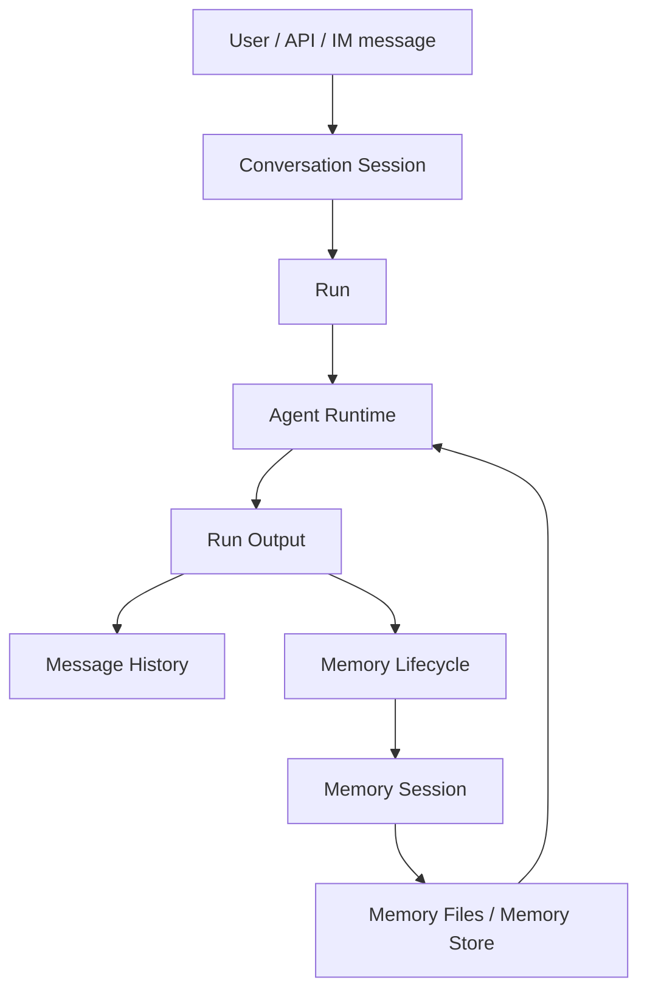

这套结构的关键边界是 session-local。一次 run 主要看到当前 session 的 context。memory lifecycle 会把当前 session 的稳定信息沉淀下来，再在后续 run 中注入。它擅长保存 long-term context，跨 session 的 proactive discovery 需要额外机制支撑。

## 2. Case：一个 release path 变更如何穿过多个群聊

考虑一个 Agent IM 场景：

1. 架构群里决定把 release path 从 `legacy-release` 改成 `canary-release`。
2. 项目群仍在按 `legacy-release` 讨论排期和负责人。
3. 某个开发在私聊里承诺周五前补齐迁移脚本。
4. 发布群里出现生产数据权限风险，需要提前确认审批路径。
5. 会议纪要里记录了最终 owner 和 deadline。

这些信息分别落在不同 session：架构群、项目群、私聊、发布群、会议 memory。每个 session 都有自己的 context 和 memory。真正需要的是一个跨 session 的 context router：它能知道架构群的决策影响项目群，私聊承诺影响项目推进，发布群风险影响当前方案，会议 memory 可以补齐 owner 和 deadline。

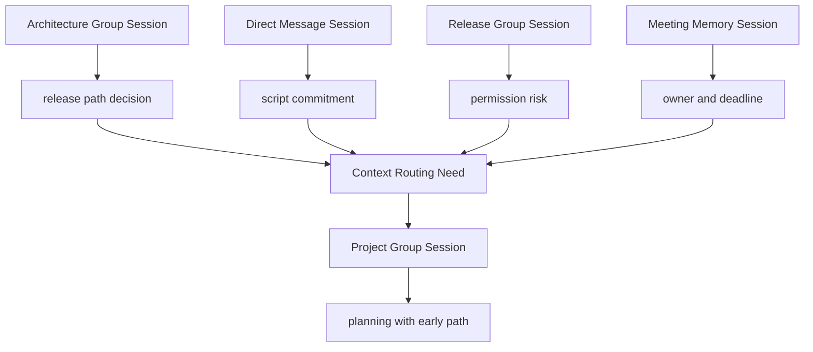

这个 case 贯穿后面的设计。Proactive Agent 的问题可以具体化为：系统怎样把这些分散 context 送到正确 session，并让目标 session 用当前语气、权限和工作状态继续处理。

## 3. 演进一：Session-local Proactive Logic

最直接的演进是在每个 conversation session 内增强 prompt 和 memory lifecycle。每条消息进来后，当前 session agent 自己判断：是否有 follow-up、是否需要提醒、是否需要写入 memory、是否需要发起下一步行动。

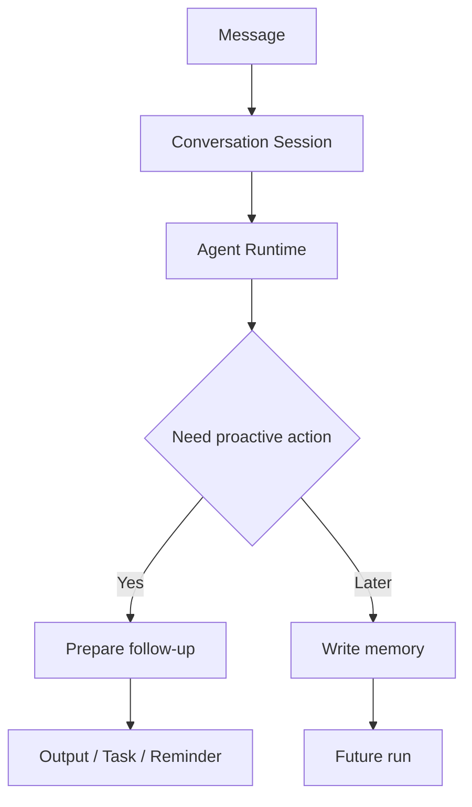

这个形态解决的是 current-session follow-up。context 在一个 session 内闭环，工具权限、用户语气、消息历史都在本地。每个 session agent 对当前对话拥有最强判断力。

它的边界也清晰：

- context 传播依赖当前 session 自己看到的内容。
- 跨 session 关系需要通过 memory 或外部检索间接发现。
- 每个 session 都会重复维护主动性逻辑。
- 主动行为的预算、风险策略和审计日志分散在多个 session 中。

这个形态适合当前会话里的主动提醒，例如从一句话里识别待办、提醒用户补充 deadline、把当前对话总结成任务。对于 release path case，项目群 session 需要主动发现架构群、私聊、发布群、会议 memory 里的相关 context，系统成本会快速上升。这个边界推动下一步演进：把前台回答和后台关注拆开。

## 4. 演进二：Paired Agency Session

下一步演进是为每个 conversation session 创建一个配套的 `agency session`。conversation session 负责用户对话，agency session 负责后台观察、反思、计划和跟进。

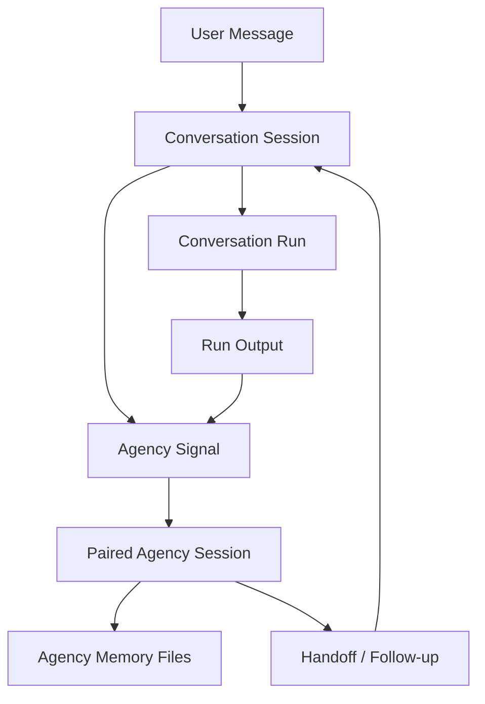

这个结构解决的是 background continuity。它把“正常回答”和“后台关注”拆成两个 session，让 agency session 拥有自己的 episode、intention、action log。它可以在 conversation session 空闲后继续整理，记录下一次唤醒条件，也可以在新信号到来时继续上一次 agency episode。

它的主要边界来自数量和视角：

- 每个 conversation session 都有自己的 agency session，后台状态数量随会话增长。
- 每个 agency session 主要关注自己的 source session，跨 session context 需要额外路由。
- 同一个人、同一个项目、同一个风险可能出现在多个 session 中，多个 agency session 会各自维护部分事实。
- 主动提醒的全局优先级难统一，例如哪个群更值得提醒、哪个 stale wait 更紧急、哪个风险应该先处理。

per-session agency 适合“每条对话都有一个 shadow agent”的产品形态。它把主动性做进了 session 体系，全局 context 仍然分散在多个 shadow agent 中。对于 release path case，每个 shadow agent 都能维护 local signal，跨群同步需要额外的 global coordination layer。这个边界推动下一步演进：把 background attention 从 per-session 结构提升到 singleton 结构。

## 5. 演进三：Singleton Agency

最终方案把 agency 收敛成一个全局 singleton session。整个 Claw 实例只有一个 `session_type="agency"` session。它通过 durable fire 观察所有 conversation session、memory session 和 heartbeat，再通过统一的 session submit 机制把输入送入 Agency runtime。

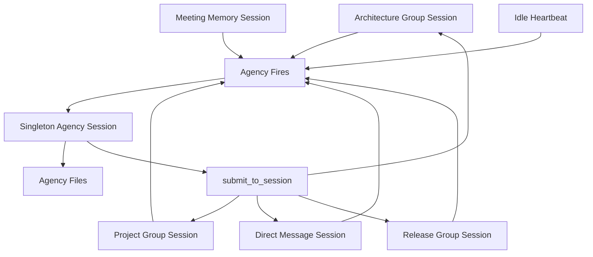

Singleton Agency 解决的是 global context routing。它是系统的 `subconscious layer`，接收 front-stage session 的消息、输出和 memory 产物，在后台维护 `global attention`。它的工作方式更接近人类员工：看见多个聊天窗口里的 weak signal，把分散事实连接成工作判断，然后在合适时机提醒正确的人或正确的群。

它也是数字员工的必要结构。数字员工需要跨群、跨任务、跨会议、跨私聊维护 continuity。一个数字员工应该能记住“架构群已经改了 release path”，也能知道“项目群现在需要这条信息”，还能把 reminder 交给项目群 session，让项目群 agent 用当前 context 完成最终表达。

Agency 观察四类 fire：

| Fire | 作用 |
| --- | --- |
| `message_observed` | 复制 source session 的新输入 |
| `run_output_observed` | 复制成功 conversation run 的输出 |
| `memory_session_completed` | 复制 memory agent 的产物 |
| `heartbeat` | 空闲时做低优先级主动回顾 |

这些 fire 进入同一个 durable queue。每条 fire 记录 source session、source run、payload、dedupe key、priority 和状态。Agency 通过 `pending -> submitted / merged / steered -> consumed / failed` 的状态流管理交付。

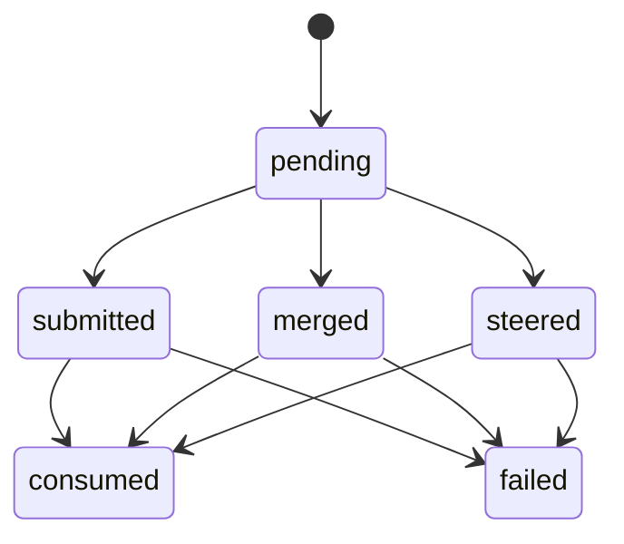

这里最重要的设计点是统一 submit 语义。Agency 自己收到 fire 时走 `SessionController.submit_input()`；Agency 想提醒某个 source session 时也走 `SessionController.submit_input()`。

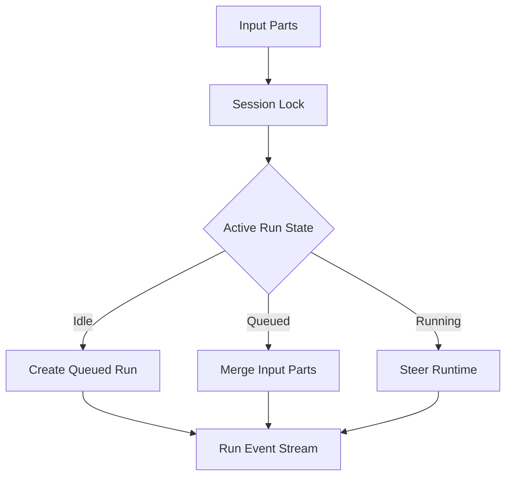

这让 context 传递变成同一种数据结构：`input_parts + metadata + trigger_type`。用户输入、IM bridge、heartbeat、agency fire、agency handoff 都是 session input。系统只需要维护一套 session delivery 语义。

## 6. Context Routing Model：从 fire 到 handoff

Singleton Agency 的核心能力是 context routing。它把 context 的发现、组织、持久化、交付拆成三层。

第一层是 source context。它来自具体 conversation session，包括用户消息、bridge metadata、run output、source run ID、source session ID。Agency 通过 fire 获取这些上下文的复制件。复制件是第一层 context，source session 和 run trace 是按需读取的第二层 context。

第二层是 agency context。Agency 拥有自己的 long-term attention state：

```text
AGENCY.md
agency/ACTION_LOG.md
agency/episodes/*.md
agency/intentions/*.md
agency/archive/*.md
```

`AGENCY.md` 记录当前 attention index，`ACTION_LOG.md` 记录 material action 和 decision，`episodes/` 保存重要 investigation 过程，`intentions/` 保存 deferred opportunity 和 future trigger condition。

第三层是 handoff context。当 Agency 发现某个 source session 可以受益于全局信息时，它调用 `submit_to_session`，把一段自然语言 nudge 注入目标 session，并附带轻量 metadata。

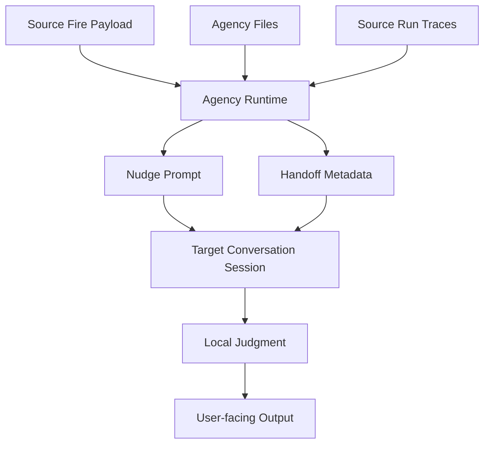

handoff 的内容通常包括：

- Agency 观察到了什么。
- 这个信号当前为什么重要。
- 建议 target session 采取什么下一步。
- 涉及哪个人、哪个群、哪个 session、哪个 run 或哪个 artifact。
- fire IDs、source run IDs、async task IDs 等 provenance。
- 影响判断的不确定性或置信度。

它的 metadata 负责机器可读部分：

```json
{
  "handoff_kind": "reminder",
  "handoff_tags": ["agency-reminder", "ask-person", "stale-wait"],
  "metadata": {
    "fire_ids": ["..."],
    "source_run_ids": ["..."],
    "people": ["Alice"],
    "artifact_paths": ["agency/episodes/..."]
  }
}
```

这个模型把 context 的 producer 和 consumer 拆开。Agency 负责 global discovery 和 preparation，conversation session 负责 local judgment 和 user-facing expression。这样可以保留 source session 的语气、权限、workspace 状态和当前对话意图。

## 7. Case Walkthrough：release path 变更如何被路由到项目群

回到前面的 release path case，Singleton Agency 的运行过程可以拆成五步。

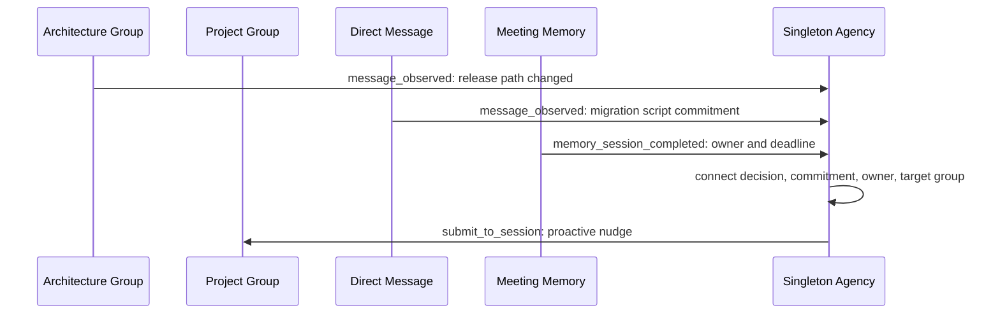

Agency 收到架构群消息 fire，记录 release path 变更。它随后收到私聊承诺 fire，知道迁移脚本有人负责。会议 memory 完成后，它拿到 owner 和 deadline。项目群继续讨论早期路径时，Agency 能把这些 context 连接起来：项目群需要更新 release path，需要确认迁移脚本 owner，也需要把发布风险纳入排期。

最终 Agency 通过 `submit_to_session` 给项目群 session 发送一段 nudge：

```text
Agency noticed a release-path update from the architecture group. The current path is canary-release. Alice committed to finish the migration script by Friday, and the meeting memory records Bob as the release owner. Suggested move: remind the project group to update the release plan, confirm the migration script owner, and include the permission risk check before finalizing the schedule.
```

项目群 session 收到这段 handoff 后，结合项目群当前 context 决定如何表达。它可以提醒群成员、询问 Alice、更新任务，也可以把风险确认放进下一步计划。Agency 负责送达 context，项目群 session 负责完成当前对话里的行动。

## 8. Task Decomposition vs Context Routing

传统 Multi-Agent 系统通常把问题拆给多个角色：planner、researcher、coder、reviewer、manager。它适合完成一个明确任务。任务被拆解，agent 之间传递中间结果，最后收敛为一个 output。

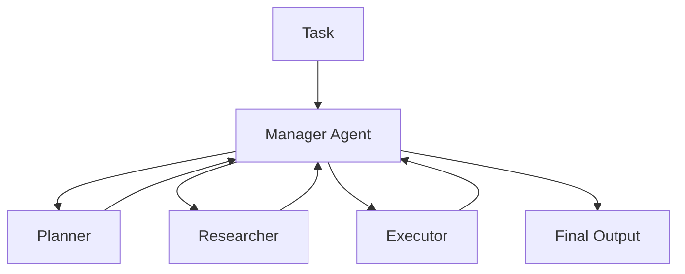

这是一种 task decomposition 架构。核心问题是：如何把一个任务拆成多个子任务，并把结果合并。

Agent IM 和数字员工面临的是 context routing。系统面对多条长期 session、多个人、多段承诺、会议 memory、跨群信息差、延迟触发和时机判断。核心问题是：哪个 context 应该在什么时间进入哪个 session。

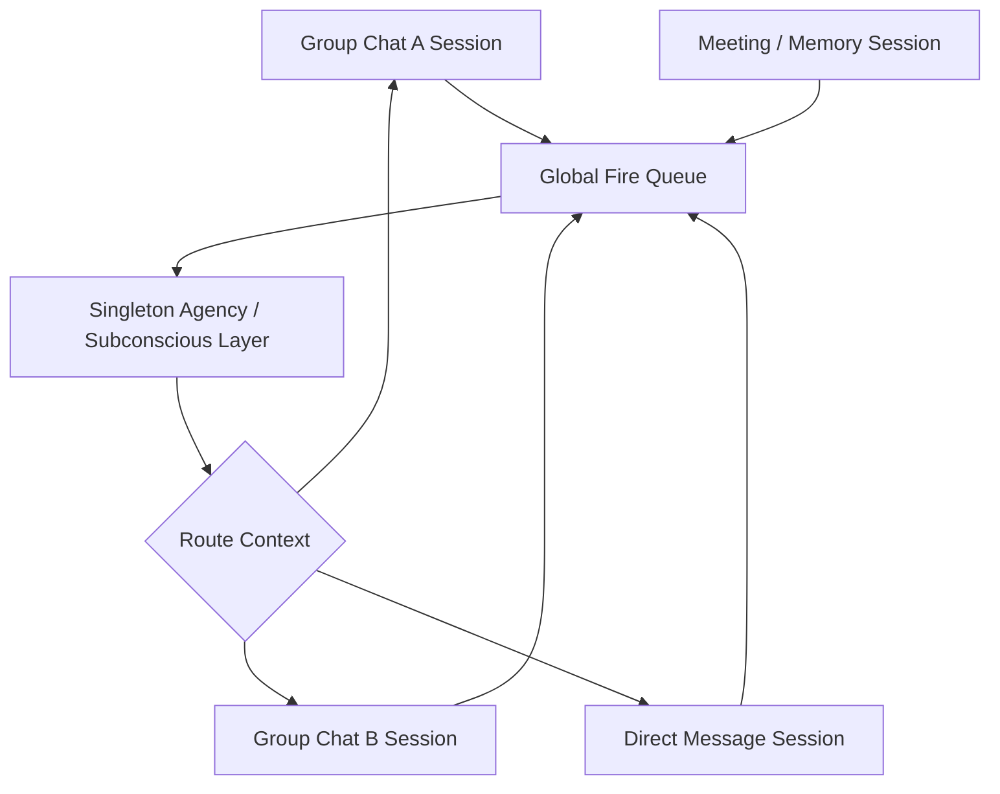

两类系统的差异可以用 context 管理来描述：

| 维度 | Multi-Agent Task System | Singleton Agency Context Routing |
| --- | --- | --- |
| 核心对象 | 一个任务 | 多个长期 session |
| 主要问题 | task decomposition | context routing |
| Context 形态 | task context 和 intermediate artifacts | 消息、输出、memory、heartbeat、cross-session signals |
| 调度方式 | manager 分派 subtask | durable fire 唤醒 subconscious layer |
| 输出位置 | final output | 目标 conversation session |
| 状态管理 | task-local state | global attention state + source session state |
| 介入方式 | 执行任务步骤 | 给正确 session 发送 bounded nudge |

Multi-Agent 系统的强项是 task decomposition。Singleton Agency 的强项是 context routing。它可以在需要时使用 async subagents 做 investigation、summary、review 和 preparation，它自己的核心角色是 global attention layer。

## 9. 为什么它更接近人和数字员工

人类员工的协作能力来自持续的 context routing。一个人参加会议、阅读文档、回复私聊、在群里协调事项时，会持续维护一张隐式工作图谱：谁拥有决策权，哪个承诺影响哪个项目，哪个风险需要提前暴露，哪个信息应该同步给哪个群。

数字员工也需要这张 implicit work graph。它需要在多个 session 之间保持 continuity，同时尊重每个 session 的 local context。Singleton Agency 提供了这层 subconscious layer：

- 它拥有跨 session 的观察面。
- 它维护 global attention state。
- 它通过 durable fire 管理触发与审计。
- 它通过 handoff 把 context 送回具体对话。
- 它让 source session 保留用户表达、权限和当前判断。

因此，这个方案更像一个数字员工的后台认知结构：front-stage session 负责说话和执行，singleton agency 负责 attention、connection、preparation 和 reminder。

## 10. 工程结果

当前方案带来的直接结果是：

1. Context 有明确分层：source context、agency context、handoff context。
2. 主动触发有 durable fire 管理，支持去重、排序、审计和失败恢复。
3. Agency 和 source session 共用 submit 语义，idle、queued、running 三种状态统一处理。
4. 全局判断和局部执行分离，source session 保留用户表达和当前上下文所有权。
5. Long-term state 有 material write policy，background agent 只在产生 durable value 时写文件。
6. Agent IM 的跨群提醒、owner routing、stale wait、risk nudge 都能复用同一套机制。

Proactive Agent 的架构重点是 context 的位置。普通 session 保存 local context，memory lifecycle 保存 stable facts，singleton agency 保存 global attention state，handoff 把 global context 送回具体对话。主动性来自这条 context routing pipeline。
