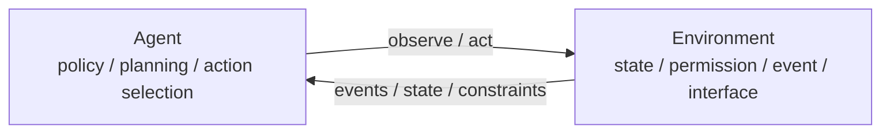
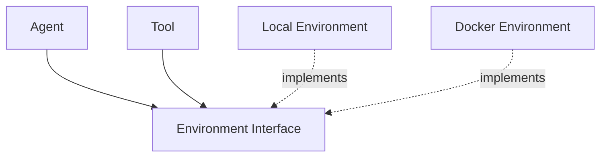
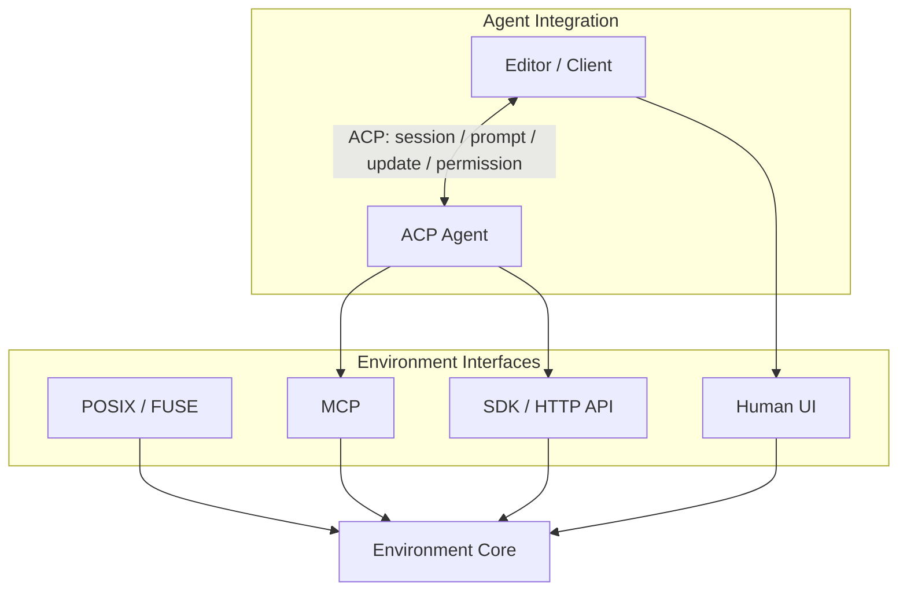
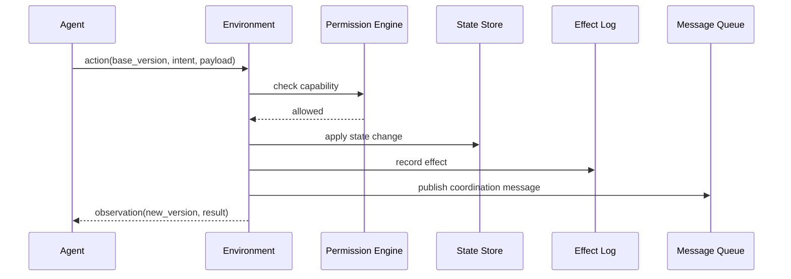
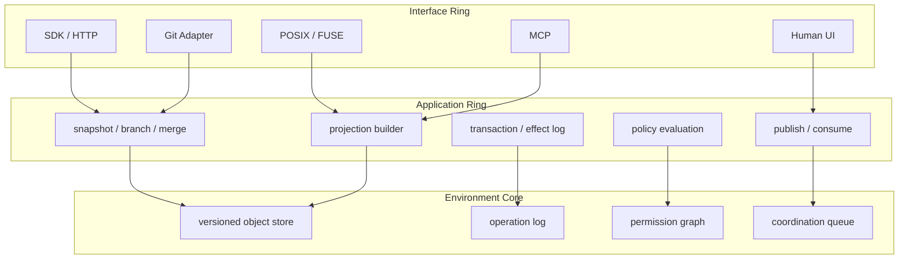
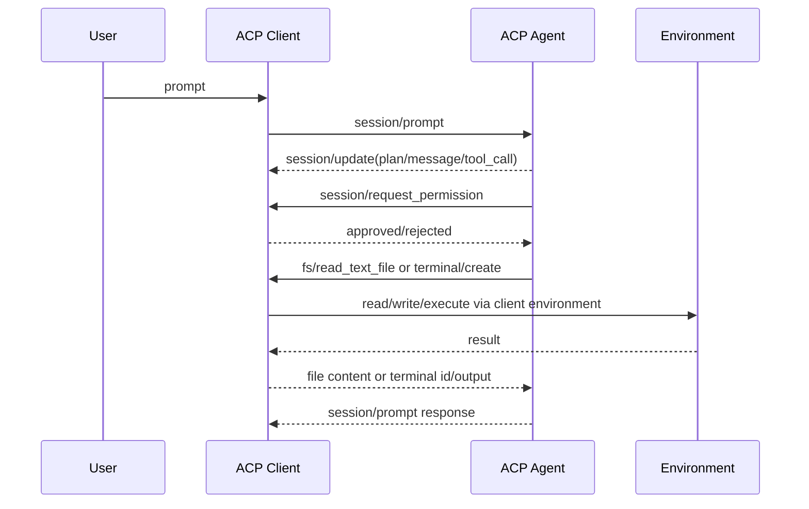
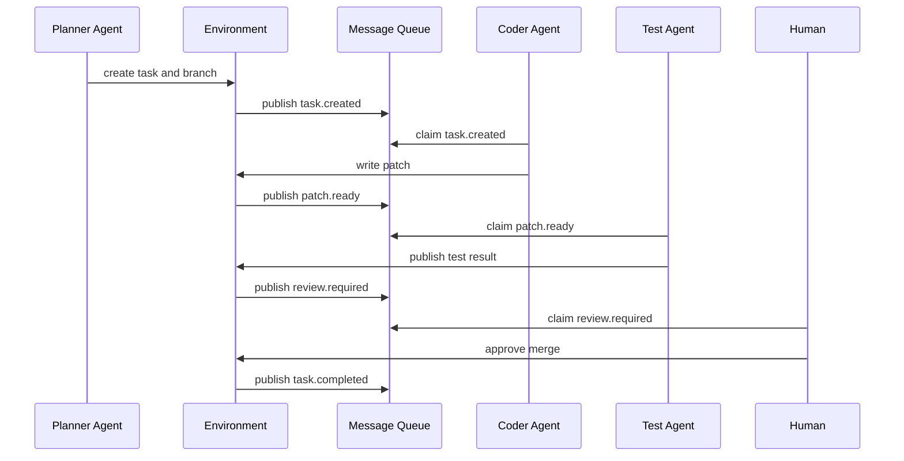
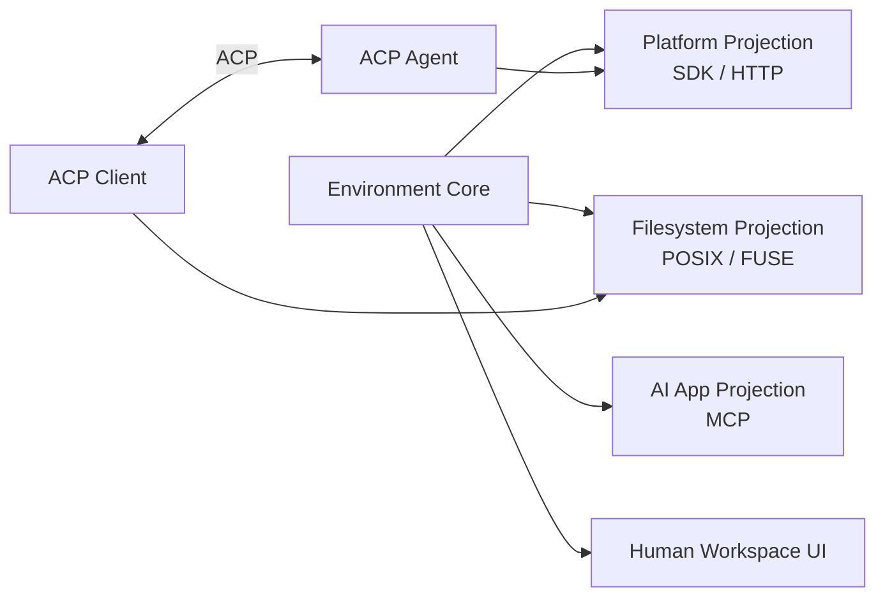
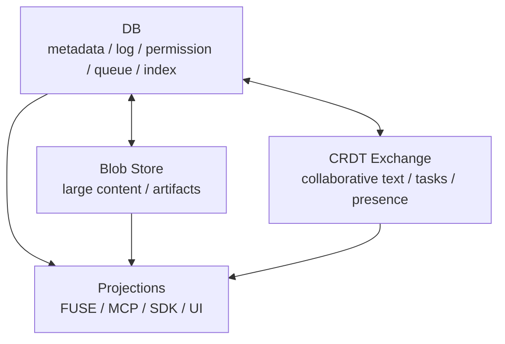

> 之前在 [Environment as Dependency Inversion](/2026/01/20/2026-01-20-environment-as-dependency-inversion/) 里，我讨论的是 Agent SDK 内部的 Environment 抽象：Agent 和 Tool 不直接依赖 Local/Docker 这类实现，而是依赖 FileOperator、Shell、Environment 这样的接口。现在看，这只是第一层依赖倒置。更关键的问题不在 SDK 内部，而在系统边界：Environment 不应该只是 Agent 的依赖项，它应该成为一个独立实体。

过去的思路大致是：Agent 需要工具，工具需要运行环境，所以我们抽象出 Environment。这个方向是对的，但仍然把 Environment 放在 Agent 内部看待：它像一个沙箱、一个运行时、一个工具集合，生命周期和语义都围绕某个 Agent 展开。

我现在更倾向于反过来看：



Agent 是作用在 Environment 上的智能执行者。Environment 是承载状态、权限、日志、协作和外部接口的工作区实体。两者是双向关系，但不应该是包含关系。

# 分离 Agentic 和 Environment

Agentic 描述的是一种执行方式：模型在 loop 中观察、规划、调用工具、接收结果，再继续下一步。它的核心是策略和控制流。

Environment 描述的是一个可被操作的世界：文件、数据、进程、权限、外部资源引用、运行痕迹和多 Agent 协作消息。它的核心是状态和副作用边界。

这两个概念经常被混在一起，是因为早期 Coding Agent 通常运行在一个本地目录或 VM 里。Shell 和文件系统太自然了，以至于我们会把“Agent 能做什么”和“Environment 是什么”绑定起来。但在系统设计里，这个绑定会带来三个问题：

1. Agent 难以替换。换一个 Agent，环境状态、历史操作和协作上下文就跟着丢失。
2. 协作难以建模。多个 Agent 或人类同时工作时，谁拥有工作区、谁记录冲突、谁广播事件都不清楚。
3. 协议层不断膨胀。POSIX、MCP、HTTP API 都在暴露环境能力；ACP 则在标准化编辑器 Client 与 coding Agent 的通信。如果这些接口和 Agent integration 背后没有统一的 Environment model，就会形成多个不一致的状态视图。

因此，更合理的边界是：

| Layer | Responsibility | Examples |
|------|----------------|----------|
| Agentic Layer | planning, reasoning, model routing, tool selection | Agent runtime, tool orchestration |
| Agent Integration Layer | connect users/editors to Agents | ACP, CLI, custom app protocol |
| Environment Layer | state, effects, permission, coordination, projections | workspace core |
| Environment Interface Layer | expose environment capabilities | POSIX/FUSE, MCP, SDK/HTTP, UI |

Agentic Layer 应该可替换。Environment Layer 应该稳定、可审计、可恢复，并且不依赖某个特定 Agent 实现。

# 旧依赖倒置还不够

旧文里讨论的依赖倒置是代码层面的：



这个结构解决了 Tool 不直接依赖 Local/Docker 的问题。但它没有解决更大的问题：Environment 的抽象形状仍然由 Agent SDK 定义，默认能力仍然是 FileOperator 和 Shell，默认语义仍然来自 OS。

新的依赖倒置应该发生在系统层面：



Agent 不再拥有 Environment。Agent、Human、CLI、MCP Client 都只是 Environment 的 actor 或 adapter。Editor 如果通过 ACP 工作，它首先是 ACP Client，连接的对象是 ACP Agent；Environment 通过 Client 的文件/终端能力、MCP 配置，或者 Agent 自己的 Environment SDK 间接进入这条链路。Environment 的生命周期独立存在：它可以先于 Agent 创建，也可以在 Agent 退出后继续存在，并且可以被另一个 Agent 接管。

# Environment 不等于 Agent Runtime

把 Environment 提到系统中心，并不意味着把所有东西都塞进 Environment。否则它会变成“OS + 数据库 + 消息队列 + 权限系统 + 协作平台 + Agent Runtime”的混合体，边界反而更不清楚。

我倾向于把最小边界限定为：

| Component | Owns | Does not own |
|----------|------|--------------|
| Agent Runtime | model call, planning loop, tool selection, response policy | durable workspace state |
| Environment | state, permission, operation log, coordination bus, projections | model reasoning policy |
| Executor / Sandbox | command execution, process isolation, resource limits | workspace truth source |
| Platform | scheduling, billing, tenant lifecycle, physical storage | domain-level operation semantics |

Environment 可以引用 Executor 或 Sandbox，但不必把执行引擎本身包含进来。它应该保存的是 `runtime_ref`、`execution_target`、`process_ref`、`effect_status` 这类可恢复引用，以及这些引用和 workspace state 的关系。

一个 action 的标准路径应该是：



Agent 负责给出 intent 和 action。Environment 负责检查能力、应用状态变化、记录副作用，并在需要协作时向消息队列发布任务或通知，再把新的 observation 返回给 Agent。这个分工比“Agent 调工具，工具改文件”更适合长生命周期协作。

# Environment 的圆环模型

如果借用 DDD 或 Hexagonal Architecture 的思路，Environment 可以被看成一个圆环模型。核心不是协议，而是领域状态。



这个模型里，POSIX、MCP、SDK、UI 都不是核心。它们只是不同使用场景下的 adapter：

- POSIX/FUSE：让传统工具链、Shell、编译器、测试命令把 Environment 看成文件系统。
- MCP：让 AI 应用以标准方式访问外部数据、工具和 workflow。
- SDK/HTTP：给平台内部服务、调度器、评测系统和自定义 Agent 使用。
- Human UI / Git Adapter：给人类审阅、版本同步、发布流程提供稳定视图。

真正重要的是中间和内层：版本化状态、操作日志、权限图、协作消息队列，以及把这些核心能力投影成多种接口的能力。

# ACP 的准确位置

这里需要单独把 ACP 拎出来。ACP 的对象是 Agent，不是 Environment。

按照 [ACP v1 overview](https://agentclientprotocol.com/protocol/v1/overview) 的定义，Client 通常是代码编辑器，Agent 是使用生成式 AI 自主修改代码的程序。典型流程是：Client 初始化连接，创建或恢复 session，把用户 prompt 发送给 Agent；Agent 在处理过程中通过 `session/update` 向 Client 回报消息、计划、tool call 状态，必要时向 Client 请求权限、读取/写入 Client environment 中的文本文件，或请求 Client 创建 terminal。



所以 ACP 更像 LSP：它把 editor 和 agent 解耦，让同一个 editor 可以接不同 Agent，让同一个 Agent 可以进入不同 Client。它承载的是 agent-facing UX 和 session 生命周期，不是 Environment domain model。

这点很关键。如果把 ACP 当成 Environment projection，就会误判两件事：

1. 误以为 Environment 需要实现 ACP。实际上 ACP-compliant 的是 Agent，Environment 可以在 Agent 后面，也可以在 Client 后面。
2. 误以为 ACP 的 `fs/read_text_file`、`terminal/create` 就是完整 Environment API。实际上这些是 Client 暴露给 Agent 的能力，解决的是编辑器集成和用户可见性，不负责定义版本、operation log、effect log、branch/merge 等环境语义。

因此，在这篇文章的模型中，ACP 应该位于 Agent Integration Layer。Environment 可以为 ACP Agent 提供 workspace source，也可以为 ACP Client 提供 file/terminal/permission 后端，但它不是 ACP 的直接对象。

# Environment 应该是什么

我认为一个可用于 Agent 协作的 Environment 至少需要五类能力。

## 1. 版本化存储

Environment 首先是存储，但不是普通文件系统。它应该存储工作区内的所有可恢复状态：

- 文件和目录
- 生成产物和中间 artifact
- 消息、任务、评论、review 结果
- 执行输出、测试结果、trace
- 外部资源引用，例如 issue、PR、deployment、database row
- secret 和 credential 的引用，而不是明文值

这些对象需要版本。版本不只是为了 rollback，也为了让 Agent 能在明确状态上工作。一个 Agent 的判断应该绑定到某个 `state_version`，否则多 Agent 并行时很容易出现“它看到的是旧世界，但写入的是新世界”的问题。

最小模型可以是：

```text
object(id, type, path, content_ref, metadata, version)
operation(id, parent_id, actor_id, base_version, patch, intent, created_at)
effect(id, operation_id, target, idempotency_key, status, result_ref)
message(id, topic, actor_id, lease_until, delivery_state, payload, created_at)
permission(subject_id, scope, action, condition)
```

这不是最终 schema，而是表达一个原则：文件树只是投影，核心应该是对象、操作、效果、消息和权限。

## 2. Append-only 操作日志

Agent 系统需要比传统应用更强的可回放能力。原因很直接：Agent 会犯错，而且错误经常发生在多步链路中。只保存最终文件状态是不够的，我们需要知道：

- 哪个 actor 做了操作
- 当时基于哪个版本
- 操作意图是什么
- 产生了哪些文件变化
- 触发了哪些外部副作用
- 失败后如何恢复或补偿

因此，Environment 应该有 append-only operation log。Materialized filesystem view 可以从 log 生成，审计、回放、评测、debug 也可以基于 log 构建。

这和 Git 的关系很近，但不完全相同。Git 擅长代码版本管理，却不天然记录 Agent 的 intent、tool result、外部副作用和权限决策。Git 可以作为某种 projection 或 storage backend，但不是完整 Environment model。

## 3. 权限图

Environment 是副作用边界，所以权限必须是核心概念，而不是某个 adapter 的附属检查。

一个 Reviewer Agent 可以读全部文件，但不能写主分支。一个 Test Agent 可以运行测试命令，但不能访问生产密钥。一个 Coder Agent 可以写 feature branch，但删除文件、调用外部 API 或触发部署需要人类确认。

权限模型至少要覆盖：

- actor identity：human、agent、service account
- resource scope：path、object、secret、external service、execution target
- action：read、write、execute、publish、approve、delegate
- condition：time、branch、quota、risk level、human approval

关键点是权限不应该绑定到 POSIX 或 MCP 某一层。无论同一操作来自 FUSE 写入、MCP tool call、内部 SDK，还是 ACP Agent 通过 Client 文件/终端能力发起的操作，都应该通过同一个 permission graph。

## 4. 多 Agent 消息总线

Environment 不是静态存储。多 Agent 协作需要一个共享消息总线，它更接近消息队列（MQ），而不是简单的日志订阅系统。

这个消息总线服务的是 Agent 之间的协作语义：

- task dispatch：把任务投递给合适的 Agent。
- claim / lease：某个 Agent 声明自己正在处理任务，避免多个 Agent 抢同一份工作。
- ack / retry：任务完成后确认，失败或超时后重新投递。
- review request：Coder Agent 完成 patch 后请求 Reviewer Agent 或 Human 审阅。
- coordination signal：测试失败、依赖缺失、权限等待等协作状态变更。



这里的消息总线不是附属功能，而是协作的核心。它承担几个职责：

1. 分发任务，让 Agent 不必靠轮询或猜测理解可处理工作。
2. 管理任务所有权，通过 claim、lease、ack、retry 避免多个 Agent 抢同一份工作。
3. 承载 review request、handoff、blocking reason 等协作语义。
4. 作为 UI 和审计系统的输入之一，使用户看到的不是“Agent 正在运行”，而是具体的协作队列和处理状态。

这也解释了为什么只做“工具协议”不够。工具协议能描述一次调用，却不能自然描述一个多人、多 Agent、长生命周期工作区中的协作关系。

## 5. 多接口与 Agent 集成

Environment 应该能暴露多种环境接口，同时支持多种 Agent 集成方式，而不是押注某一个协议。



同一个核心状态可以被投影为：

- 一个 POSIX 文件树，供 `npm test`、`grep`、`clang`、`pytest` 使用。
- 一组 MCP resources/tools，供 AI app 获取上下文或调用能力。
- 一个内部 API，供 scheduler、benchmark、billing、audit 使用。
- 一个 workspace UI，供人类审阅事件、diff、权限请求和协作状态。

接口之间不需要互相模拟。FUSE 不应该被迫表达 tool result 或 review event，MCP 也不应该被迫表达完整 POSIX inode 语义。ACP 更不应该被当成 Environment API；它应该连接 Client 和 Agent，并允许 Agent 通过 Client capabilities 或自己的 SDK/MCP 工具触达 Environment。

# DB as FS 和 CRDT 的位置

从实现角度看，DB as FS 和 CRDT 都值得尝试，但它们解决的是不同层的问题。

DB as FS 不是特指 SQLite，也不是说要把数据库伪装成一个完整操作系统文件系统。它表达的是：Environment 的真实状态可以先进入数据库模型，再根据使用场景投影为文件系统视图。

SQLite 是这个方向上很自然的单机实现选项，因为它适合作为本地优先、可嵌入、事务化的 Environment metadata store：

- ACID transaction 可以保证一次 operation 的多表写入一致。
- WAL 模式适合承载轻量 append-only 写入。
- SQL 查询适合构建审计、索引、权限检查和 projection。
- 单文件部署降低了本地 workspace runtime 的复杂度。

但 DB as FS 不应该理解为把所有文件内容塞进数据库 blob 表。更合理的方式是：数据库保存对象索引、版本、日志、权限、消息队列状态和小对象；大文件进入 content-addressed blob store；POSIX 文件树是基于这些状态构建出的 projection。

CRDT 的位置也需要更精确。它不一定是 Environment 的核心存储模型，更像某些人类 / 多 Agent 协作场景下的高性能交换协议。它适合文本、结构化文档、presence、评论、任务状态等高频协同对象，用来降低协作延迟和冲突处理成本。

它不适合无差别覆盖所有东西。二进制 artifact、外部副作用、长生命周期进程、数据库变更，很难用 CRDT 本身解释清楚。CRDT 更适合作为局部协作对象的同步层，而不是整个 Environment 的一致性模型。

一个现实的组合可能是：



DB 提供可查询的系统骨架，Blob Store 承载大内容，CRDT 作为局部协作对象的高速交换层，最终由 projection layer 暴露给不同客户端。

# 仍然困难的地方

这个方向的难点不在写一个 FUSE，也不在包一层 JSON-RPC。真正困难的是状态语义。

## Shell 作为可选 trait

Shell 很容易被误认为 Environment 的标准能力，因为 Coding Agent 的默认工作区通常就是 repo + shell。但这其实带着很多隐含假设：

- Environment 背后有类 POSIX 的文件系统。
- 命令可以通过字符串表达，并由某种 shell 解释。
- `cwd`、环境变量、PATH、权限、进程组、信号都有稳定语义。
- 进程输出可以被截断、回放和持久化。
- 长生命周期进程可以被重新连接、终止或恢复。

这些假设在本地开发环境里成立，但在浏览器环境、API 环境、数据分析环境、移动端环境、远程托管 workspace 中都不一定成立。因此，Shell 更适合被建模为 Environment 的可选 trait，而不是标准接口。

如果一个 Environment 声明支持 Shell trait，它也应该继续拆分能力，而不是只暴露一个笼统的 `shell.execute`：

1. stateless command execution：执行命令，返回输出。
2. background process：启动进程，后续 wait、kill、read output。
3. durable shell session：可重连的 PTY 或 login shell。

这三者的恢复、权限、日志和 projection 语义不同。把它们混成一个接口，会把 OS 的隐含假设重新带回 Environment core。

## 外部副作用

Environment 可以记录“调用了 GitHub API 创建 issue”，但它不能让外部世界自动回滚。因此 effect log 和 idempotency key 是必须的。恢复策略通常不是强事务 rollback，而是确认状态、补偿操作和语义恢复。

## Merge 语义

多个 Agent 并行修改同一工作区时，Git merge 只能处理部分问题。它不能解释两个 Agent 的 intent 是否冲突，也不能判断一个测试失败是否使另一个 patch 失效。Environment 需要把 merge 从文本层提升到 operation 层。

## UX 表达

用户不应该只看到 Agent 的聊天消息，而应该看到 Environment 的事件：谁创建了分支、谁改了文件、哪个测试失败、哪个权限请求待确认、哪个外部副作用已经发生。否则多 Agent 协作会变成不可观察的黑盒。

# 结论

旧的 Environment dependency inversion 解决的是 SDK 内部依赖方向：Agent 和 Tool 不直接依赖具体执行环境。

新的问题是系统级的：Environment 应该从 Agent 的依赖项升级为独立实体。它是版本化存储、权限边界、操作日志、消息总线和多接口 projection 的组合。

这样看，Agentic 能力反而变得更清楚：Agent 是 Environment 上的 actor，它负责规划和行动，但不拥有世界状态。Environment 承载世界状态，并通过 POSIX、MCP、SDK、UI 等接口暴露给不同 actor；ACP 则把编辑器 Client 和 coding Agent 接起来，让 Agent 更自然地进入用户的开发工作流。

未来 Agent 系统的核心竞争力可能不只是更强的 Agent loop，而是更好的 Environment model。因为只有 Environment 足够稳定、可表达、可协作，Agent 才能在其中顺畅地工作，并且和人类、其他 Agent、传统工具链共享同一个可理解的世界。
