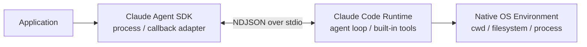
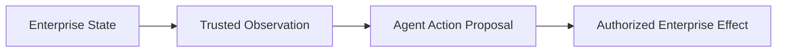
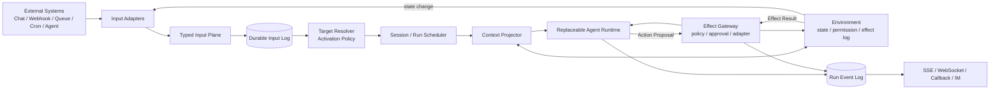
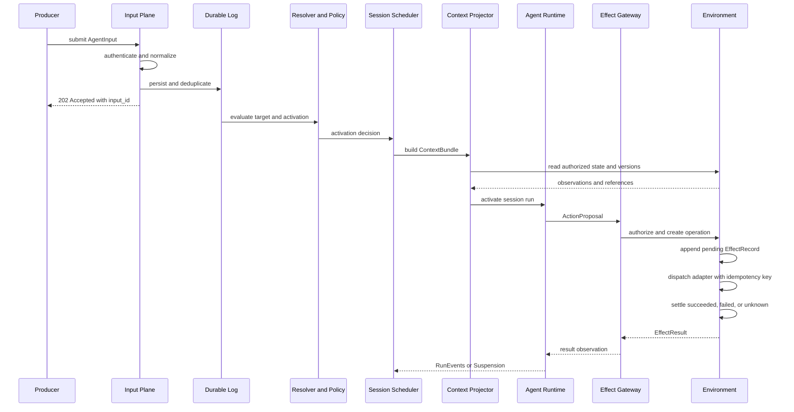
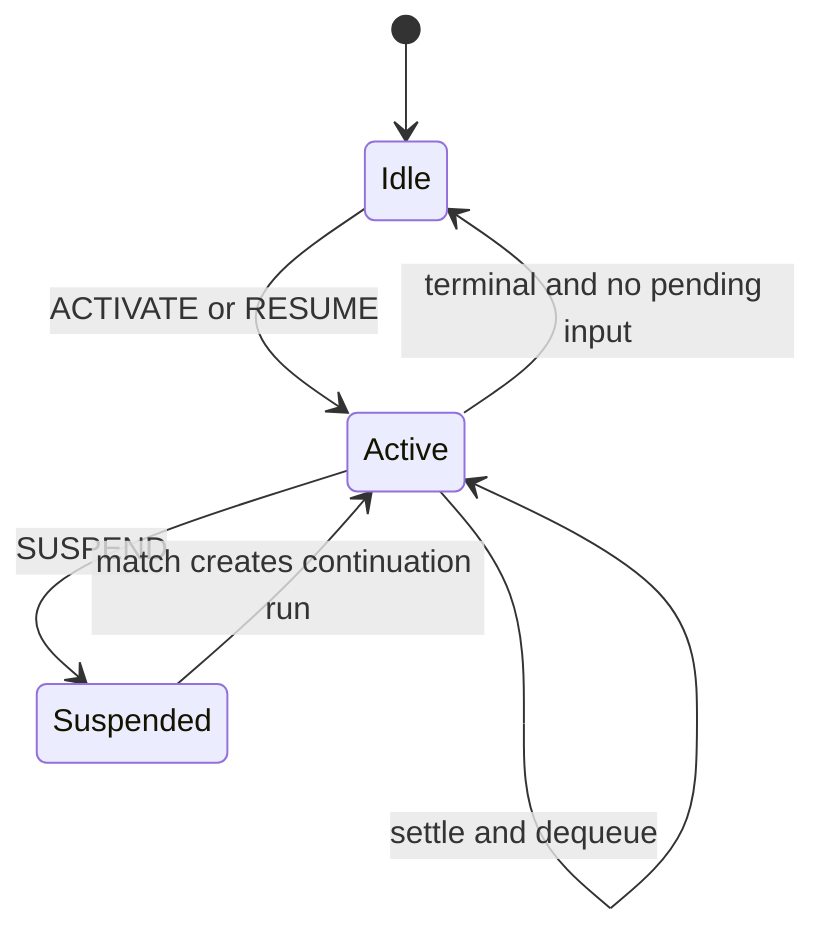
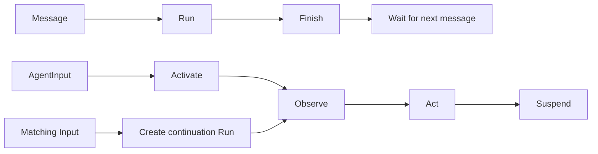
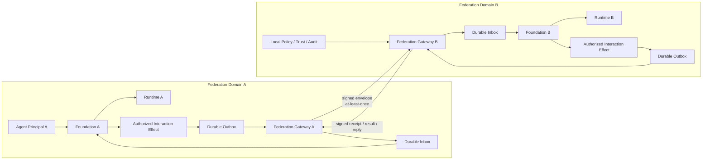

> 下一代 Agent Foundation 的重点不是继续拆解 Agent loop，而是让一个通用 Agent 能够稳定地接收外部状态变化、获得正确上下文、产生受控副作用，并在等待条件满足时重新运行。

我在前面的[《聊聊云上 Agent 的架构设计》](../../../02/17/architecture-of-cloud-agent/)、[《构建潜意识：一种 Proactive Agent 构建方式》](../../../05/20/proactive-agent-attention/)和[《Environment as Agentic Infrastructure》](../../../06/20/environment-as-agentic-infrastructure/)里，分别讨论过云上执行、主动唤醒和 Environment 独立化。这些问题最终指向同一个系统边界：

**当 Agent 不再只是一个由用户临时启动的 CLI，而是云上长期存在的执行主体时，平台应该为它提供什么？**

这个问题容易被回答成“再设计一个 Agent Harness”。新的框架会提供更多 middleware、hook、plugin 和可替换 loop。DeepSeek Harness 最近提出的 “Everything is a plugin” 已经把这条路线推到了很完整的位置。它证明 Agent runtime 的每一层都可以被组合和替换。

云上平台面对的是另一层问题。企业很少因为缺少一种 loop 才无法接入 Agent。真正困难的是让 Agent 进入已有的事件流、权限体系和业务状态，并在进程退出、沙箱回收和外部状态变化之后继续工作。

这篇文章讨论的不是另一个 Harness，而是 Harness 外围的 **Agent Foundation**。

# Harness 的三次边界变化

先明确本文中的四个概念：

- **Agent Runtime**：一次 Run 内负责模型驱动、上下文消费、工具选择和 within-run control 的部分。
- **Harness**：承载、配置或替换 Agent Runtime 的具体实现。项目名称中的 Harness 可能覆盖更宽的 Session、Storage 和 UI 范围。
- **Foundation**：位于 Agent Runtime 外部，负责 Input、Session/Run、路由、调度、身份上下文、Effect 编排、挂起和恢复的持久系统。
- **Platform**：在 Foundation 之上提供多租户、产品接口、计费、运营和用户体验的完整服务。

过去几代 Agent 架构主要改变了 Harness 的交付和扩展方式。

## 第一代：把完整 Agent 封装在可执行程序里

Claude Agent SDK 是这类架构的典型代表。它对外表现为 Python 或 TypeScript SDK，内部并不是重新实现一套 Claude Code loop。当前 [Python SDK](https://github.com/anthropics/claude-agent-sdk-python) 会在发布包中携带平台相关的 Claude Code executable，默认通过 `SubprocessCLITransport` 启动子进程，并通过 stdin/stdout 传递 `stream-json` 格式的双向 NDJSON 消息。

这不是简单的“向 CLI 写入 prompt，再读取文本”。同一条通道还承载 control request、hook callback、permission callback 和进程内 MCP tool 调用。SDK 更接近 Claude Code runtime 的语言绑定：



这种方案有明确优势：核心 Agent Runtime 复用同一份 Claude Code 实现，SDK 可以快速获得相同的工具、会话和 loop 能力。代价也很直接：

- 部署物实际包含 native executable。
- SDK 与 CLI 的私有协议和版本需要协同演进。
- 运行时仍然依赖进程、cwd、home directory 和本地文件布局。
- 默认 transcript 语义仍来自 Claude Code 的本地 JSONL；外部 `SessionStore` 通过 mirror 和恢复时的本地物化完成适配。
- SDK 内进程工具与 CLI sandbox 不在同一个安全边界。

这里需要修正一个容易出现的表述：它不是严格的 POSIX-only 架构，当前 SDK 也支持 Windows native executable。更准确的约束是 **native process + OS execution environment**。操作系统不是一个可选工具，而是 Harness 默认存在的世界。

## 第二代：把 Agent loop 变成可以嵌入的代码

[Pi](https://github.com/earendil-works/pi) 代表另一种路线。它把模型协议、Agent core 和 Coding Agent host 分成几个层次：

- `pi-ai` 统一不同模型供应商的消息和流式协议。
- `pi-agent-core` 提供较小的状态化 Agent loop、工具调用和 steering/follow-up queue。
- `pi-coding-agent` 提供文件工具、JSONL session、compaction、Skills、Extensions、CLI/TUI 和项目资源加载。

Pi 的默认 Coding Agent 只启用 `read`、`bash`、`edit`、`write` 四个工具。它没有内建权限隔离，官方仓库也明确说明：默认工具和 Extension 继承启动 Pi 的用户与进程权限，需要容器、VM 或外部 sandbox 提供真正的隔离。

Pi 最重要的设计不是“四个工具”，而是 **保持 loop 很小，把策略留给 host**。模型 provider、上下文转换、工具实现、compaction、资源加载和 UI 都可以在 loop 外变化。Agent 不再必须通过一个封闭 binary 才能存在。

OpenClaw 的早期演进和 Pi 有很深的关系，但不能把当前 OpenClaw 简化为“Pi 的封装”。截至本文调研的版本，[OpenClaw 官方运行时文档](https://docs.openclaw.ai/agent-runtime-architecture)已经明确说明：外部 Agent framework package 不再存在于 core 中，原有 runtime 被内化为自己的 `@openclaw/agent-core`，`pi` 只作为 legacy runtime alias，保留的 Pi 依赖主要是 TUI 组件。

当前 OpenClaw 更适合被理解为一个常驻 Agent host：

- Gateway 接收 channel、Webhook、Cron 和 UI 输入。
- Gateway 解析 Agent、Session、Workspace、Skills、Sandbox 和权限策略。
- Session lane 处理并发写入与 queue mode。
- 内置或插件化 Harness 执行一次已经准备好的模型循环。
- Gateway 再把运行事件投影到原始 channel。

[OpenClaw Agent Loop 文档](https://docs.openclaw.ai/concepts/agent-loop)已经包含 `steer`、`followup`、`collect`、`interrupt` 等输入队列语义；[HTTP hook](https://docs.openclaw.ai/automation/cron-jobs#webhooks)也区分“向目标 Session 写入 system event 并触发 heartbeat”和“创建一次 synthetic Agent job”。这些能力已经开始接近 Agent Foundation。

它的边界仍然来自 host：在标准 Gateway 部署形态下，Gateway 是常驻宿主，部分 system event queue 属于进程内状态；Sandbox 移动的是工具执行位置，不是 Gateway 和 Agent loop。代码级 Harness 降低了二次开发成本，却没有自动消除运行宿主、会话所有权和唤醒可靠性问题。

## 并行路线：把 Agent loop 做成 Serverless Worker

另一条路线不是继续改造本地 Coding Agent，而是把 loop、状态和执行环境拆开。Agent Worker 只在一次 Activation 到来时运行；消息、Session、checkpoint 和 Effect 写入外部存储；Shell 或 Browser 需要执行时，再连接独立 Sandbox/Executor。Worker 结束后不保留进程内状态，下次从持久引用恢复。

这种架构消除了“每个 Agent 必须先拥有一台长期运行的操作系统”的前提。OS 变成按需绑定的执行能力，Agent loop 可以在 Lambda、Container Worker 或普通无状态服务中运行。

Serverless 解决的是调度和成本，不自动解决专用化。这里的“高度通用”也不是褒义词：一个只有通用 prompt、通用工具和通用 Session 的 Worker，不知道企业中的哪些状态变化值得处理，也不知道应该加载哪一份业务上下文。Skill 可以补充任务知识和工具使用方法，外部唤醒、状态路由、权限与 Effect 语义仍然缺少平台边界。

因此，OS-first Agent 和 Serverless Agent 看起来是两种部署方式，最终遇到的是同一个问题：**Agent 怎样进入一个具体软件系统的生命周期。**

## 第三代：把 Harness 内部全部变成 Plugin

[DeepSeek Harness](https://deepseek.com/harness/en/) 把插件化推进到了新的程度。它基于 [Cordis](https://github.com/cordiverse/cordis) 构建，模型 adapter、工具 registry、Session log、Agent loop、Sandbox、Storage、Scheduler 和 UI 都由 Plugin 组合。官方的[架构文档](https://github.com/deepseek-ai/deepseek-harness/blob/47f943859bef60e4160492346772ded9b24f765a/docs/architecture.md)给出了三个重要机制：

1. Plugin 向共享 Context 提供 Service、typed event 和 reversible effect。
2. Service 的出现和消失会驱动依赖 Plugin 激活、卸载和重新加载。
3. Durable Session Event、live Agent Event 和 capability event 分属不同事件域。

DeepSeek Harness 还有一个非常重要的约束：**Model-visible means logged**。任何进入模型请求的信息都必须能够从 append-only Session log 重建。Resume、fork、replay、trajectory 和 context projection 都建立在同一条事件流上。

它的 inbox 也区分不同输入行为：有些 message 会立即唤醒 driver，注入的 context 可以先停留在 inbox 中，等待另一个 message 触发下一次 step。这已经说明“输入”和“唤醒”不应该是同一件事。

“Everything is a plugin”不是字面意义上的没有内核。Cordis、root context、loader、profile composer 和 launcher 仍然是特权底座。Cordis 的 isolation 主要表达 Service 可见性和事件路由隔离，也不等价于进程或安全隔离。DeepSeek Harness 当前仍处于 Developer Preview，官方明确提示 Plugin API 会发生兼容性破坏。

这些限制不削弱它的价值。它证明了一件事：**Agent runtime 可以通过 typed event、service seam 和生命周期所有权获得很强的可组合性。**

它仍然没有替云上平台回答全部问题：外部业务事件应该怎样进入？如何绑定租户身份？应该唤醒哪个 Session？运行中到达的事件如何处理？等待条件如何跨进程持久化？外部副作用如何去重和审计？

# 专用 Agent 的差异不一定在 Loop

过去构建专用 Agent，通常会修改以下内容：

- system prompt
- planning loop
- tool selection
- memory
- validation
- retry
- context filter
- human-in-the-loop
- workflow state machine

这种方法隐含了一个判断：专用任务需要专用控制流。

强模型和通用 Agent 改变了这个前提。通用 loop 加上 Skills、按需工具发现和代码执行，已经可以完成大量专用任务。Skill 提供领域知识、约束和操作方法；工具提供实际能力；模型根据当前状态选择执行路径。定制从不可见的程序控制流移动到了可以被读取、更新和组合的上下文中。

这不是说专用 loop 没有价值。强合规流程、确定性审批和固定成本路径仍然适合显式 workflow。需要警惕的是把所有领域知识都提前固化成状态机。设计者对任务的理解会成为 Agent 的能力上限，任何流程变化都需要修改 Harness。

在多数开放任务中，更实用的默认值是：

> 保留一个能力较强、语义稳定的通用 Agent，把专用知识放进 Skill，把系统能力放进 Tool，把外部集成放进 Foundation。

因此，完全插件化 Harness 的主要价值是可演进、可替换和可测试，而不是要求每个团队都重新设计 Agent 的每一个内部阶段。

# FDE 真正在定制什么

企业接入 Agent 时需要大量 Forward Deployed Engineer（FDE）参与，不代表 Agent loop 不够灵活。实际工作通常集中在下面这条转换链：



展开以后包括：

1. 哪个外部状态变化与 Agent 有关。
2. 外部身份如何映射为租户、用户和权限主体。
3. 事件属于哪个项目、任务、Environment 或 Session。
4. Agent 运行前应该看到哪些业务状态。
5. 哪些字段是可信事实，哪些内容只能作为不可信数据。
6. Agent 已经运行时，新输入应该排队、合并、steer、interrupt 还是创建分支。
7. Tool call 如何变成具有幂等、审批和审计语义的业务副作用。
8. Agent 应该把结果发送回原 channel、业务系统、另一个 Agent，还是只更新 Environment。
9. Agent 等待审批、部署或其他外部状态时，如何挂起并在未来恢复。

这些工作很少需要修改 token loop。它们发生在 Agent 与软件系统的连接面。

Skill 解决“遇到某类任务时如何完成”。Foundation 需要解决“什么时候开始、基于什么状态开始、结束后等待什么”。

# Foundation 的三个稳定对象

下一代 Foundation 需要把 Agent Runtime、Environment 和 Foundation 本身分开。

| Object | Owns | Does not own |
| --- | --- | --- |
| Agent Runtime | model call、reasoning policy、tool selection、within-run control | 企业状态、持久调度、外部事件真相 |
| Environment | versioned domain state、resource permission enforcement、operation/effect log、resource refs | 模型策略、prompt 编排 |
| Foundation | input、routing、activation、Session/Run、identity context、context projection、subscription、output | 具体模型如何推理、资源状态真相 |

Agent Runtime 应该可以是 Claude Agent SDK、OpenClaw Harness、Pi loop、DeepSeek Harness profile，或者一个更简单的自研 runtime。Foundation 不要求这些 Harness 共享内部 Plugin API，只要求它们服从少量外部运行契约。

Environment 也不等于 Sandbox。Sandbox 是命令执行和资源隔离位置；Environment 是持久的世界状态和副作用边界。一个 Session 可以在 Sandbox 被销毁以后继续引用同一个 Environment。Session 默认仍绑定兼容的 `runtime_id`、`runtime_version` 和 `runtime_state_ref`；切换 Harness 需要 Foundation-level portable state，或者显式 migration/replay adapter，通常应该表现为 fork 或 migration，而不是无条件 resume。

Foundation 位于两者之间。它把外部输入转换为一次 Activation，把 Environment 投影为模型可用的 Context，并通过 Effect Gateway 把 Agent 的 Action Proposal 交给权限、审批和执行边界。Environment 记录实际 Effect，Foundation 维护 Run 生命周期和未来的唤醒条件。



# 一个 Input Plane，而不是一个 Chat API

聊天接口是最自然的 Agent 产品入口，但不适合作为底层唯一语义。

聊天消息通常隐含以下假设：

- 发送者是人类。
- 内容主要是自然语言。
- 输入属于一个线性 Conversation。
- 系统应该立即开始推理。
- 系统最终应该返回一段面向人的回答。

外部系统产生的输入不满足这些假设。PR 被批准、部署失败、审批完成、定时器到期和另一个 Agent 完成任务，都是状态事实。它们可能只需要被记录，可能更新 Context，可能恢复一个正在等待的 Session，也可能启动新的 Run。

因此，统一入口应该是 `AgentInput`，而不是 `ChatMessage`。至少需要区分四种 kind：

| Kind | Meaning | Default activation semantics |
| --- | --- | --- |
| `command` | 用户或系统请求 Agent 执行工作 | 通常触发 Run |
| `event` | 外部世界已经发生的事实 | 由 Subscription/Policy 决定是否触发 |
| `context` | 可供后续推理使用的信息 | 默认只记录，不主动唤醒 |
| `control` | 对已有 Run/Session 的 approve、cancel、resume、steer | 定向改变运行状态 |

这和 DeepSeek Harness 中“会唤醒的 message”与“等待下一次请求的 injected context”是同一个方向，只是 Foundation 需要把它扩展为持久、跨进程和多租户的公共语义。

## Input Envelope

可以借鉴 [CloudEvents](https://github.com/cloudevents/spec/blob/v1.0.2/cloudevents/spec.md) 的设计。CloudEvents 用 `id`、`source`、`type`、`subject` 和 `time` 描述一个 occurrence 的上下文。Agent Foundation 还需要表达输入种类、因果关系和目标资源：

```json
{
  "schema_version": "agent-input/1",
  "id": "in_01...",
  "source_event_id": "github-delivery-01...",
  "kind": "event",
  "type": "github.pull_request.reviewed",
  "source": "github://acme/platform",
  "subject": {
    "environment_id": "env_01...",
    "resource": "pull-request/123"
  },
  "target": null,
  "occurred_at": "2026-08-17T00:20:00+08:00",
  "correlation_id": "task_01...",
  "causation_id": "effect_01...",
  "data_content_type": "application/json",
  "data": {
    "state": "approved"
  }
}
```

这个 Envelope 有几个约束：

1. `id` 是 Foundation 生成的 Input ID；`source_event_id` 是来源系统的事件身份。默认可以使用 `(tenant, source, source_event_id)` 去重，但具体规则由 Normalizer 声明。
2. `principal`、`tenant_id`、trust label 和 authorization claim 由 Ingress 根据签名、连接和平台身份生成，不能相信 payload 自己声明。
3. `idempotency_key` 可以来自协议 header 或 source event id，但需要与领域事件身份分开建模。
4. `subject` 描述业务实体；可选 `target` 描述 direct command/control 的 `agent_id`、`session_id` 或 `run_id`。普通 domain event 通常没有 direct target。
5. 原始 `data` 不直接成为 user message。它首先是外部事实，是否进入模型由 Context Projector 决定。
6. Producer 不应该在 payload 中决定 `bypassPermissions`、`steer` 或 `interrupt` 等可信执行策略。

## 输入应该发给谁

“外部事件应该发给 Agent、Session 还是 Environment”不存在一个统一答案。不同 kind 具有不同寻址语义：

- `command` 可以直接发给 Agent 或 Session，因为调用者明确请求它工作。
- `event` 通常应该指向 Environment 中的 subject 或一个 topic，再由 Target Resolver 找到订阅它的 Agent/Session。
- `context` 可以绑定 subject 或 Session，但默认不触发 Run。
- `control` 必须指向具体 Run 或 Session。

让 GitHub、审批系统和数据库直接知道某个 Agent ID，会把业务系统与 Agent 部署结构绑定在一起。更稳定的方式是让 Producer 描述“发生了什么”，由 Foundation 决定“谁应该处理”。

# Activation 是平台的核心状态机

Input 被接受不等于 Agent 立即运行。Foundation 需要先完成以下步骤：



所有通过认证和 Schema 验证的 canonical Input 都先进入 Durable Input Log。Target Resolver 先只读解析候选 Agent、已有 Session、Subscription 和 subject binding；Activation Policy 再决定后续处置。只有 `ACTIVATE`、`ENQUEUE`、`RESUME` 或 `FORK` 确实需要执行连续性时，Scheduler 才在同一个可恢复状态转移中创建或绑定 Session：

- `IGNORE`：不产生业务投影或 Run，Input 仍保留在审计日志中。
- `PROJECT`：更新 Environment/Context projection，不运行 Agent。
- `ACTIVATE`：绑定已有 Session，或原子创建 Session 与第一个 Run。
- `ENQUEUE`：把 Input 排入现有 Session lane，等待创建下一次 Run。
- `STEER`：把高优先级 Input 送入支持在线 steering 的当前 Run。
- `INTERRUPT`：通过 control policy 取消或抢占当前 Run。
- `FORK`：从当前 portable state 或 runtime adapter 创建独立分支。
- `RESUME`：满足 Suspension 后创建 continuation Run，并记录 `resumed_from_run_id`。

这些动作需要结合当前 Session 状态：



这里描述的是 Session 的激活状态，不是单个 Run 的终态。Pending Input Queue 是 Session 的附属集合，不是与 `Active` 互斥的状态。每个 Run 仍然独立记录 `completed`、`failed`、`cancelled` 或 `suspended`；Session 在 Run 结束后可以回到 `Idle`，也可以立即消费队列并创建下一次 Run。本文把 Run 定义为一次 Activation attempt，因此 `RESUME` 创建关联的 continuation Run，而不是把旧 Run 原地改回 `running`。

同一个事件在不同状态下可能产生不同决策。审批完成时，等待审批的 Session 应该 `RESUME`；没有相关任务时只需要 `PROJECT`；存在正在生成错误方案的 Run 时可能需要 `STEER` 或 `INTERRUPT`。

这也是为什么 Webhook 和 WebSocket 不能成为领域语义：

- Webhook、Queue 和 Cron 负责把输入送进平台。
- SSE、WebSocket、Callback 和 IM 负责把 Run Event 投影给消费者。
- Foundation 内部依赖持久 Input/Run Event Log，而不是依赖连接是否仍然存在。

提交接口可以立即返回 `202 Accepted`。一个 Input 可能不激活任何 Run，也可能命中多个 Subscription，因此不能假设提交时存在唯一 `run_id`。`GET /v1/inputs/{input_id}` 应返回 disposition、`activation_refs` 和 `run_refs[]`；消费者再按具体 `run_id` 与 cursor 订阅或回放事件。连接断开不应该让运行轨迹消失。

# Context Projector 是最重要的企业扩展点

Tool 和 Skill 很容易被识别为 Agent 扩展点，Context Projector 往往被藏在“组装 prompt”的代码里。对于企业系统，它通常比自定义 loop 更重要。

外部事件不能直接追加成一条 user message，原因包括：

- payload 可能包含 prompt injection。
- 同一事件对不同 Agent 的相关字段不同。
- Agent 需要的是实体当前状态，不只是事件发生时的 delta。
- 数据访问范围依赖租户、角色和任务阶段。
- 大对象需要按 token budget 过滤和压缩。
- 模型需要区分 instruction、trusted fact、untrusted content 和 historical evidence。

Context Projector 的输入应该是 Input ref、Session、Agent Definition、Environment version 和权限主体。输出是一个可重建的 `ContextBundle`：

```text
ContextBundle
- activation_input_ref
- observations[]
  - source_ref
  - state_version
  - provenance
  - trust_class
  - content_type
  - projected_content
- memory_refs[]
- environment_version
- capability_manifest
- context_budget
- projector_version
```

在 Foundation 边界内应该继承 DeepSeek Harness 的约束：**任何由 Foundation 投影给 Runtime 的外部事实都必须被记录并可以重建。** 这不要求保存不可见的模型内部思考，但必须知道 `ContextBundle` 包含哪些事实、来自什么版本、经过哪个 Projector。

这不等于 Foundation 天然知道最终 model-visible input。Claude Agent SDK、OpenClaw 或其他 Runtime 还可能加入 system prompt、Tool schema、内建 Resource、compaction 结果和 provider-specific transformation。需要对最终模型请求做严格 replay 或审计时，Runtime contract 还必须产出持久的 `ModelInputRecord` 或 content hash，记录最终 message、Tool schema、prompt/template version、Runtime artifact version 和转换 provenance。否则平台只能重建 Foundation 输入，不能声称重建了 opaque Runtime 实际发送给模型的全部内容。

Context Projector 也是我之前讨论的 Display Layer 与 Business Layer 的进一步演化：

- Display/Audit Layer 保存原始输入、外部事件和 Run Event。
- Business/Model Layer 保存经过权限、相关性和 token budget 处理的 Context projection。

同一份原始事实可以产生不同投影，而审计记录保持不变。

# Effect 是 Tool Call 之外的持久语义

Tool Call 描述模型想调用哪个能力。Effect 描述外部世界实际发生了什么。

对于读取文件，这两者可能看起来相同。对于创建 Issue、修改数据库、发送消息、部署和付款，它们完全不同。平台需要知道：

- 操作是否通过授权。
- 是否需要人工审批。
- 是否已经发起。
- 超时后外部系统是否可能已经成功。
- 重试是否会重复产生副作用。
- 如何确认、补偿或继续。

一致的执行路径应该是：Agent Runtime 产生 `ActionProposal`；Foundation 中的 Effect Gateway 绑定 principal、平台策略和审批状态；Environment **先**在 operation/effect log 中持久化带 `operation_id`、`idempotency_key`、授权结果和 `pending` 状态的 Effect intent，**再**在资源边界执行或委派 Adapter；调用结束后把记录 settle 为 `succeeded`、`failed` 或 `unknown`。Effect Result 再作为 Observation 返回 Runtime，同时投影为 Run Event。

持久化 intent 与外部调用不能组成跨系统原子事务，但顺序不能颠倒。进程在 dispatch 前崩溃时，恢复逻辑看到 `pending` 并可以安全决定是否发起；在外部系统成功而结果回写前崩溃时，恢复逻辑仍然拥有 operation record，可以先按 idempotency key 查询，再重试、确认或补偿。没有 pre-dispatch record，就无法区分“从未执行”与“可能已经执行”。

因此，`EffectRecord` 的最终所有者应该是 Environment：

```text
EffectRecord
- effect_id
- operation_id
- run_id
- actor_id
- target
- action
- idempotency_key
- authorization_decision
- status: pending | dispatching | succeeded | failed | unknown
- attempt
- result_ref
- created_at
- dispatched_at
- settled_at
```

可靠性目标不应该是虚构的全局 exactly-once。更现实的组合是：

- Input 采用 at-least-once delivery 和 deduplication。
- 需要顺序的事件按 subject 或 Session 建立局部顺序。
- 外部写操作使用 idempotency key。
- 不可确认的操作先查询当前状态，再决定重试或补偿。
- Effect result 重新变成 Environment state change 或 AgentInput。

这与传统 Durable Execution 一致，但 Agent 多了一层语义恢复：模型可以观察“不确定但可能已经成功”的 Effect，再决定确认状态、补偿或改变计划。

# Suspension 与 Subscription 应该成为一等能力

传统 Agent loop 在完成当前消息后只能等待下一条消息。长期工作的 Agent 需要在产生 Action 后声明等待条件，并由未来事件创建 continuation Run：



Agent 不应该通过无限轮询等待审批、PR review、部署结果或某个时间点。Run 可以返回一个结构化 Suspension：

```yaml
session_id: ses_01...
run_id: run_01...
reason: waiting_for_release_approval
runtime_id: openclaw
runtime_version: 2026.8.16
runtime_state_ref: runtime-state://state_01...
checkpoint_ref: ckpt_01...
input_log_cursor: 18421
subscriptions:
  - type: release.approval.completed
    subject: release/2026.08.17
  - type: timer.expired
    subject: deadline/2026-08-17T10:00:00+08:00
resume_policy: first_match
```

Foundation 持久化 Subscription。匹配的 `AgentInput` 到达后，Activation Policy 产生 `RESUME`，Context Projector 加载最新 Environment state，并创建 continuation Run。新的 Worker 可以在新进程中使用同一兼容 Runtime 继续执行；切换 Harness 只有在状态已经投影为 portable Foundation state，或存在明确 migration/replay adapter 时才成立。

这里必须解决 durable wait 的 lost wake-up：

1. `run.suspended`、`checkpoint_ref`、Subscription 和 `input_log_cursor` 必须在同一个 durable commit 中建立。
2. Subscription 安装后需要重放 cursor 之后已经进入 Input Log 的匹配项，避免事件恰好在挂起提交期间到达。
3. Subscription 消费需要 dedupe、lease、`once`/repeat、expiry 和 retry 语义。
4. 恢复成功后，Input consumption 与 continuation Run 创建需要形成同一个可恢复状态转移。

这些约束是 Foundation 与普通 Webhook glue code 的主要区别。

[Temporal 的 Workflow message passing](https://docs.temporal.io/develop/python/message-passing)提供了有价值的参照：Signal、Update 和 Query 让外部系统与 durable computation 交互。Agent Foundation 还需要补充模型上下文投影、Effect provenance 和动态等待条件。

我之前在 Singleton Agency 中定义的 `message_observed`、`run_output_observed`、`memory_session_completed` 和 `heartbeat`，本质上都是一种应用级 `AgentInput`。当 Foundation 提供持久 Input Plane 和 Subscription 后，Proactive Agent 不再需要每个产品重新实现一套 fire queue。

# 哪些 Plugin Point 值得标准化

平台需要可扩展，不代表所有东西都应该成为公共 Plugin API。

身份、租户隔离、持久事件日志、Session writer lease、Run 状态机、Effect provenance 和 secret reference 属于平台不变量。底层存储实现可以替换，语义不能由任意 Plugin 改写。否则恢复、审计和互操作没有稳定基础。

真正具有跨业务复用价值的扩展点可以收敛为八类：

| Extension Point | Responsibility |
| --- | --- |
| `InputAdapter` | 接收 Webhook、Queue、IM、Cron、Agent-to-Agent 等输入，并建立经过认证的 source metadata |
| `EventNormalizer` | 校验 schema，把已绑定来源的输入转换为 canonical `AgentInput` |
| `TargetResolver` | 根据 subject、binding、subscription 只读解析候选 Agent/Session |
| `ActivationPolicy` | 决定 ignore、project、activate、enqueue、steer、interrupt、fork 或 resume |
| `ContextProjector` | 把 Input 与 Environment state 转换为带来源的 ContextBundle |
| `CapabilityProvider` | 提供 Skill、Tool 和 Environment projection |
| `EffectAdapter` | 把经过授权的 Action Proposal 映射为业务副作用 |
| `OutputSink` | 把已经授权、持久化的记录投影到 Callback、IM 或其他外部系统 |

企业定制可以进一步形成一种可分发的 `Integration Pack`，包含 Sources、Normalizers、Projections、Capabilities、Policies、Effect Adapters 和 Output Sinks。

Skill 是其中面向模型的知识组件，Integration Pack 是面向系统的集成组件。FDE 的工作从 fork Agent 源码，转变为实现这些边界。

# Foundation 如何自然扩展为 Agent Federation

到这里为止，Foundation 默认运行在一个管理域内：平台知道 Agent 属于谁、Input 来自哪里、Environment 由谁管理。下一步不是把所有 Agent 接进一张由中央 Planner 控制的全局图，而是允许不同管理域中的 Agent 在保留本地身份、权限和失败边界的前提下协作。

这更接近 **Agent Federation**，而不是泛化的“Agent Internet”。Internet 描述连接和传输；Federation 描述多个自治域如何通过公共契约互认身份、投递消息并各自执行策略。

Foundation 不需要为此推翻重来。输入侧的跨域协议位于 `AgentInput` 之前；输出侧的跨域 Interaction 必须在 `ActionProposal` 经过授权、成为持久化 `EffectRecord` 与 Interaction record 之后：



联邦化需要增加几类外围对象：

- `Principal` 与 domain-qualified `Address`：Human、Agent 和 Service 都能成为可寻址主体；Agent identity 不再等同于某个 Runtime 进程。
- `Mailbox`、`Outbox` 与 `Conversation`：跨域原始消息先进入有容量和保留策略的 bounded ingress/quarantine；通过来源绑定、验签和 abuse/consent policy 后，才可靠进入目标 Mailbox。Conversation 表达参与者关系，Session 仍表达单个 Agent 的执行连续性。
- `FederatedEnvelope`：保存发送域、签名、key id、body digest、有效期和投递 provenance。通过验签只代表消息来自谁，不代表本地域允许它做什么。
- `CapabilityRequest`、`CapabilityLease` 与 delegation chain：Tool、Sandbox、Compute 和 credential handle 成为可申请、限时、限作用域、可撤销的基础设施，不再在 Agent 启动时永久注入。
- `Interaction` 与 `Commitment`：`request`、`offer`、`accept`、`delegate`、`commit`、`revoke`、`report` 等社会行为拥有结构化状态，不能只依赖自然语言对话推断责任。
- `AgentLineage` 与 placement lease：Runtime Migration 保留同一 Identity 与 Home；同域 Effect boundary 通过权威 placement record、lease/epoch 和原子 fencing comparison 排除旧 Runtime，跨域离线验证则只能提供有界 stale window。Fork 创建新的 child identity，只能通过显式 delegation 获得能力。

原有八个公共对象仍然成立。远端 Envelope 被本地域接收、验证和授权后，才归一化为 `AgentInput`；Attention Policy 仍通过 `Activation` 创建 `Run`；Foundation 仍只通过 `ContextBundle` 向 Runtime 提交受控外部投影；行为仍先成为 `ActionProposal`，Environment 再先持久化 Effect intent、执行并 settle `EffectRecord`；等待仍使用 `Suspension` 与 `Subscription`；执行实现仍通过 `RuntimeDescriptor` 和 `RuntimeStateRef` 被替换。最终 model-visible input 如需完整审计，由 Runtime 额外返回 `ModelInputRecord`。

需要升级的是边缘 Adapter，而不是 Runtime contract：Federation Gateway 负责 bounded ingress、cryptographic verification、origin binding、replay protection 和 acceptance policy；`EventNormalizer` 只负责 schema 与 canonical conversion；`TargetResolver` 只读解析域限定地址、Mailbox 和候选 Session；`CapabilityProvider` 能签发 Lease。Agent 主动发送的跨域 Interaction 仍然是结构化 `ActionProposal`，必须经过 Effect Gateway 的数据出境、权限和审批策略，再原子写入 Interaction record 与 durable Outbox。`OutputSink` 只投影已经授权并持久化的 Run Event、EffectRecord、receipt 或 Interaction，不能把自由文本输出升级为签名社会行为。跨域 Context 也不会直接进入 Prompt，它必须先成为本地域可审计的输入，再经过 Context Projector。

这种兼容性正是 Foundation 边界是否稳固的检验。Identity、Mailbox、Trust 和 Commitment 可以在它外围继续生长，而 Run、Context、Effect 与 Suspension 的语义无需改变。下一篇[《Agent 联邦：从云 Agent Foundation 到 Human-Agent Society》](../../17/agent-federation/)会完整展开这套多域架构。

# MCP 与 ACP 的位置

现有协议覆盖了 Foundation 的部分边界，但没有定义完整的激活语义。

[MCP](https://modelcontextprotocol.io/docs/learn/architecture)连接 Host、Client 与 Server，标准化 Tool、Resource、Prompt 和 capability negotiation。它适合让 Agent 发现和调用能力，不负责定义外部领域事件应该唤醒哪个 Session，也不负责 Session 挂起、Effect 幂等和 Run 状态机。

[ACP](https://agentclientprotocol.com/protocol/v1/overview)连接 Client 与 Agent，标准化 Session、Prompt、Update、Permission，以及可选的 File/Terminal capability。它解决的是编辑器或其他 Client 如何进入 Agent 交互，不是通用 Environment Event Protocol。

[A2A](https://a2a-protocol.org/latest/specification/) 也不需要成为 Runtime 内部的特殊通路。进入本地 Foundation 以后，另一个 Agent 仍然是具有明确 principal 的 Producer，提交带 `correlation_id`、`causation_id` 和 subject 的 `command` 或 `event`。跨管理域时，前面还需要 Federation Gateway 完成寻址、验签、信任判断、Mailbox 投递和 delegation 校验。是否接受请求、是否创建子 Session，仍由本地 Target Resolver 与 Activation Policy 决定。

Foundation 与这些协议是组合关系：MCP 提供能力面，ACP 提供 Client-Agent 交互面，A2A 可以提供 peer task 交互面，Input/Activation/Effect contract 提供长期运行的系统面，Federation 则提供跨自治域的通信与信任面。

# 最小公共契约

如果要为下一代 Foundation 定义一套 API，我倾向于先稳定八个对象：

1. `AgentInput`
2. `Session`
3. `Activation` / `Run`
4. `ContextBundle`
5. `RunEvent`
6. `ActionProposal` / `EffectRecord`
7. `Suspension` / `Subscription`
8. `RuntimeDescriptor` / `RuntimeStateRef`

不需要优先标准化：

- 模型 loop 的内部 middleware 顺序。
- planning 是否显式存在。
- subagent 如何实现。
- compaction 使用摘要还是 message tree。
- Tool 是 native call、proxy call 还是 programmatic call。
- UI 如何渲染 reasoning 和 tool event。

这些内容适合由 Claude Agent SDK、OpenClaw、Pi 和 DeepSeek Harness 各自演进。Foundation 只需要一个较粗粒度、能力可协商的 Runtime contract：

```text
describe() -> RuntimeDescriptor
activate(session_ref, runtime_state_ref, context_bundle, run_policy) -> RunEvent stream
steer?(run_id, input_ref)
cancel?(run_id)
fork?(session_ref, runtime_state_ref) -> RuntimeStateRef
```

`RuntimeDescriptor` 至少声明 `supports_steer`、`supports_interrupt`、`supports_native_resume`、`supports_fork` 和 `supports_checkpoint`。不支持在线 steering 时，Foundation 把 `STEER` 降级为 `ENQUEUE`；不支持 portable checkpoint 时，Session 继续绑定原 Runtime 的 resume adapter。

Suspension 不再是 Foundation 主动调用 Runtime 的 `suspend()`。Runtime 通过 terminal `run.suspended` event 返回 `Suspension` 和 `RuntimeStateRef`，Foundation 再按前述原子性要求持久化 Run、checkpoint、Subscription 与 cursor。

公共 HTTP API 也可以保持简单：

```text
POST /v1/inputs
GET  /v1/inputs/{input_id}
GET  /v1/runs/{run_id}
GET  /v1/runs/{run_id}/events?after={cursor}
POST /v1/runs/{run_id}/controls
```

Webhook 和 Chat API 最终都可以落到 `POST /v1/inputs`，但它们生成不同 kind、source、subject 和 trust context。`POST /v1/runs/{run_id}/controls` 只是 `kind=control` 的便捷 Adapter，最终仍归一化为 `AgentInput`，避免形成第二套状态模型。统一的是提交与持久化语义，不是把所有输入伪装成聊天文本。

# 边界与约束

这套 Foundation 不解决所有问题。它需要明确以下边界：

## 1. Foundation 不保证任意副作用 exactly-once

平台只能提供 deduplication、幂等键、状态确认和补偿记录。外部系统不支持幂等时，业务语义仍然需要 Adapter 处理。

## 2. 不是所有事件都应该唤醒 Agent

大部分事件可能只更新 Environment projection。Activation Policy 应根据相关性、预算、风险和 Subscription 决定是否运行模型。

## 3. 输入持久化不等于进入 Prompt

Input Log 是事实记录，ContextBundle 才是模型输入。二者之间必须有显式权限和投影边界。

## 4. Agent Runtime 可以依赖 OS，Foundation 不应该依赖

Coding Agent 仍然适合 POSIX-like workspace 和 Shell。Foundation 必须允许 API Environment、Data Environment、Browser Environment 和无 Shell 的业务系统存在。Sandbox/Executor 是可绑定能力，不是 Agent Session 的唯一状态容器。

## 5. Plugin API 不等于开放所有内部状态

公共契约应该小而稳定。内部 Plugin 可以丰富，跨版本平台 API 不能跟着每一种 prompt、tool 或 loop 细节变化。

# 结论

Claude Agent SDK 把成熟 Agent 封装成可编排的 native subprocess；Pi 把 loop 降为可嵌入代码；OpenClaw 把代码级 runtime 放进常驻 Gateway、Session、Channel 和 Sandbox 系统；DeepSeek Harness 又用 Service、Event 和 reversible effect 把整个 Harness 变成可组合 Plugin tree。

这条演进说明 Harness 已经越来越灵活。下一阶段的主要瓶颈不再是“能不能修改 Agent loop”，而是“Agent 能不能作为一个长期存在的执行主体进入外部世界”。

通用 Agent、Skill 和 Tool 解决智能与能力。Foundation 需要提供剩下的系统语义：

- 外部状态以什么形式进入。
- 哪个 Agent/Session 应该被激活。
- 模型实际看到哪一份带来源的 Context。
- Action 如何成为受授权、可审计的 Effect。
- Agent 如何挂起并被未来事件恢复。
- 运行轨迹如何脱离具体连接被持久化和回放。

因此，下一代 Agent Foundation 不应该首先被定义成一个更复杂的 Agent framework。它应该被定义成：

> **一个围绕可替换通用 Agent Runtime 的持久事件、上下文和副作用系统。它把外部状态变化转换为受权限约束的 Observation，把 Agent Action 转换为可恢复的 Effect，并通过 Subscription 让 Agent 在正确的时间重新运行。**

Agent 的“大脑”可以继续快速变化。平台真正需要稳定的是 Agent 与世界之间的边界。

# 参考资料

> 项目实现与文档核对时间为 2026-08-16。Claude Agent SDK、Pi、OpenClaw 和 DeepSeek Harness 都在快速演进，涉及当前实现的判断以这里记录的 commit 为准。

1. [Anthropic Claude Agent SDK for Python](https://github.com/anthropics/claude-agent-sdk-python/tree/d416278da98d61261fab0305036eacf19aa83ebc) — bundled CLI、subprocess transport、hooks、MCP 与 SessionStore 实现。
2. [Pi Agent Harness](https://github.com/earendil-works/pi/tree/d3ab2af969d64997338253c9151190aa1bc33580) — Agent core、Coding Agent host、Skills、Extensions 与安全边界。
3. [OpenClaw Agent Runtime Architecture](https://docs.openclaw.ai/agent-runtime-architecture) — 当前 runtime ownership、`@openclaw/agent-core` 与 Harness selection；源码核对 commit 为 [`01a23bc`](https://github.com/openclaw/openclaw/tree/01a23bc8b9c65f7d63843ea12d55d8890ccb14b5)。
4. [OpenClaw Agent Loop](https://docs.openclaw.ai/concepts/agent-loop) — Session queue、hooks、streaming 与运行事件。
5. [OpenClaw Webhooks](https://docs.openclaw.ai/automation/cron-jobs#webhooks) — `/hooks/wake` 与 `/hooks/agent` 输入语义。
6. [OpenClaw Agent Harness Plugins](https://docs.openclaw.ai/plugins/sdk-agent-harness) — 可替换 Harness 的 host/runtime 边界。
7. [DeepSeek Harness](https://deepseek.com/harness/en/) — Everything is a plugin 与 runtime modes。
8. [DeepSeek Harness Architecture](https://github.com/deepseek-ai/deepseek-harness/blob/47f943859bef60e4160492346772ded9b24f765a/docs/architecture.md) — Cordis、Session Event、Agent Event、inbox 和 capability seam。
9. [Cordis](https://github.com/cordiverse/cordis/tree/8cc9e33fab69e2d0476d126baaf2acb24e6a6ab4) — Service、typed event、Fiber 与 reversible effect。
10. [CloudEvents Specification v1.0.2](https://github.com/cloudevents/spec/blob/v1.0.2/cloudevents/spec.md) — vendor-neutral event envelope。
11. [Temporal Workflow Message Passing](https://docs.temporal.io/develop/python/message-passing) — Signal、Update、Query 与 durable workflow interaction。
12. [Model Context Protocol Architecture](https://modelcontextprotocol.io/docs/learn/architecture) — Host、Client、Server 与 capability negotiation 边界。
13. [Agent Client Protocol Overview](https://agentclientprotocol.com/protocol/v1/overview) — Client-Agent Session、prompt、update、permission 与 file/terminal capability。
