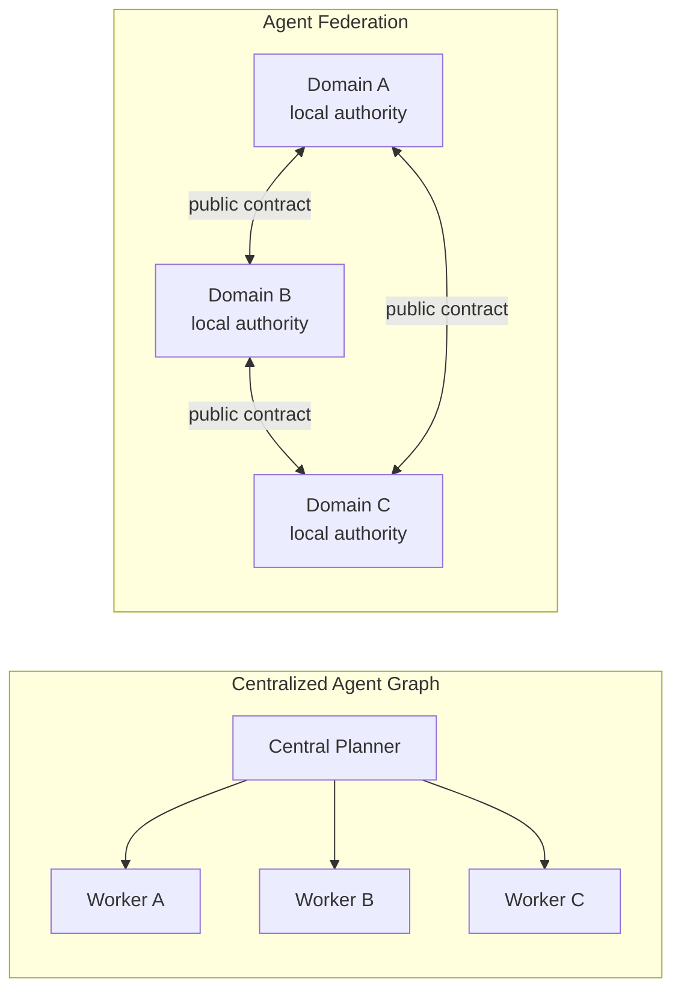
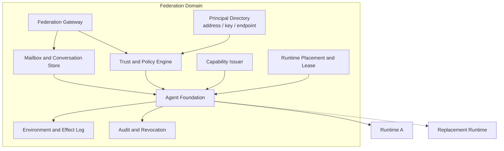
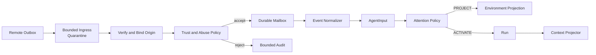
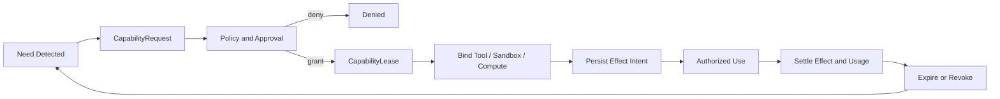
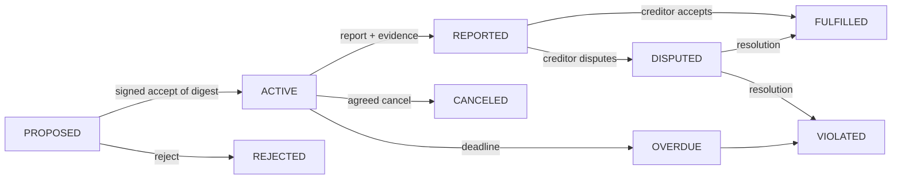
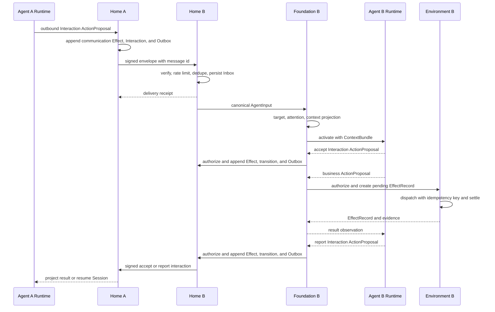
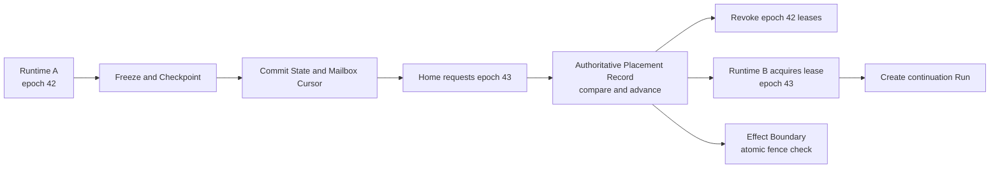

> Agent 的下一步不是连接到一个更大的中央编排图，而是成为有身份、有边界、有承诺、能够进入其他自治域的长期主体。

上一篇[《下一代 Agent Foundation：标准化 Agent 与世界的边界》](../../16/next-generation-agent-foundation/)讨论了单个平台内的 Input、Activation、Context、Effect、Suspension 和可替换 Runtime。它解决的是一个 Agent 如何稳定进入软件系统。

当这些 Agent 分属不同个人、企业和平台时，问题会再向外移动一层：

- Agent 如何拥有独立于 Runtime 的长期身份？
- 两个从未共享 Session、Memory 和管理员的 Agent 如何通信？
- 一个域如何验证另一个域的 Agent，同时保留自己的授权策略？
- Agent 如何申请 Sandbox、Tool、Compute 和临时凭证，而不是永久携带所有权限？
- Request 如何变成可追踪的委托和承诺，而不只是聊天记录中的一句话？
- Agent 迁移、复制和派生时，如何避免同一身份同时出现在两个地方？
- Human 与 Agent 如何处于同一协作网络，同时保留必要的控制不对称？

这些问题组合起来，不是一个更复杂的 Multi-Agent Framework，而是一套 **Agent Federation**。

# 为什么是 Federation，而不是 Agent Internet

“Agent Internet”强调 Agent 可以互相连接。这个比喻容易把重点放在 endpoint、协议发现和消息传输上，也容易让人误以为只要所有 Agent 支持同一个 A2A API，网络就自然形成。

真正困难的是管理边界。每个个人、组织或平台都需要保留自己的：

- Identity authority
- Membership 与 relationship policy
- Runtime placement
- Memory 与 Mailbox
- Environment 与 Effect boundary
- Capability issuer
- Risk、budget 与 approval policy
- Audit、revocation 与 abuse control

因此更准确的描述是：

> **Agent Federation 是多个自治域通过公共通信、身份、能力和交互契约协作，同时由每个域独立执行信任与授权策略。**

Internet 可以是底层 transport，Federation 才是上层治理拓扑。它既不是一个全球中央平台，也不是没有管理者的 trustless network。



中央图中的 Worker 可以很复杂，却仍然只是一个系统的内部组件。联邦中的节点首先是自治主体，其次才是协作者。

# 先区分 Composite Agent 与 Multi-Agent

“调用了 subagent”不代表系统中存在多个独立 Agent。多个执行单元如果共享同一个 planner、identity、memory owner、permission root 和 failure domain，本质上仍是一个 Composite Agent。

一个独立 Agent 至少需要具备下面这些属性：

| Property | Question |
| --- | --- |
| Identity | 它能否被长期、唯一地寻址，而不依赖当前进程？ |
| Lifecycle | 它能否独立创建、暂停、迁移、撤销和终止？ |
| Memory | 它是否拥有明确归属和访问边界的持久状态？ |
| Authority | 它能以自己的 principal 行动，并被授予或撤销能力吗？ |
| Failure Domain | 它失败、断网或升级时，其他 Agent 是否仍可独立存在？ |
| Agency | 它能否根据本地状态接受、拒绝、协商或延迟请求？ |
| Communication | 它是否通过公共协议通信，而不是读取另一个进程的内部变量？ |
| Accountability | 它的承诺、委托与 Effect 能否归因和审计？ |

这些条件不是为了模拟人格，而是为了建立系统边界。

- 一个 Planner 临时启动十个共享权限的 Worker，是 **Composite Agent**。
- 一个企业内部由统一控制面管理的多个长期 Agent，可以是 **Multi-Agent System**，但还不是 Federation。
- 多个独立管理域中的 Agent 通过公共契约协作，才形成 **Agent Federation**。

这一区分很重要。没有独立 Identity 和 Authority，后面的信任、委托、迁移和责任都没有稳定对象。

# Federation Domain 与 Agent Home

联邦的基本部署单元不是 Agent 进程，而是 **Federation Domain**。每个 Agent 在一个域中拥有自己的 **Agent Home**。

Agent Home 不是永远在线的 VM。它是一组由本域负责的持久系统服务：



这个边界与现实中的 federated system 有相似之处，但不复制任何单一协议：

- [Internet Mail Architecture](https://www.rfc-editor.org/rfc/rfc5598.html)把用户层与 Message Handling Service 分开，依赖全局地址和异步 point-to-point transfer；发送者与接收者不需要同时在线。
- [ActivityPub](https://www.w3.org/TR/activitypub/)让 Actor 暴露 Inbox 和 Outbox，跨服务器投递发生在 Actor 所在服务之间。
- [Matrix Server-Server API](https://spec.matrix.org/v1.19/server-server-api/)由 homeserver 交换签名请求和事件，接收域独立执行格式、签名和授权检查；它的 transaction 只在一对 homeserver 之间有意义，而不是全局事务。

Agent Federation 需要提炼这些边界：**主体有稳定地址，消息由 Home 持久接收，管理域互相通信，本地策略拥有最终决定权。**

# Identity 才是 Agent 的连续性

当前许多 Agent 系统把 Session、容器或进程 ID 当成 Agent ID。这在单机工具中足够，在联邦中会立即失效：Runtime 会升级，Sandbox 会销毁，模型会切换，Agent 也可能迁移到另一组 Worker。

Agent 的 durable self 应该由 Home 持有，至少包含：

```yaml
agent_id: agent://acme.example/agents/release-manager
home_domain: acme.example
owner: human://acme.example/users/alice
status: active
key_refs:
  - kms://agent-keys/release-manager/3
mailbox_ref: mailbox://acme.example/release-manager
memory_refs:
  - memory://acme.example/release-manager/private
relationship_refs:
  - graph://acme.example/release-manager/relationships
capability_grants:
  - cap://acme.example/grants/deploy-staging
commitment_cursor: 184
runtime_lineage_ref: lineage://acme.example/release-manager
placement_lease_id: placelease_01...
placement_epoch: 42
environment_refs:
  - env://acme.example/projects/payments
latest_audit_cursor: 91028
```

这个对象描述“谁在行动”，`RuntimeDescriptor` 和 `RuntimeStateRef` 描述“它现在由什么执行”。二者必须分开：

- Identity 可以连续存在，Runtime 可以被替换。
- Home 可以接收消息，Runtime 可以暂时不存在。
- Agent 可以切换模型，历史责任不能随之消失。
- Runtime 只能获得有期限的 placement lease，不能因为拿到 checkpoint 就自动成为该 Agent。
- 签名密钥最好由 Home、KMS 或受证明的执行环境控制，而不是永久复制进每个 Sandbox。

Self-certifying identifier 或 DID 可以成为某种实现，但不是联邦成立的前提。系统仍然需要 naming、endpoint resolution、key rotation、revocation、attestation 和本地信任策略。一个能由公钥验证的名字，只解决“这次签名对应哪个 key”，不自动解决“我是否信任它、是否允许它部署生产环境”。

上面的 `agent://acme.example/...` 是 **Home-qualified address**：`acme.example` 同时是命名 authority 和路由 authority。它允许 Runtime 被放到其他执行域，但 Home、Mailbox 和 Identity authority 仍由 `acme.example` 持有。若要把 Home 本身转移到新 Domain，需要另一套 re-homing 协议：使用独立于 Home 的 immutable principal ID，或由旧 authority 签名的 transfer/redirect chain，并对 Mailbox route 建立 epoch、接管与撤销状态。仅复制 key 或 checkpoint 不能让新域合法接管旧域地址。

更实用的组合是：

> **去中心化的主体标识 + 联邦式 endpoint/key discovery + 本地策略执行。**

# Communication Plane 不是 Chat UI

IM 对 Agent 最有价值的部分不是气泡界面，而是已经被大量系统验证的通信原语：

- Address
- Durable Mailbox 与 Outbox
- Thread / Conversation
- History cursor
- Membership 与 consent
- Presence
- Notification policy
- Permission
- Relationship graph
- Delivery receipt

Chat、Email、Webhook、A2A 和企业消息队列可以成为 Communication Plane 的 Adapter。它们不应该分别定义一套 Agent 生命周期。

## Message Envelope 与 AgentInput 必须分层

跨域消息不应该直接成为 Prompt，也不应该直接等同于上一篇中的 `AgentInput`。它首先是一个不可信的 `FederatedEnvelope`：

```yaml
message_id: msg_01...
sender: agent://vendor.example/agents/release-auditor
sender_domain: vendor.example
to:
  - agent://acme.example/agents/release-manager
conversation_id: conv_01...
interaction_type: request
in_reply_to: msg_00...
correlation_id: corr_01...
causation_id: msg_00...
issued_at: 2026-08-17T09:30:00Z
expires_at: 2026-08-17T10:30:00Z
body_ref: object://vendor.example/messages/msg_01
body_digest: sha256:...
content_type: application/agent-interaction+json
idempotency_key: vendor.example/release/184
key_id: key://vendor.example/agents/release-auditor/7
signature: ...
```

接收域先完成：

1. 解析目标地址和 endpoint，并对连接、Envelope、附件和引用对象施加硬性大小限制。
2. 把尚未认证的 bytes 写入有容量、TTL 和保留策略的 bounded ingress/quarantine，而不是目标 Mailbox。
3. Federation Gateway 验证发送域、key、签名、digest、时间和 replay window，并把 `sender` 绑定到经过认证的 origin；不能相信 payload 自报的 principal。
4. 执行 block list、relationship、consent、rate、budget 和 abuse policy。
5. 接受后，按 `(authenticated_origin_domain, authenticated_sender, destination_mailbox, message_id)` 去重并持久化到正式 Mailbox。Pairwise transaction id 同样只在经过认证的 origin/destination pair 内有意义。
6. 返回只表示“本域已接收”的 delivery receipt；被拒绝内容如需审计，只进入 bounded quarantine/audit log。
7. Event Normalizer 只做 schema 校验与 canonical conversion，生成 `AgentInput`，不重新决定发送者身份。
8. 由 Context Projector 决定哪些字段能进入模型上下文。

Transport delivery identity 与业务 `idempotency_key` 必须分开。前者防止同一个 Envelope 被重复接收，后者防止同一业务意图经过多条消息或重试重复执行。



这条链路防止一种常见错误：远端 Agent 发来的文本因为“已经通过 A2A”就直接获得 trusted system context。Transport authentication、message acceptance、business authorization 和 prompt projection 是四个不同决策。

反方向也不能绕开 Effect boundary。Agent 主动发送的 `request`、`accept`、`commit` 或 `report` 是可能泄露数据、消耗远端资源或建立义务的 **communication Effect**。Runtime 必须先产生结构化 `ActionProposal`；Effect Gateway 执行数据出境、Capability、预算和审批策略，并原子持久化 Interaction record 与 durable Outbox record。`OutputSink` 只能投影已经授权的记录，不能把普通自由文本 `RunEvent` 自动升级为 Agent 的签名社会行为。协议级 delivery receipt 可以由 Gateway 生成，但它不代表 Agent 接受了任何义务。

## Conversation 不等于 Session

Conversation 是多个 Principal 共享的通信对象；Session 是单个 Agent 的私有执行连续性。

| Conversation | Session |
| --- | --- |
| 记录参与者、thread、membership 和可见历史 | 记录一个 Agent 的 Run、checkpoint 和 runtime state |
| 可以跨 Agent、Human 和管理域 | 归属于一个 Agent Home |
| 受通信 consent 和 retention policy 约束 | 受 Agent memory 和 execution policy 约束 |
| 一个 Conversation 可触发多个 Agent Session | 一个 Session 可以参与多个 Conversation |
| 对外暴露 delivery 与 interaction 状态 | 不应对远端暴露内部 reasoning 和完整 Context |

二者可以通过 `conversation_id` 和 `session_ref` 关联，不能合并成同一条 transcript。否则跨域参与者会意外获得内部上下文，Agent 的迁移也会被某个聊天产品的数据模型绑死。

Presence 同样只是弱信号。`online` 可能代表 Home 可达、Mailbox 可写或 Runtime 正在运行，三者含义不同。可靠工作必须依赖 durable delivery 和 explicit commitment，不能依赖绿色圆点。

# Trust Plane：认证不是授权

联邦没有一个全局万能身份提供者。每个 Domain 签发或托管本域 Principal 的凭证，同时决定信任哪些外域。

[SPIFFE Federation](https://spiffe.io/docs/latest/spiffe-specs/spiffe_federation/)提供了一个清晰参照：trust domain 在管理上彼此隔离，通过持续获取对方的 bundle，获得验证外域 SVID 所需的公钥材料。它解决跨域认证，不替接收方决定授权。

Agent Trust Plane 也应该分层：

1. **Naming**：这个 domain-qualified address 的 authority 是谁。
2. **Endpoint discovery**：它的 Gateway、Inbox、key endpoint 在哪里。
3. **Credential verification**：Envelope 是否由当前有效 key 签名。
4. **Attestation**：需要时，发送方运行于什么受证明的 Runtime 或 Sandbox。
5. **Relationship trust**：双方是否有组织关系、合同、联系人或历史互动。
6. **Authorization**：这个 Principal 对当前 subject 能做什么。
7. **Risk policy**：即使允许，是否需要预算、限速、审批或更强证明。
8. **Revocation**：key、Agent、Domain、relationship 和 delegation 如何失效。

Domain trust 不应该直接传播为 transitive trust。A 信任 B、B 信任 C，不代表 A 自动信任 C。Reputation 也只能成为本地策略输入，不能覆盖明确权限。

## Spam 与 Sybil 是协议核心问题

一旦公开 endpoint 能唤醒模型，每一封垃圾消息都可能变成真实成本。Agent Federation 的 abuse surface 比普通 IM 更大：攻击者不仅消耗存储和网络，还能消耗 token、Sandbox、Tool quota，甚至诱导 Effect。

因此 Gateway 必须在 Activation 之前提供：

- per-domain、per-principal、per-conversation rate limit
- message size、attachment、recursive fetch 和 fan-out limit
- proof-of-relationship 或 invitation requirement
- sender budget / receiver budget policy
- duplicate、replay 和 loop detection
- quarantine 与 delayed delivery
- block、mute、revoke 和 domain-level deny
- unknown sender 不唤醒模型的默认策略
- outbound amplification 与 auto-reply loop control

身份可以是开放创建的，Attention 不应是开放消耗的。

# Capability Plane：Tool 与 Sandbox 都是动态基础设施

Agent 身份稳定，不代表它应该永久携带能力。启动时把所有 Tool、云凭证和 Sandbox 权限注入 Runtime，会让长期 Agent 变成长期风险。

更合适的生命周期是：



一个 Capability Lease 至少需要描述：

```yaml
lease_id: caplease_01...
issuer: service://acme.example/capability-authority
subject: agent://acme.example/agents/release-manager
actor_for: human://acme.example/users/alice
audience: env://acme.example/clusters/staging
actions:
  - deployment.read
  - deployment.create
constraints:
  branch: release/*
  max_rollouts: 1
  max_cost_usd: 20
issued_at: 2026-08-17T09:35:00Z
expires_at: 2026-08-17T10:05:00Z
placement_lease_id: placelease_01...
placement_epoch: 42
parent_lease_id: caplease_parent_01...
delegation_depth: 1
revocation_ref: revocations://acme.example/caplease_01
```

Tool、Browser、Sandbox、GPU、database session、secret handle 和 outbound network policy 都可以由同一个抽象描述。Lease 不一定是 bearer token，也可以是服务端 policy record、短期证书或只能在特定 executor 使用的 opaque handle。代表某个 Agent placement 使用的 Lease 还必须绑定 `placement_lease_id` 与 `placement_epoch`；迁移时旧 Lease 被撤销，或因权威 fencing comparison 自动失效。

## Delegation 不能抹掉 Agent 身份

[OAuth 2.0 Token Exchange](https://www.rfc-editor.org/rfc/rfc8693.html)明确区分 delegation 与 impersonation：

- Impersonation 让 A 在某个权限上下文中表现为 B。
- Delegation 保留 A 自己的身份，同时表达 A 代表 B 行动。

Agent 的默认模式应该是 delegation。EffectRecord 同时记录：

- 谁拥有原始 authority。
- 哪个 Agent 实际采取行动。
- 哪个域签发了 Lease。
- 能力经过了怎样的 delegation chain。
- 最终在哪个 Environment 和 audience 中使用。

人类把部署权限委托给 Agent，不应该等于把自己的长期 token 复制给 Agent。父 Agent 派生子 Agent，也不应该共享同一 root credential。Capability 应随委托逐级收窄，而不是扩大。

# Interaction Protocol：从消息升级为社会行为

消息投递只说明“对方收到了数据”，不能说明“对方接受了工作”。自然语言中的“好”“我来处理”“应该可以”也不足以形成可恢复的系统状态。

Agent 间协议需要 typed speech act。一个最小 vocabulary 可以包括：

| Interaction | Meaning |
| --- | --- |
| `request` | 请求对方完成动作或提供结果 |
| `offer` | 声明可在条件下提供能力或结果 |
| `accept` / `reject` | 接受或拒绝一个 proposal |
| `delegate` | 把目标与受限 authority 委托给另一主体 |
| `commit` | 对条件、期限和结果承担可追踪义务 |
| `approve` / `revoke` | 批准或撤销权限、计划或承诺 |
| `handoff` | 转移后续责任并声明当前进度 |
| `report` | 提交状态、证据或最终结果 |
| `query` | 查询事实或协议状态，不隐含承诺 |
| `subscribe` | 请求接收某类未来变化 |
| `negotiate` | 对 scope、price、deadline 或风险提出新条件 |

这些类型不会替模型做决定。它们把模型决定变成平台可以验证、持久化和恢复的状态转移。

## Commitment 是独立于 Session 的对象

```yaml
commitment_id: cmt_01...
conversation_id: conv_01...
proposal_id: proposal_01...
proposal_version: 3
proposal_digest: sha256:...
debtor: agent://vendor.example/agents/release-auditor
creditor: agent://acme.example/agents/release-manager
content:
  action: audit.release
  subject: release://acme.example/payments/2026.08.17
conditions:
  source_digest: sha256:...
deadline: 2026-08-17T12:00:00Z
evidence_policy:
  required_artifacts:
    - signed-audit-report
capability_lease_refs:
  - caplease://acme.example/read-release-184
transition_log_refs:
  - commitments://vendor.example/cmt_01/transitions
  - commitments://acme.example/cmt_01/transitions
observed_transition_cursors:
  vendor.example: 7
  acme.example: 5
local_assessment: active
created_from_interaction: int_01...
```



Commitment 不需要变成链上合约，也不应该依赖一个跨域共享的可变 `state` 字段。事实源是一组 append-only、签名的 transition 与 evidence：`accept` 必须绑定准确的 proposal id、version 和 digest；`report` 由 debtor 发出；对 evidence 的 `accept` 或 `dispute` 由 creditor 发出；cancel、revoke 和 resolution 也要声明有权发起的主体。上图是某个 Domain 根据这组事实计算的 local materialized view。

不同域可能同时拥有合法但不同的判断：debtor 已经 `REPORTED`，creditor 仍认为 `DISPUTED`；deadline 与 report 也可能并发。协议保留 transition id、causation、签名 evidence 和各域 assessment，通过后续 Interaction 解决分歧，而不是假设全局单值共识。

现有 [A2A Protocol](https://a2a-protocol.org/latest/specification/)已经标准化 Agent Card、Message、Task、Artifact、streaming 和 task lifecycle，适合 peer task interoperability。Federation 仍需在其外围补充 durable address/mailbox、domain trust、capability delegation 和跨会话 commitment。A2A 可以成为 Adapter 或 Interaction transport，不必独自承担整个社会模型。

# Attention System：Hook 与 Heartbeat 是不同信号

长期 Agent 不应该让每条 Mailbox message 都立即创建 Run，也不应该靠固定 heartbeat 扫描世界。它需要一个独立的 Attention System，把多种弱信号转换为有限的 Activation：

| Signal source | Example |
| --- | --- |
| Event-driven | 新消息、代码提交、部署失败、传感器事件 |
| Time-driven | deadline、定时检查、lease 即将过期 |
| State-driven | Environment projection 满足某个条件 |
| Goal-driven | Commitment 尚未完成，但下一步条件已经具备 |

Hook 是事件驱动入口；Heartbeat 是时间驱动采样。二者都只产生 signal，不应该绕过统一的 Attention Policy。

Attention Policy 可以综合：

- message trust 与 relationship
- Subscription 和 Commitment urgency
- Environment state freshness
- expected value 与 token/compute budget
- duplicate 与 recent run
- risk 和 required approval
- Agent 是否已有 active Run

然后沿用 Foundation 的决策：`IGNORE | PROJECT | ACTIVATE | ENQUEUE | STEER | INTERRUPT | FORK | RESUME`。

这意味着一个来自可信 Agent 的 `report` 可以只更新 Commitment 和 Environment；一个 deadline signal 可以 RESUME 已挂起 Session；一个未知发送者的 `request` 可以停留在 quarantine；只有需要模型判断的变化才创建 Run。

# 一次跨域协作如何发生

把前面的对象放到一起，一次 request 到 effect/result 的完整路径如下：



关键语义有四点。

## 1. Receipt 必须分层

`delivery.accepted` 只表示远端 Home 已持久化 Envelope。它不等于：

- 目标 Agent 已经读取。
- Attention Policy 已经激活模型。
- Agent 接受了 request。
- Commitment 已经成立。
- Effect 已经完成。

这些状态应分别由 `message.received`、`interaction.accepted`、`commitment.active`、`effect.settled` 或 `report` 表达。

## 2. 跨域 delivery 采用 at-least-once

发送端在不确定时会重试。接收端使用 `(authenticated_origin_domain, authenticated_sender, destination_mailbox, message_id)` 去重；pairwise transaction id 只在认证后的 origin/destination pair 内解释。裸 `message_id` 不是全局唯一键，不能让一个发送者通过复用其他主体的 ID 抑制消息。系统不承诺跨所有 Domain 的全局 exactly-once。

## 3. 顺序只能局部建立

单个 Conversation 可以用 cursor、causation link 或 event DAG 建立 partial order。联邦不存在所有 Agent 共享的 total order。Matrix 用 `prev_events` 构造 room event DAG，也说明联邦并发天然需要 partial order 和冲突处理，而不是中央序号。

## 4. 跨域失败不会回滚本地域历史

远端拒绝、超时或不可达时，本地 Outbox、attempt、receipt 和 Commitment 状态仍然保留。补偿通过新 Interaction 和 Effect 完成，不伪造分布式事务回滚。

# Migration、Fork 与 Delegation 必须分开

这三个操作经常被统一称为“把 Agent 交给另一个节点”，实际安全语义完全不同。

| Operation | Identity | Runtime state | Authority | Main risk |
| --- | --- | --- | --- | --- |
| Runtime migration | 保持同一 Agent ID 与 Home | checkpoint 转移或重建 | 旧 placement Lease 失效，新 Lease 重新绑定 | split-brain |
| Home transfer | 保持 immutable ID，或建立可验证 redirect | 转移 Home state 与 Mailbox route | 新 authority 接管并撤销旧 route | naming / mailbox split-brain |
| Fork | 创建新的 child Agent ID | 可复制允许共享的 Foundation state | 默认无权，需显式 delegation | 身份与凭证被复制 |
| Delegation | 双方 Identity 都不变 | 不要求复制 Runtime state | 签发收窄的 Capability Lease | confused deputy / over-delegation |

## Runtime Migration 需要权威 placement fencing



Effect request 携带 `agent_id + placement_lease_id + placement_epoch + run_id` 只是必要条件，不是证明。每个同域 Effect boundary 必须把请求 token 与一个权威、单调且线性一致的 placement record 做原子比较，不能相信 Runtime 自报的 `epoch=42`。Capability Lease 同样绑定 placement lease/epoch；record 前进到 43 时，epoch 42 的调用即使持有尚未到期的旧 Lease 也会被拒绝。

跨域 Environment 无法在网络分区中同时保证即时 fencing 和持续可用。需要严格排除旧 Runtime 时，可以使用短期、proof-of-possession 的 placement credential，并在无法确认 credential 新鲜度时 fail closed。若业务选择离线验证并保持可用，就只能承诺一个由 credential TTL 限定的旧 Runtime 有效窗口，不能宣称即时排除双活。

这里的 Migration 默认只移动 **Runtime placement**：Home、Identity authority、Mailbox route 与 key custody 保持不变，Runtime 可以在另一个执行域运行，但仍受原 Home 的 placement authority 约束。把 Home 本身交给新 Domain 是独立的 **Home transfer / re-homing**，需要 immutable principal ID 或旧 authority 签名的 transfer/redirect chain、Mailbox route epoch、接管确认和旧 route 撤销。仅重新签发 key 或复制 checkpoint 不足以完成命名权转移。

## Fork 必须创建 child identity

Fork 可以复制：

- 经过策略允许的 memory snapshot
- public Conversation history
- Skill 和 Runtime descriptor
- Environment projection
- unfinished goal description

Fork 不能复制：

- parent identity private key
- 不可转授的 Capability Lease
- 把 parent 已接受的 Commitment 自动改成 child 的义务
- 未经 consent 的私有 Conversation 和 Memory

父 Agent 通过 `AgentLineage` 记录派生关系，再用 delegation 把特定 goal、deadline 和 capability 交给 child。这样系统可以独立撤销 child，而不需要终止 parent。

# Human 与 Agent：通信对称，控制不对称

Human、Agent 和 Service 都应该是一等 Principal。Human 可以拥有 Address、Mailbox、Conversation、Capability 和 Commitment，也可以向 Agent 发出 request、接受 offer、订阅状态或提供 evidence。

这种通信层对称很重要。Human 不再被限制为 Agent UI 中的一个 `user` message，也不需要进入某个 Agent 的内部 Session 才能参与工作。

控制层不应该完全对称：

- Agent 受到 token、compute、money、time 和 fan-out budget 限制。
- 高风险 Effect 可以要求 Human approval 或多方 approval。
- Capability Lease 有 expiry、scope、audience 和 revocation。
- Agent 不能自行扩大 delegation depth。
- Human 可以暂停或终止自己拥有的 Agent，但不能修改不可抵赖的历史记录。
- 跨域 Human 也必须经过本域授权，不能仅凭“是人类”获得更高权限。
- Agent 的 autonomous decision、operator policy 和实际 Effect 都需要分别归因。

这不是把 Agent 永久降为 Copilot。自治与问责可以同时存在：Agent 能独立接受任务、协商条件和完成低风险 Effect；Domain 对资源与风险拥有最终政策权。

# 从 Agent Federation 到 Human-Agent Society

Society 不是把更多 Agent 放进一个 swarm，也不是先由中央 Planner 画好所有岗位和汇报线。

当系统具备以下条件时，社会结构会从重复互动中出现：

- Principal 拥有持续身份和独立边界。
- Address 与 Mailbox 让陌生主体能够异步接触。
- Relationship 与 consent 决定谁可以打扰谁。
- Capability delegation 让 authority 可以受限流动。
- Offer、request、negotiation 和 commitment 形成协作关系。
- Evidence、report、reputation 和 audit 让履约历史可观察。
- Fork、migration 和 revocation 让主体可以演化且不会失去责任链。
- Human 与 Agent 使用同一 Communication Plane，但执行不同控制策略。

团队、市场、社区、供应链和公共服务可以在这些协议之上形成。组织图是 interaction history、capability flow 和 commitment graph 的投影，而不是系统唯一的真实结构。

这也是“Federation”比“Internet”更重要的地方。连接产生流量，**自治主体之间可验证、可拒绝、可撤销、可追责的关系**才可能产生社会。

# 第一篇 Foundation 为什么不需要推翻

联邦化是对架构边界的一次压力测试。上一篇定义的八个公共对象全部保留：

| Existing Foundation object | Federation 中保持的语义 | 新增外围对象或限定 |
| --- | --- | --- |
| `AgentInput` | 本地域内统一的输入事实 | 由验证后的 `FederatedEnvelope` 生成 |
| `Session` | 一个 Agent 的私有执行连续性 | 与 `Conversation` 多对多关联，不向远端暴露内部状态 |
| `Activation` / `Run` | 一次 Attention decision 和执行 attempt | 记录 remote principal、message 与 commitment provenance |
| `ContextBundle` | Foundation 交给 Runtime 的唯一受控投影 | 跨域内容默认 untrusted；最终模型输入审计另需 Runtime 的 `ModelInputRecord` |
| `RunEvent` | Runtime 的 append-only 执行输出 | 只能投影为展示或已授权记录，不能自动建立 Interaction |
| `ActionProposal` / `EffectRecord` | proposal、pre-dispatch intent 与实际副作用分离 | 绑定 Capability Lease、placement fence、delegation chain 和本域 policy；outbound Interaction 也是 Effect |
| `Suspension` / `Subscription` | 等待条件与 continuation Run | 可等待 receipt、commitment、remote report 和 lease event |
| `RuntimeDescriptor` / `RuntimeStateRef` | Runtime 可替换、状态有兼容边界 | 加入 AgentLineage、placement lease、epoch 与 migration record |

需要新增的是 `Principal`、domain-qualified `Address`、`Mailbox`、`Conversation`、`FederatedEnvelope`、`CapabilityLease`、`Interaction`、`Commitment` 和 `AgentLineage`。它们位于 Foundation 外围，回答跨主体和跨管理域的问题。

需要升级的是 Adapter：

- Federation Gateway / Ingress Verifier 负责 bounded quarantine、验签、origin binding、replay protection 和 acceptance policy。
- `InputAdapter` 接入已经建立来源元数据的 Federation Gateway、Email、IM 或 A2A。
- `EventNormalizer` 只做 Envelope schema 与 canonical conversion，并保留不可伪造的 provenance。
- `TargetResolver` 只读解析 domain-qualified Principal、Mailbox、Conversation 和候选 Session。
- `ActivationPolicy` 纳入 trust、relationship、budget、commitment 和 abuse signal。
- `ContextProjector` 隔离远端不可信内容。
- `CapabilityProvider` 处理 request、lease、delegation、placement binding 和 revocation。
- `EffectAdapter` 对权威 placement record 做 fencing comparison，并执行已经持久化 intent 的副作用。
- `OutputSink` 只投影已授权、已持久化的记录；outbound Interaction 由 Effect Gateway 原子写入 Interaction 与 durable Outbox。

不需要变化的是 Runtime contract：Runtime 仍然消费 `ContextBundle`，产生 `RunEvent` 和 `ActionProposal`。Claude Agent SDK、Pi、OpenClaw、DeepSeek Harness 或未来 Runtime 都不需要理解 Matrix、SMTP、SPIFFE bundle 和跨域重试。

这证明上一篇 Foundation 的设计是 solid 的：它稳定的是 Agent 与本地世界的边界，Federation 只需要在边界外增加社会对象和跨域协议，不需要侵入模型 loop。

# 实现顺序

完整联邦不适合一次上线。可以按四个阶段逐步建立不变量。

## Phase 1：单域 durable identity 与 mailbox

- 把 Agent ID 从 Session/Runtime ID 中拆出。
- 建立 Principal、Address、Mailbox、Outbox 和 Conversation。
- 所有 channel 先进入 Mailbox，再生成 AgentInput。
- 建立分层 receipt、dedupe 和 history cursor。

这一步即使没有跨域，也能统一 Chat、Webhook、Cron 和 A2A 输入。

## Phase 2：Capability 与 Attention

- Tool、Sandbox、Compute 和 credential 改为 Capability Lease。
- Effect Gateway 强制校验 audience、scope、expiry，并把 placement lease/epoch 与权威 placement record 做原子 fencing comparison。
- 合并 Hook、Heartbeat、Subscription 与 Commitment deadline signal。
- 未知发送者默认只持久化或 quarantine，不自动激活模型。

## Phase 3：同组织多域 Federation

- 引入 domain-qualified address 和 Gateway-to-Gateway envelope。
- 建立 key discovery、rotation、revocation 与 explicit trust relationship。
- 用 at-least-once、pairwise transaction 和 Outbox/Inbox recovery 处理失败。
- 先在同一组织的多个安全域中验证 local policy independence。

## Phase 4：外部 Federation 与 Interaction

- 开放受邀 domain federation。
- 标准化 request、offer、delegation、commitment 和 evidence。
- 增加 abuse、reputation、dispute 与 domain isolation。
- 在稳定审计和撤销能力之后，再允许自动跨域 Effect。

这个顺序优先建立 durable state 和 authority boundary，再扩大连接范围。直接从公开 A2A endpoint 起步，通常会把安全和恢复问题留到最难补救的时候。

# 边界与非目标

Agent Federation 需要主动拒绝几种过度设计和错误承诺。

## 1. 不复制 Internet 的全部协议栈

Email、ActivityPub、Matrix、SPIFFE 和 OAuth 提供设计参照。Agent Federation 可以复用其中某些协议，也可以只复用边界。目标是最小公共契约，不是把所有历史标准叠加在一起。

## 2. 不要求 Blockchain 或全局 Ledger

大部分 Identity、Mailbox、Commitment 和 Audit 可以由自治域持久化，并通过签名 evidence 互证。只有业务真的需要多方共识时，才引入额外 ledger。

## 3. 不存在全局万能身份与自动信任

地址可发现不等于身份可信，身份可信不等于行为授权。所有跨域能力最终由资源所在域决定。

## 4. 不承诺全局 exactly-once 与 total order

系统提供 at-least-once delivery、去重、局部顺序、causation、幂等 Effect 和补偿。跨域网络分区下，不存在免费的全局事务。

## 5. 跨域 Context 不直接进入 Prompt

Envelope、附件、远程 memory link 和 tool description 都是不可信输入。Context Projector 必须执行来源标注、权限过滤、大小限制和 prompt injection isolation。

## 6. Federation 不等于任意主体都能消耗 Agent

公开地址可以支持 discovery，Mailbox、Attention、Capability 和 Effect 必须受 consent、rate、budget、spam 与 Sybil policy 约束。

## 7. Society 不是单一协议对象

协议只能提供身份、通信、能力和承诺原语。组织、文化、市场与公共规则来自长期互动和治理，不能由一个 `society.create` API 生成。

# 结论

Agent Foundation 让一个可替换 Runtime 成为长期存在的本地执行主体。Agent Federation 再向外增加四层系统语义：

1. **Identity**：Agent 的连续性属于 Principal 和 Home，不属于 Runtime。
2. **Communication**：Address、Mailbox、Conversation 和 receipt 让主体异步协作。
3. **Trust and Capability**：每个域独立认证、授权、委托、限权和撤销。
4. **Interaction and Commitment**：消息变成可恢复、可审计的社会行为。

Runtime Migration 保留一个身份与 Home，并通过权威 placement fencing 排除同域双活；跨域离线验证只能提供由短期 credential 限定的旧 Runtime 窗口。Home transfer 是独立的命名与路由接管协议；Fork 创建新身份；Delegation 只转移受限 authority。Human 与 Agent 在 Communication Plane 上都是 Principal，在高风险控制上保持必要的不对称。Attention System 决定哪些外部变化值得花费智能，而不是让网络流量直接变成模型调用。

最终，Human-Agent Society 不需要由一个超级 Planner 设计。它可以从一组较小但稳定的公共契约中出现：主体能够被找到，消息能够被持久投递，权限能够被受限委托，承诺能够被验证，失败能够被恢复，关系能够被拒绝和撤销。

> **Agent Federation 不是让所有 Agent 共享一个大脑，而是让拥有不同大脑、不同所有者和不同规则的主体，仍然能够建立可靠关系。**

# 参考资料

> 协议与文档核对时间为 2026-08-16。Matrix 与 A2A 等规范仍在演进，涉及具体版本的判断以这里链接的版本或当时的 `latest` 文档为准。

1. [Internet Mail Architecture, RFC 5598](https://www.rfc-editor.org/rfc/rfc5598.html) — 用户层、Message Handling Service、全局地址与异步传输边界。
2. [ActivityPub, W3C Recommendation](https://www.w3.org/TR/activitypub/) — Actor、Inbox、Outbox 与 server-to-server federation。
3. [Matrix Server-Server API v1.19](https://spec.matrix.org/v1.19/server-server-api/) — homeserver federation、request/event signing、pairwise transaction、事件 DAG 与本地 authorization checks。
4. [SPIFFE Federation](https://spiffe.io/docs/latest/spiffe-specs/spiffe_federation/) — trust domain、bundle exchange、跨域 credential authentication 与 federation relationship lifecycle。
5. [OAuth 2.0 Token Exchange, RFC 8693](https://www.rfc-editor.org/rfc/rfc8693.html) — token exchange、audience/scope 以及 delegation 与 impersonation 的区别。
6. [Agent2Agent Protocol Specification](https://a2a-protocol.org/latest/specification/) — Agent Card、Message、Task、Artifact、streaming 与 task lifecycle。
7. [CloudEvents Specification v1.0.2](https://github.com/cloudevents/spec/blob/v1.0.2/cloudevents/spec.md) — 跨系统 event envelope 的基础参照。
8. [Model Context Protocol Architecture](https://modelcontextprotocol.io/docs/learn/architecture) — Tool、Resource、Prompt 与 capability negotiation 的协议边界。
